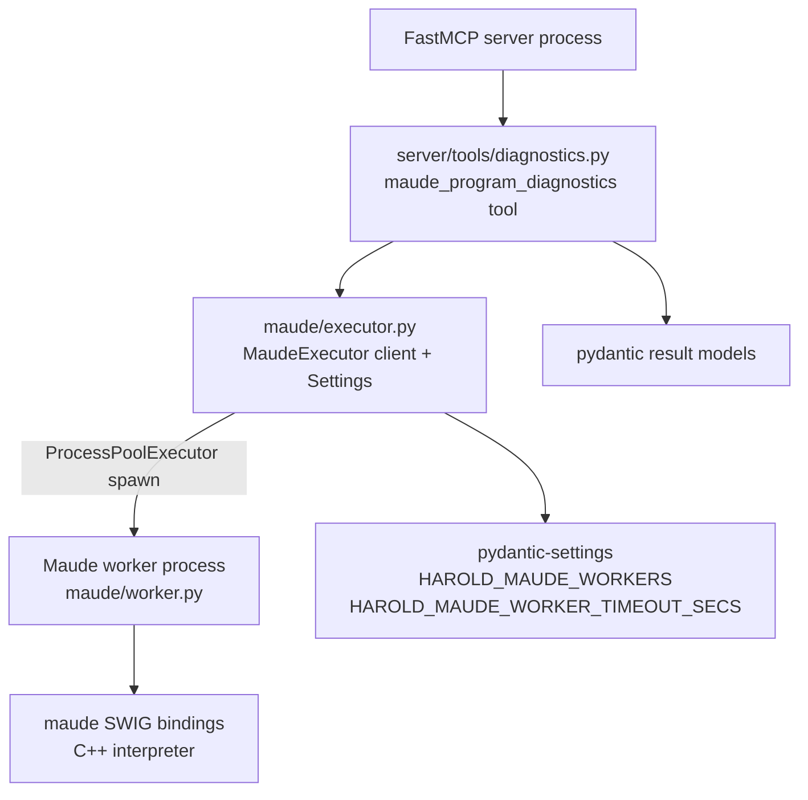
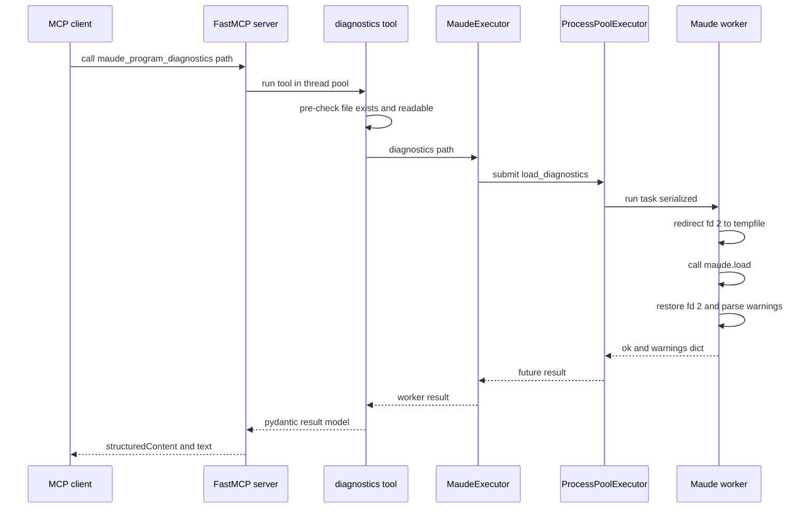
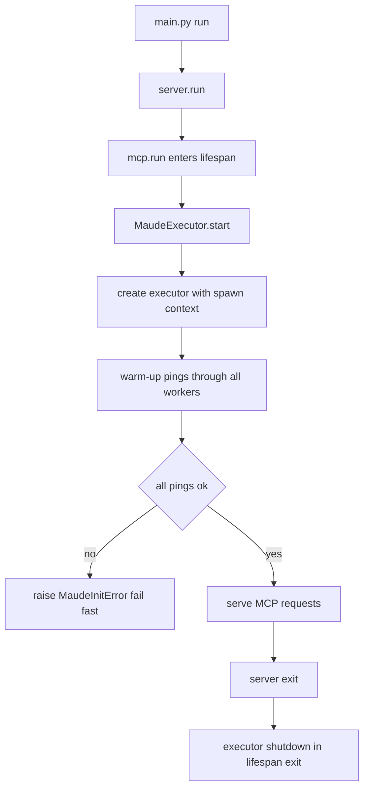
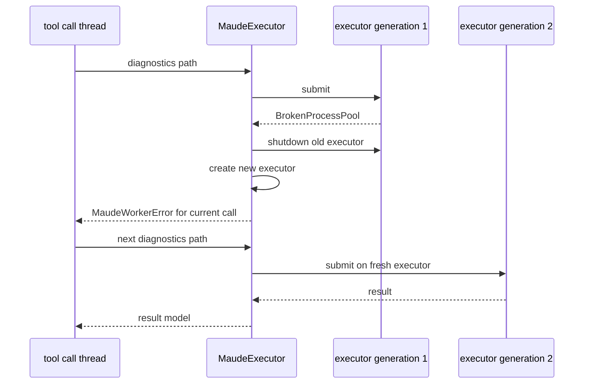
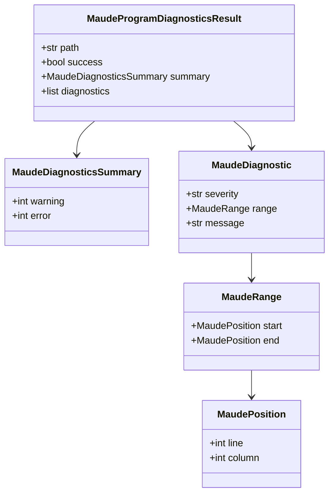

# Detailed Design — `maude_program_diagnostics` (v1)

> Standalone design document for the first real Harold MCP tool. Consolidates the
> requirements Q&A (`../idea-honing.md`) and the research notes (`../research/`). Dates in
> this document are the decision dates recorded in those files.

## 1. Overview

`maude_program_diagnostics` is an MCP tool that **loads a Maude source file into the Maude
interpreter and reports every problem the interpreter finds** — including warnings Maude can
recover from. It is the first real tool of the `harold-mcp` server (an MCP server for
AI-assisted Maude programming); the placeholder `greet` tool is removed by this work.

The key insight driving the design (verified empirically, `research/maude-bindings.md`):
Maude is **lenient** — it loads files with syntactic errors, emitting `Warning:` lines to
stderr while still returning success. A tool that only reported "load failed or not" would
miss exactly the recoverable issues an AI coding agent needs to fix. Therefore the tool must
capture and surface those warnings.

The Maude interpreter therefore runs in a **dedicated worker process**, for two reasons:

1. **Stderr isolation / capture**: the `maude` package writes its `Warning:` diagnostics to
   **fd 2 (stderr) directly from C++**, so Python-level redirection (`contextlib`, `capsys`)
   cannot capture them. Inside the worker we redirect its stderr to a temp file around each
   `maude.load` call (the only viable capture mechanism; §4.2), while the parent FastMCP
   process keeps its own stderr available for logging — as recommended for stdio MCP servers
   (stdout stays reserved for the transport).
2. **Crash containment**: feeding arbitrary, LLM-generated files to the interpreter is
   adversarial — the `maude` bindings have a documented SIGSEGV history
   (`.agents/planning/sigsegv-under-load/issue.md`). A worker death kills only the worker;
   the server survives and replaces it.

### Scope

In scope (v1):

- `maude_program_diagnostics(path: str)` → structured diagnostics result.
- Dedicated Maude worker process via `concurrent.futures.ProcessPoolExecutor`, with crash
  containment and recovery.
- Worker configuration via `pydantic-settings` env vars.

Out of scope (explicitly deferred):

- Running/reducing terms, module introspection (future tools).
- RAG over the Maude documentation.
- Program slicing, advisory channel, richer diagnostics (columns, codes).
- Patching/vendoring the `maude` bindings for a proper warning API.

## 2. Detailed Requirements

Consolidated from `../idea-honing.md` (Q1–Q8, design-review amendments) and
`../rough-idea.md`.

| ID | Requirement |
| --- | --- |
| R1 | The tool is a function `maude_program_diagnostics` in `src/harold_mcp/server/tools/diagnostics.py` (path amended during design review — see the amendments in `../idea-honing.md`), registered with `@mcp.tool` on the `mcp` instance. The docstring is the MCP tool description (FastMCP convention). |
| R2 | Input: a single `path: str` parameter (typically a `.maude` file; the extension is **not** validated). The MCP input schema must be exactly `{path: str}` — the executor is injected, not a schema parameter (R7). |
| R3 | Behavior: load the file into the Maude interpreter and report all problems. Tri-state outcome: (a) clean load — no diagnostics; (b) load with recoverable warnings — warnings reported, `success=False`; (c) unrecoverable load failure — warnings (if any) plus one synthesized `error` diagnostic, `success=False`. |
| R4 | `success=True` **iff there are no warnings and no errors**. A recoverable warning makes `success=False` (the tool's purpose is to point out anything the agent should fix). |
| R5 | Missing/unreadable file → **tool error** (`isError`), raised before touching the interpreter. Unrecoverable *parse* failures are diagnostics (R3c), not errors. |
| R6 | Output: structured pydantic model (see §5): `path` (echo of the input as given), `success`, `summary` (per-severity counts), `diagnostics` list. FastMCP emits both `structuredContent` and a JSON text block for object returns. |
| R7 | Diagnostics use LSP-style positions: a `range` with `start`/`end` positions, 1-based `line`, `column=None` (Maude reports no columns). `range=None` means a whole-file problem. |
| R8 | `summary` is a small per-severity counts object (`warning`, `error`). |
| R9 | Worker architecture: Maude runs in a dedicated long-lived worker process driven by `ProcessPoolExecutor(max_workers=HAROLD_MAUDE_WORKERS, mp_context=spawn, initializer=init_maude)`. `max_tasks_per_child` stays `None` (long-lived). |
| R10 | Settings via `pydantic-settings`, env prefix `HAROLD_`: `HAROLD_MAUDE_WORKERS` (default `1`, `gt=0`), `HAROLD_MAUDE_WORKER_TIMEOUT_SECS` (default `60`, `gt=0`). `pydantic-settings` becomes a direct dependency. |
| R11 | Timeout: each call waits at most `maude_worker_timeout_secs` for the worker future. Timeout and worker crash → **tool error** (`isError`), and the pool is recreated so the *next* call works. |
| R12 | Fail fast at startup: the server warms up the pool (ping through every worker) during lifespan startup; Maude-init failure aborts server start with a meaningful error. |
| R13 | `greet` is removed (no migration needed: the worker protocol has no term-reduction op). |
| R14 | The tool declares `readOnlyHint=True` (it does not modify user files; it does mutate server-side interpreter state, which is documented in the tool description). |
| R15 | Advisories stay suppressed (`maude.init(advise=False)`); no `info`/`advisory` severity. |
| R16 | No module-set detection: well-formedness is judged solely by the `maude.load` return value + captured warnings. A program may legitimately define no modules. |
| R17 | The main process never imports or calls `maude.*`; only the worker process touches the interpreter. |
| R18 | Success criteria (acceptance, Q8): (1) tool callable over MCP with schema `{path: str}`, structured result; (2) four fixture outcomes correct end-to-end (clean / recoverable / non-recoverable / no-new-module); (3) missing/unreadable file → tool error; (4) simulated worker crash → current call errors, next call succeeds; (5) both settings honored; (6) CI green (`make release`), docs updated, unit + integration tests. |
| R19 | Repo conventions: Python ≥ 3.14, mypy strict (`disallow_untyped_defs`), ruff (auto-fix fails CI), `uv` for deps, new modules documented in `docs/modules.md`, README documents the env vars, knowledge base refreshed after implementation. |

## 3. Architecture Overview

Two processes:

- **MCP server process** (FastMCP, threaded): the tool, the result models, and a thin
  `MaudeExecutor` client wrapper around a `ProcessPoolExecutor`. Never imports the `maude`
  bindings.
- **Maude worker process** (spawned, single-threaded): owns the interpreter, performs the
  stderr capture, parses warnings. Executed via `ProcessPoolExecutor`; `max_workers=1` by
  default makes it an implicit serialization lock (two concurrent tool calls run
  sequentially, each with its own `Future`, so results never cross-talk — verified
  empirically, `research/process-pool-executor.md`).



### 3.1 Tool call flow



### 3.2 Lifecycle (pool warm-up and shutdown)



### 3.3 Crash recovery

A worker death breaks the whole executor (`BrokenProcessPool`); there is no self-healing.
`MaudeExecutor` recreates the executor so the next call works.



## 4. Components and Interfaces

### 4.0 Package layout

The design reorganizes the flat modules into two packages (decided in the design review —
see `../idea-honing.md`, "Design review amendments"):

```
src/harold_mcp/
    main.py                  # console-script entry point (unchanged behavior)
    logging.py               # get_logger re-export (unchanged)
    resources.py             # HAROLD_ICON (unchanged)
    server/
        __init__.py          # public API: mcp, run + registers the tools
        server.py            # FastMCP instance, lifespan, run()   (moved from server.py)
        tools/
            __init__.py      # re-exports the tool functions
            diagnostics.py   # pydantic result models + maude_program_diagnostics
    maude/
        __init__.py          # re-exports errors, Settings, MaudeExecutor, get_maude_executor
        executor.py          # client-side: errors, Settings, MaudeExecutor   (from maude.py)
        worker.py            # worker-side: init_maude, ping, load_diagnostics, _crash
```

File changes:

| File | Change |
| --- | --- |
| `src/harold_mcp/server/__init__.py` | **New**: re-exports `mcp`/`run`; imports `tools` (registers the tool) |
| `src/harold_mcp/server/server.py` | Moved from `src/harold_mcp/server.py`; `greet` removed; `lifespan` added |
| `src/harold_mcp/server/tools/__init__.py` | **New**: re-exports the tool functions |
| `src/harold_mcp/server/tools/diagnostics.py` | **New**: pydantic result models + the tool |
| `src/harold_mcp/maude/__init__.py` | **New**: re-exports the public Maude-subsystem API |
| `src/harold_mcp/maude/executor.py` | Moved/reworked from `maude.py`: errors, `Settings`, `MaudeExecutor` |
| `src/harold_mcp/maude/worker.py` | **New**: interpreter-side functions run by the worker process |
| `src/harold_mcp/maude.py`, `src/harold_mcp/server.py` | Deleted (split/moved into the packages above) |
| `src/harold_mcp/main.py` | Effectively unchanged — importing `harold_mcp.server` now registers the tools |
| `pyproject.toml` | Add `pydantic-settings` (then `uv lock`; commit `uv.lock`) |
| `README.md` | Add an env-var configuration subsection under "How to run harold-mcp" (see §4.5) |
| `docs/modules.md` | Update entries to the new modules |
| `tests/unit/test_maude.py` | Replaced by `test_maude_executor.py` (wrapper) + `test_maude_worker.py` (parser) |
| `tests/integration/test_maude_runtime.py` | Replaced by integration tests for the executor + tool |

### 4.1 `harold_mcp/maude/executor.py` — client-side access layer

Imports: stdlib (`concurrent.futures`, `multiprocessing`, `threading`, `os`, `pathlib`),
`pydantic_settings`, and `from . import worker` (safe: `worker.py` imports the third-party
`maude` lazily, see §4.2). **Never** imports `maude`.

#### Errors

```python
class MaudeError(RuntimeError): ...


class MaudeInitError(MaudeError):
    """Maude failed to initialize in the worker (surfaced at warm-up)."""


class MaudeWorkerError(MaudeError):
    """The worker crashed or timed out during a call; the executor was replaced."""

    def __init__(self, reason: str) -> None: ...


class MaudeFileNotFoundError(MaudeError):
    """The input path is missing or unreadable (raised before any worker call)."""

    def __init__(self, path: str) -> None: ...
```

`MaudeLoadError` and `MaudeModuleNotFoundError` are removed (load failures are diagnostics,
not exceptions; no module lookups cross the process boundary).

#### Settings

```python
class Settings(BaseSettings):
    model_config = SettingsConfigDict(env_prefix="HAROLD_")

    maude_workers: int = Field(default=1, gt=0)
    maude_worker_timeout_secs: int = Field(default=60, gt=0)


settings = Settings()  # module-level singleton; env vars read once at import
```

pydantic-settings maps `HAROLD_MAUDE_WORKERS` / `HAROLD_MAUDE_WORKER_TIMEOUT_SECS`
(case-insensitive). Invalid values fail fast at import with a pydantic validation error.

#### `MaudeExecutor` — executor wrapper with recovery

```python
ExecutorFactory = Callable[[], ProcessPoolExecutor]

class MaudeExecutor:
    def __init__(
        self,
        settings: Settings | None = None,
        *,
        executor_factory: ExecutorFactory | None = None,   # test seam
    ) -> None: ...

    def start(self) -> None:        # create executor + warm-up pings; MaudeInitError on failure
    def shutdown(self) -> None:     # idempotent; shutdown(wait=False, cancel_futures=True)
    def submit(self, fn, *args) -> Future:  # recovery on BrokenProcessPool from submit()
    def diagnostics(self, path: str) -> LoadDiagnosticsResult: ...
```

Behavior:

- `_new_executor()`: `ProcessPoolExecutor(max_workers=settings.maude_workers,
  mp_context=multiprocessing.get_context("spawn"), initializer=worker.init_maude)`.
  Explicit **spawn** (portable, pipe-based; `forkserver` — the Linux 3.14 default — needs an
  AF_UNIX socket and failed in sandboxes; never `fork`, the parent is threaded).
- `start()`: create the executor, then submit one `worker.ping` **per worker**
  (`maude_workers` pings — this forces all workers to spawn and run `init_maude`). Await
  all with the configured timeout. Any `BrokenProcessPool`/`TimeoutError` → `MaudeInitError`
  (the initializer's own failure only surfaces as a dead worker, since its exception
  message cannot cross the process boundary).
- `submit(fn, *args)`: lock-guarded; if the current executor is `None` (lazy start) or
  `submit` raises `BrokenProcessPool` (pool already broken), replace the executor and
  resubmit once.
- `diagnostics(path)`: `submit(worker.load_diagnostics, path)` then
  `future.result(timeout=settings.maude_worker_timeout_secs)`. Maps:
  - `BrokenProcessPool` → replace executor → `MaudeWorkerError("Maude worker crashed")`;
  - `concurrent.futures.TimeoutError` → replace executor (`shutdown(wait=False,
    cancel_futures=True)` — a timeout does **not** cancel the task; killing the pool is the
    only way to interrupt a stuck interpreter) → `MaudeWorkerError("...timed out")`;
  - any other worker exception → propagates unchanged (a real bug should be visible).
- Replacement is **eager** (new worker spawned immediately — confirmed in the design
  review) and lock-guarded, so two threads detecting the crash concurrently create exactly
  one new executor.
- **No auto-retry** of the failed call itself: a file that crashed the worker would likely
  crash it again. Diagnostics is load-only (idempotent), so the MCP client can retry the
  tool call.
- `shutdown()`: idempotent, `executor.shutdown(wait=False, cancel_futures=True)`.

#### Singleton

```python
_EXECUTOR = MaudeExecutor()


def get_maude_executor() -> MaudeExecutor:
    """Process-wide MaudeExecutor singleton (server process)."""
    return _EXECUTOR
```

Note: the **worker** process has its own equivalent — `init_maude()` — and tasks call the
interpreter directly (§4.2). Two singletons, one per process, by design.

#### Package `__init__.py`

```python
from harold_mcp.maude.executor import (
    MaudeError,
    MaudeInitError,
    MaudeWorkerError,
    MaudeFileNotFoundError,
    MaudeExecutor,
    Settings,
    get_maude_executor,
    settings,
)

__all__ = [...]
```

### 4.2 `harold_mcp/maude/worker.py` — interpreter side (worker only)

This module is pickled/spawn-imported by the worker process. It imports `maude` **lazily,
inside functions**, so that importing the module in the MCP server process (which
`executor.py` does, for the function references) does **not** import the SWIG bindings there
(R17).

**Gotcha**: inside this module the lazy `import maude` refers to the **third-party `maude`
package** (absolute import), not to our `harold_mcp.maude` package. Do not rename it to a
relative import.

```python
class WarningDict(TypedDict):
    line: int | None
    message: str


class LoadDiagnosticsResult(TypedDict):
    ok: bool
    warnings: list[WarningDict]


def init_maude() -> None:
    """Idempotent; maude.init(advise=False). Raises RuntimeError on failure."""
    # raises RuntimeError("Failed to initialize the Maude interpreter") — the
    # client maps the resulting dead-worker signal to MaudeInitError.


def ping() -> None:
    """No-op task used to warm up workers (initializer runs before it)."""


def load_diagnostics(path: str) -> LoadDiagnosticsResult: ...


def _crash() -> None:
    """Test-only: os._exit(1) to simulate an abrupt worker death (SIGSEGV analogue)."""
```

`load_diagnostics` performs the fd-2 capture (researched in `research/maude-bindings.md`,
option A, scoped to the worker):

1. `saved = os.dup(2)`
2. `os.dup2(tempfile.TemporaryFile().fileno(), 2)` — a **regular file**, not a pipe: no
   64 KB pipe-buffer blocking, and the worker is single-threaded so no reader thread needed.
3. `ok = maude.load(path)` inside `try/finally` that restores fd 2 and closes `saved`.
4. Read the tempfile back and parse `Warning:` lines into `list[WarningDict]`.

**Invariant**: no Python logging/prints between the `dup2` and the restore — anything
written to fd 2 in that window is captured and parsed as a Maude warning. (Worker logging
outside the window is harmless: the worker inherits the server's stderr, which is not the
MCP transport. The worker must **never write to stdout** — stdout *is* the transport.)

Warning parsing (formats from `research/maude-bindings.md` §4):

```
Warning: "<file>", line <N>: <message>
Warning: "<file>", line <N> (<context>): <message>
Warning: <standard input>, line <N>: <message>
```

```python
_WARNING_RE = re.compile(r"Warning:\s+\S[^:]*,\s+line\s+(\d+)\s*(?:\([^)]*\))?:\s*(.*)")
```

- Matched lines → `{"line": int, "message": str}`. The `line: int | None` union in the
  TypedDict is reserved for future whole-file warnings.
- Unmatched lines: ignored for v1. Hardening the parser against adversarial formats
  (multi-line messages, module redefinitions) is a final-testing item (§7.4).
- `Advisory:` lines are suppressed at the source (`advise=False`), per R15.

### 4.3 `harold_mcp/server/tools/diagnostics.py` — the tool

Imports: `from fastmcp.dependencies import Depends` (the documented public path,
verified in fastmcp 3.4.7), `from mcp.types import ToolAnnotations` (the same class fastmcp
uses), `from harold_mcp.server.server import mcp` (**the concrete module — never the
package `__init__`**, which makes the import order cycle-proof), and
`from harold_mcp.maude import MaudeExecutor, MaudeFileNotFoundError, get_maude_executor`.

```python
@mcp.tool(annotations=ToolAnnotations(readOnlyHint=True))
def maude_program_diagnostics(
    path: str,
    maude_executor: MaudeExecutor = Depends(get_maude_executor),
) -> MaudeProgramDiagnosticsResult:
    """Diagnose a Maude source file by loading it into the Maude interpreter.

    Loads the file at `path` and reports every problem Maude encounters,
    including warnings the interpreter can recover from. Use this tool to
    check whether a Maude program is well formed, and to get a list of issues
    to fix when it is not.

    Args:
        path: Path to the Maude source file to diagnose (typically `.maude`).

    Returns:
        A structured result with `success` (true only when the file loaded
        with no warnings and no errors), per-severity counts, and one
        diagnostic per problem, with LSP-style ranges.

    Note:
        Loading the file updates the interpreter's loaded modules
        (last load wins), like the Maude CLI.
    """
```

Logic:

1. Pre-check (R5): `if not Path(path).is_file() or not os.access(path, os.R_OK):
   raise MaudeFileNotFoundError(path)`. Relative paths resolve against the server's cwd,
   which equals the worker's cwd (spawn inherits it), so the same string is passed through.
2. `worker: LoadDiagnosticsResult = maude_executor.diagnostics(path)`.
3. Build the result (mapping lives in the tool, keeping the worker dumb):
   - warnings → `MaudeDiagnostic(severity="warning",
     range=MaudeRange(start=MaudePosition(line=line)))` (`range=None` if a parsed warning
     has no line);
   - if not `worker["ok"]`: append one synthesized
     `MaudeDiagnostic(severity="error", range=None,
     message="Failed to load Maude program: unrecoverable parse error.")`;
   - `success = worker["ok"] and not warnings`;
   - `summary` = counts by severity;
   - `path` = the input string as given (R6).

Registration wiring: `server/__init__.py` registers the tools as a side effect of importing
the server package, so `main.py` needs no extra import:

```python
# src/harold_mcp/server/__init__.py
from harold_mcp.server.server import mcp, run
from harold_mcp.server import tools  # noqa: F401  (registers the tools on mcp)

__all__ = ["mcp", "run"]
```

```python
# src/harold_mcp/server/tools/__init__.py
from harold_mcp.server.tools.diagnostics import maude_program_diagnostics

__all__ = ["maude_program_diagnostics"]
```

Because `diagnostics.py` imports `mcp` from the concrete `harold_mcp.server.server` module,
any import order works: importing the package, the subpackage, or the tool module directly
always runs `server/__init__.py` first, which defines `mcp` before the tool's decorator
runs. No import cycle.

### 4.4 `harold_mcp/server/server.py` — lifespan and startup

```python
@asynccontextmanager
async def lifespan(server: FastMCP) -> AsyncIterator[None]:
    executor = get_maude_executor()
    executor.start()  # pool + warm-up pings; MaudeInitError fails startup
    try:
        yield
    finally:
        executor.shutdown()


mcp = FastMCP(..., lifespan=lifespan)


def run() -> None:
    _LOG.info("Initializing Harold...")
    mcp.run()  # enters the lifespan (start + shutdown)
```

- The current `init_maude()` call in `run()` is replaced by the lifespan warm-up (R12).
- `greet` and its imports are removed.
- The warm-up ping blocks the event loop briefly at startup (worker spawn + `maude` import
  + prelude load). Acceptable for v1; documented trade-off.
- **Verification reminder** (from the research phase, §7.4): confirm the lifespan actually
  fires on the stdio transport before relying on it.

### 4.5 Dependencies, docs, and README

- `uv add pydantic-settings` (already in the venv as a fastmcp transitive dep), commit the
  new `uv.lock`. deptry (in `make check`) requires the direct import to be declared.
- `docs/modules.md` — replace the old entries with:

  ```
  ::: harold_mcp.server.server
  ::: harold_mcp.server.tools.diagnostics
  ::: harold_mcp.maude.executor
  ::: harold_mcp.maude.worker
  ```

- `README.md` — add a subsection under "How to run harold-mcp" documenting the
  configuration env vars (what they do and their defaults):

  | Env var | Meaning | Default |
  | --- | --- | --- |
  | `HAROLD_MAUDE_WORKERS` | Number of Maude worker processes (parallel diagnostics) | `1` |
  | `HAROLD_MAUDE_WORKER_TIMEOUT_SECS` | Max seconds to wait for each worker call before failing it | `60` |

- After implementation: re-run the codebase-summary skill to refresh `.agents/summary/`
  (AGENTS.md describes the old flat layout).

## 5. Data Models

All models are pydantic `BaseModel`s defined in `server/tools/diagnostics.py`. FastMCP
derives the output JSON Schema from the return annotation and emits the result as both
`structuredContent` and a JSON text block.



| Model | Field | Type | Notes |
| --- | --- | --- | --- |
| `MaudePosition` | `line` | `int` | 1-based; always present when a range exists |
| | `column` | `int \| None = None` | Maude reports no columns; reserved for future sources |
| `MaudeRange` | `start` | `MaudePosition` | required |
| | `end` | `MaudePosition \| None = None` | Maude reports no spans |
| `MaudeDiagnostic` | `severity` | `Literal["warning", "error"]` | "error" is synthesized for unrecoverable load failures |
| | `range` | `MaudeRange \| None` | `None` = whole-file problem (e.g. completely unparseable input); Q7 |
| | `message` | `str` | free text from the Maude warning |
| `MaudeDiagnosticsSummary` | `warning` | `int` | count |
| | `error` | `int` | count |
| `MaudeProgramDiagnosticsResult` | `path` | `str` | echo of the input path as given |
| | `success` | `bool` | true iff no warnings and no errors (R4) |
| | `summary` | `MaudeDiagnosticsSummary` | per-severity counts (R8) |
| | `diagnostics` | `list[MaudeDiagnostic]` | in parse order |

Example (recoverable fixture `broken-recoverable.maude`):

```json
{
  "path": "tests/integration/fixtures/broken-recoverable.maude",
  "success": false,
  "summary": {"warning": 1, "error": 0},
  "diagnostics": [
    {
      "severity": "warning",
      "range": {"start": {"line": 2, "column": null}, "end": null},
      "message": "missing is keyword."
    }
  ]
}
```

## 6. Error Handling

| Condition | Where detected | Response |
| --- | --- | --- |
| Input path missing/unreadable | Tool pre-check (before any worker call) | `MaudeFileNotFoundError` → FastMCP `ToolError` → `isError` result |
| Maude fails to initialize (worker start) | `MaudeExecutor.start` warm-up ping | `MaudeInitError` → server fails fast at startup |
| Worker crashes mid-call (e.g. SIGSEGV) | `future.result` → `BrokenProcessPool` | `MaudeWorkerError` ("worker crashed") → `isError`; executor replaced for the next call |
| Worker times out | `future.result(timeout=...)` → `concurrent.futures.TimeoutError` | `MaudeWorkerError` ("worker timed out") → `isError`; pool killed and replaced |
| Recoverable parse warnings | worker stderr capture | `success=False` + `warning` diagnostics (not an error) |
| Unrecoverable parse failure | `maude.load` → `False` | `success=False` + warnings + one synthesized `error` diagnostic (`range=None`) |
| Unexpected worker task exception (bug) | `future.result` | propagates unchanged (visible in server logs; client gets a generic tool error) |
| Invalid env var value (e.g. `HAROLD_MAUDE_WORKERS=0`) | pydantic-settings at import | pydantic `ValidationError` fails fast at startup |

Notes:

- The FastMCP server converts uncaught tool exceptions into `ToolError` error results
  ("Error calling tool ..."), i.e. the "HTTP 500" analogue (verified in fastmcp 3.4.7
  source, `server.py`).
- Worker-crash detection relies on `BrokenProcessPool` from
  `concurrent.futures.process` (in Python 3.14 it is **not** re-exported from the top-level
  `concurrent.futures`).
- TOCTOU caveat: the file could vanish between the pre-check and `maude.load`; the load
  then fails hard and surfaces as the synthesized error diagnostic. Accepted.
- The initializer's own exception text cannot cross the process boundary (the worker dies
  before running any task); the warm-up maps the signal to a generic `MaudeInitError`, and
  the worker's traceback lands on the server's stderr for diagnosis.

## 7. Testing Strategy

Per repo convention: `tests/unit/` hermetic (mocked), `tests/integration/` real interpreter.
FastMCP's `Depends` default does not prevent direct calls — unit tests call
`maude_program_diagnostics(path, maude_executor=fake)` explicitly.

### 7.1 Unit

| File | Covers |
| --- | --- |
| `tests/unit/test_settings.py` | defaults; env-var overrides (`HAROLD_MAUDE_WORKERS`, `HAROLD_MAUDE_WORKER_TIMEOUT_SECS`); invalid values rejected |
| `tests/unit/test_maude_worker.py` | `_parse_warnings`: the three observed formats, `<standard input>` attribution, `(context)` fragments, unmatched lines ignored, empty capture |
| `tests/unit/test_maude_executor.py` | (fake executor factory + fake futures) `start` warm-up success; warm-up `BrokenProcessPool` → `MaudeInitError`; `submit` recovery (broken submit → recreate → resubmit once); `diagnostics` success delegation; result `BrokenProcessPool` → `MaudeWorkerError` + executor replaced; `TimeoutError` → `MaudeWorkerError` + executor replaced; `shutdown` idempotence; concurrent replacement creates one executor (lock) |
| `tests/unit/test_diagnostics.py` | (fake `MaudeExecutor`) tri-state mapping → model (clean / warnings / hard failure + synthesized error with `range=None`); `success` semantics; `summary` counts; `path` echo; missing file → `MaudeFileNotFoundError`; unreadable file (chmod 000, skipped if root) |

### 7.2 Integration

| File | Covers |
| --- | --- |
| `tests/integration/test_diagnostics_integration.py` | Through a real `MaudeExecutor` + real interpreter, all four fixtures: `hello.maude`/`hello2.maude` → `success=True`, no diagnostics; `broken-recoverable.maude` → `success=False`, warning `missing is keyword.` at line 2; `broken-non-recoverable.maude` → `success=False`, 12 warnings + synthesized error; `no_new_module.maude` → `success=True` (no module-set heuristics) |
| | Crash resilience: `executor.submit(worker._crash)` → `BrokenProcessPool`; the next `executor.diagnostics(...)` succeeds on the recreated worker (R18.4) |
| | Settings honored: an executor with `maude_workers=2` runs tasks on two pids; timeout mapping exercised via a short timeout against a slow task (or left to unit tests if no slow fixture exists) |

Replaced: `tests/unit/test_maude.py`, `tests/integration/test_maude_runtime.py` (their API —
`get_module`/`load_program`/`load_module`, in-process `init_maude` — no longer exists).

### 7.3 Acceptance mapping (R18 / Q8)

1–2 → unit + integration above; 3 → `test_diagnostics.py`; 4 → crash tests; 5 →
`test_settings.py` + integration; 6 → `make release` (install, check, test, docs-test) plus
the README subsection (§4.5).

### 7.4 Final-testing reminders (from `../idea-honing.md`)

1. **Warning-format catalog**: feed additional adversarial fixtures (module redefinitions →
   advisories, multi-line messages, `<standard input>` attribution) through the worker
   capture to harden the parser.
2. **Lifespan + `mcp.run()` interaction**: verify lifespan startup/shutdown actually fires
   on the stdio transport before relying on pool warm-up/teardown.

## 8. Appendices

### 8.1 Technology choices

| Choice | Rationale | Trade-offs |
| --- | --- | --- |
| `ProcessPoolExecutor` (`max_workers=1`, spawn) over hand-rolled `multiprocessing` queues | Per-call `Future`s eliminate result cross-talk between concurrent threads (the queue design could not demultiplex); battle-tested lifecycle + `BrokenProcessPool` semantics; `shutdown`/timeouts built in; later parallelism is one argument away. Empirically verified. | Timeout does not cancel the running task — killing the pool is the only interrupt; a crash breaks the whole executor (moot at `max_workers=1`); no self-healing → recovery wrapper needed. |
| `spawn` over `fork`/`forkserver` | `fork` in a threaded parent is hazardous; `forkserver` (3.14's Linux default) needs an AF_UNIX socket and failed in sandboxes. `spawn` is pipe-based and portable. | Slightly slower worker startup (re-import + prelude load per worker, one-time, during warm-up). |
| `pydantic-settings` for worker config | Already in the dependency tree via fastmcp; env-var config with validation (`gt=0`) fails fast. | Adds one direct dependency (must be declared for deptry). |
| fd-2 capture (`os.dup2` to a tempfile) inside the worker | The only mechanism that captures C++-side stderr; the bindings expose no warning hook; scoped to the worker so the server's stderr is untouched. | Process-global within the worker → no logging during the window; fragile against new Maude warning formats (hardened in final testing). |
| Structured pydantic output over plain text | LLM consumers get `structuredContent` + text for free; matches Zed/LSP diagnostic shapes. | Slightly more code than a text dump. |
| `readOnlyHint=True` | Declares the tool's safety profile for clients; accurate — user files are never modified. | None; interpreter-state mutation is documented in the tool description. |
| Package layout (`server/`, `maude/`) over flat modules | Tool registration becomes a package side effect (no wiring in `main.py`); groups the coupled server+tools and the Maude subsystem; scales to more tools. | One-time churn: AGENTS.md conventions, docs entries, knowledge base refresh (all in the plan). |

### 8.2 Research findings (key facts)

- `maude.load` returns `True` even for garbage; `False` only for missing files /
  unrecoverable bison failures. Well-formedness = load bool + captured warnings
  (`research/maude-bindings.md`).
- `advise=False` suppresses advisories, **not** warnings; warnings always print to stderr
  (`research/maude-bindings.md` §1).
- Module-set detection rejected: programs may define no modules
  (`no_new_module.maude`).
- Warning formats: quoted file / `<standard input>`, `line N`, optional `(context)`
  (`research/maude-bindings.md` §4).
- FastMCP: pydantic returns → `structuredContent` + JSON text; `Depends` params excluded
  from the schema; tool exceptions → `ToolError`/`isError` (`research/tool-schema.md`,
  verified again for the design).
- Python 3.14: `ProcessPoolExecutor` honors the default start method (no forced fork);
  `BrokenProcessPool` lives in `concurrent.futures.process`
  (`research/process-pool-executor.md`).

### 8.3 Alternative approaches

| Approach | Why rejected |
| --- | --- |
| In-process interpreter + fd-2 capture + file logging | fd-2 redirect is process-global (thread races, stolen stderr); no SIGSEGV containment; required reverse-engineering FastMCP logging internals. Superseded by the worker (Q1). |
| Raw `multiprocessing` queue pair | Result demultiplexing problem; hand-rolled lifecycle/crash detection. Superseded by `ProcessPoolExecutor`. |
| Per-call `maude` CLI subprocess | Re-spawn + re-init + prelude load per call; no persistent interpreter state. |
| Patch/vendor the `maude` bindings (warning callback) | Cleanest long-term but requires forking the pip-installed package; out of scope for v1. |
| Plain-text output (Zed-style) | LLM must re-parse to count/filter severities; loses `structuredContent`. |
| Synthesized error with a fabricated line number | Misleading; `range=None` (whole-file) is honest and keeps `line` a strict invariant (Q7). |
| Automatic retry of a crashed call | A crashing file likely crashes again; diagnostics is idempotent so the client retries instead. |
