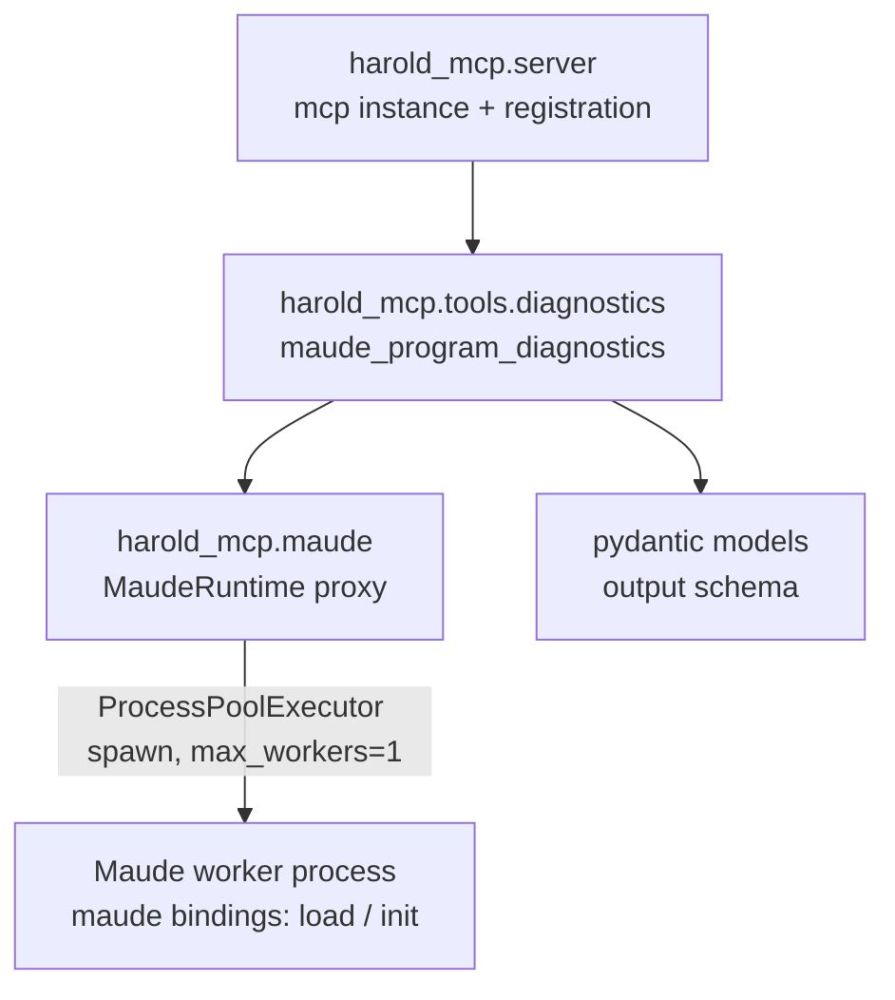

# Research: Existing code patterns in harold-mcp

<!-- Research topic 3 of the PDD project. Based on reading the source and the committed
     knowledge base at `../../.agents/summary/` (index.md, interfaces.md, components.md,
     data_models.md), per the AGENTS.md routing instructions. -->

## 1. Server and tool registration (`src/harold_mcp/server.py`)

- Single shared `mcp = FastMCP(name="Harold", instructions=..., website_url=..., icons=[HAROLD_ICON])`.
- Tools register with `@mcp.tool` on this instance. The placeholder `greet` tool (hello-world
  reduction of `2 * 3` in `NAT`) is **removed** in v1 (decision Q2) — `maude_program_diagnostics`
  becomes the first real tool.
- `run()` starts the **Maude worker process** before `mcp.run()` (fail-fast at startup if Maude
  cannot initialize in the worker; see
  [`worker-process-architecture.md`](worker-process-architecture.md)).

**Pattern for the new tool** (per knowledge base `components.md` and the rough idea):

- Implementation lives in `src/harold_mcp/tools/diagnostics.py`; annotated with `@mcp.tool`.
- Registration wiring: `tools/diagnostics.py` must import `mcp` from `harold_mcp.server`
  (`from harold_mcp.server import mcp`), and **something must import** `harold_mcp.tools.diagnostics`
  so the decorator runs. Options: import it at the end of `server.py` (after `mcp` is defined),
  or from `main.py`. Note the import cycle shape: `server.py` → `tools.diagnostics` →
  `server.py`; safe only if the `server.py` import happens after `mcp` is created, or if
  `main.py` imports both. Design phase must pick one (see `interfaces.md`: "Modules register
  tools on it via `@mcp.tool`").
- **Runtime access via dependency injection** (decision from requirements feedback): the tool
  should receive the `MaudeRuntime` singleton as a parameter using FastMCP custom
  dependencies — e.g. `runtime: MaudeRuntime = Depends(get_runtime)` — see
  <https://gofastmcp.com/servers/dependency-injection#custom-dependencies>. `Depends(...)`
  parameters are injected at runtime and **excluded from the MCP tool schema**, so the tool
  keeps a clean `path: str` schema while `harold_mcp.maude.get_runtime()` supplies the
  singleton.

## 2. Maude access layer (`src/harold_mcp/maude.py`)

- Today: `init_maude()` (once per process, `advise=False`) + `MaudeRuntime` serializing
  `get_module`/`load_program`/`load_module` on an `RLock` ("last load wins", no wrapper caching —
  see `.agents/planning/sigsegv-under-load/issue.md`).
- **v1 rework** (decision Q1): the interpreter moves into a dedicated worker process
  driven by a `ProcessPoolExecutor` (transport refined 2026-08-24, see
  [`process-pool-executor.md`](process-pool-executor.md)); `MaudeRuntime` becomes a **proxy**
  that submits calls to the pool and returns serializable results (SWIG wrappers cannot
  cross processes). The wrapper-returning methods (`get_module`, `load_module`) disappear;
  v1 needs only `load_diagnostics(path) -> DiagnosticsResult` plus worker lifecycle
  management.
- `get_runtime()` — process-wide proxy singleton (worker handle + queues).
- Error hierarchy adapted: `MaudeError(RuntimeError)` base; `MaudeInitError` (worker failed to
  initialize Maude); `MaudeLoadError(.program_path)` (hard load failure); plus a
  worker-crash/unavailable error. `MaudeModuleNotFoundError` becomes obsolete for v1 (no
  module lookups across the process boundary).

**Implications for the diagnostics tool**:

- The main process must **never** import or call `maude.*` directly; the worker is the only
  place that touches the interpreter. Tool code stays a thin adapter over the proxy, received
  via `Depends(get_runtime)` (see above).
- The worker performs the fd-2 warning capture around `maude.load` and returns the parsed
  `Warning:` lines (see [`maude-bindings.md`](maude-bindings.md),
  [`worker-process-architecture.md`](worker-process-architecture.md)).
- Hard failure (`maude.load` returns `False`) vs. warnings vs. clean is the worker's
  tri-state outcome; the proxy maps it onto the pydantic result model.

## 3. Typing, linting, and style constraints (from `pyproject.toml` + knowledge base)

- Python ≥ 3.14, line length 120, `ruff format` (preview), mypy strict:
  `disallow_untyped_defs = true` — **all functions/methods need full annotations**.
- `maude` has no stubs: mypy override `ignore_missing_imports` → Maude values are `Any`.
  Our new pydantic models are fully typed; boundary conversions will need explicit handling.
- Ruff ruleset is broad (E, W, F, I, UP, SIM, B, S, RUF, TRY, C90, ...). Ruff auto-fix fails
  CI — run `ruff check` + `ruff format` before committing.
- Dependencies: `fastmcp>=3.4.7`, `maude>=1.6.0`, `mcp>=1.29.0`. Pydantic is available via
  fastmcp; FastMCP ≥ 3.4 supports structured outputs per the tools docs (see
  [`tool-schema.md`](tool-schema.md)).

## 4. Tests

- `tests/unit/` — mocked, hermetic. Current `test_maude.py` (9 tests around
  `get_module`/`load_program`/`load_module` and `init_maude`) is **replaced** by tests for the
  worker proxy: startup, `load_diagnostics` delegation, warning parsing (synthetic stderr
  text), crash detection/restart, shutdown. `test_diagnostics.py` (unit) mocks the proxy.
- `tests/integration/` — real worker + real interpreter; fixtures in
  `tests/integration/fixtures/`:
  - `hello.maude` / `hello2.maude` — clean programs (module `HELLO-WORLD`).
  - `broken-recoverable.maude` — warning (`missing is keyword.`) but still loads/works.
  - `broken-non-recoverable.maude` — 14 warnings, module NOT defined.
  - `no_new_module.maude` — no modules defined, only commands; must still report `success`.
  Integration tests assert all four outcomes through the worker protocol.
- `make test` runs pytest with coverage (`--cov`, branch coverage enabled).

## 5. Docs and knowledge base

- MkDocs + mkdocstrings: new modules need a `::: harold_mcp.<module>` entry in
  `docs/modules.md`; `make docs-test` is strict.
- Docstrings on the tool function become the MCP tool description (FastMCP parses the
  docstring; parameter descriptions from the docstring `Args:` section or `Annotated`/`Field`).
- After significant changes, re-run the codebase-summary skill to keep `.agents/summary/`
  in sync (Custom Instructions in AGENTS.md).

## 6. Module layering (from knowledge base `architecture.md` / `components.md`)

- `tools/` is currently an empty placeholder package — the new module is its first occupant.
- **No Maude init at import time**: importing `harold_mcp.server` builds the `mcp` instance but
  does not initialize Maude. In v1, the Maude worker (which owns the interpreter and its
  `maude.init(advise=False)`) is started in `server.run()` before `mcp.run()` — intentional,
  to fail fast at startup. Keep heavy logic out of import time.
- **stderr isolation**: capture happens inside the worker process, so the main process keeps
  FastMCP's default stderr logging (spec-recommended for stdio servers); the file-logging plan
  in [`logging.md`](logging.md) is **not needed** for v1.

## Sources

- `src/harold_mcp/server.py`, `src/harold_mcp/maude.py`, `pyproject.toml`
- Knowledge base: `../../.agents/summary/index.md`, `interfaces.md`, `components.md`, `data_models.md`
- AGENTS.md (repo conventions)
