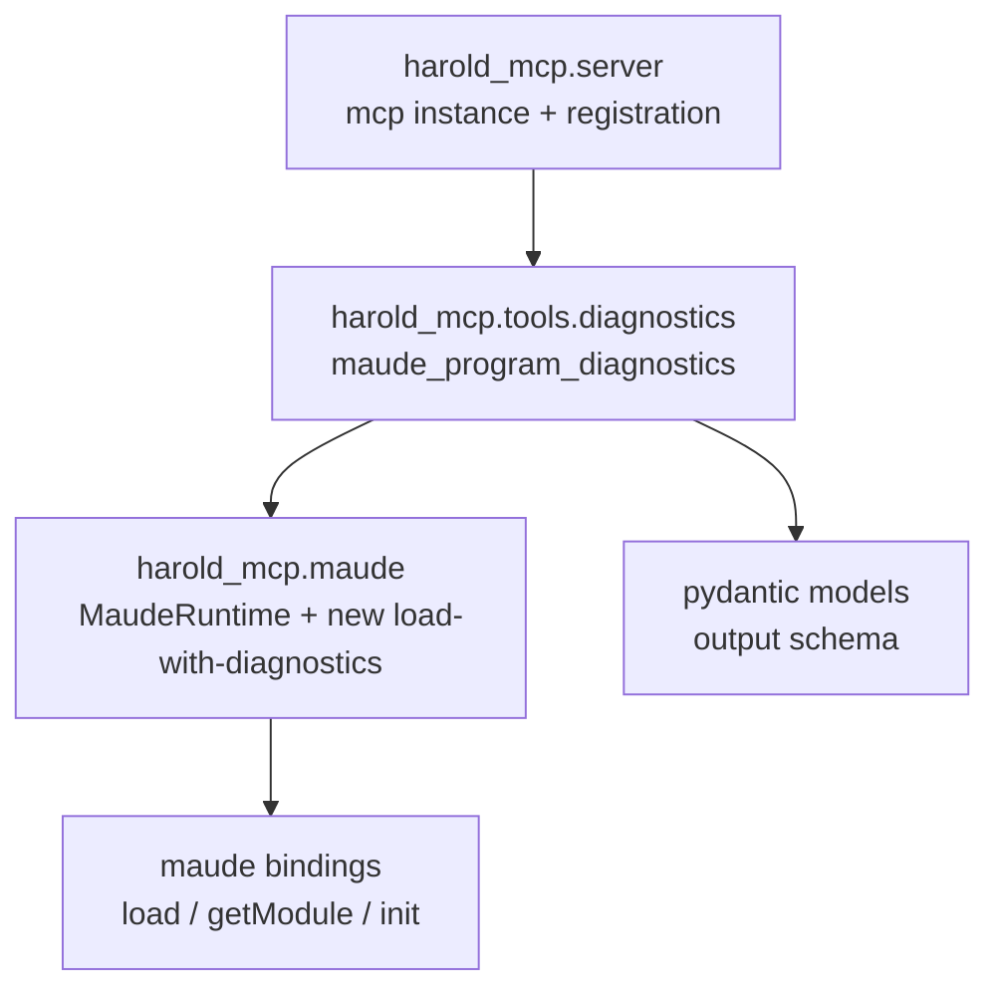

# Research: Existing code patterns in harold-mcp

<!-- Research topic 3 of the PDD project. Based on reading the source and the committed
     knowledge base at `../../.agents/summary/` (index.md, interfaces.md, components.md,
     data_models.md), per the AGENTS.md routing instructions. -->

## 1. Server and tool registration (`src/harold_mcp/server.py`)

- Single shared `mcp = FastMCP(name="Harold", instructions=..., website_url=..., icons=[HAROLD_ICON])`.
- Tools register with `@mcp.tool` on this instance. Current tool: `greet(name: str) -> str`
  (hello-world; reduces `2 * 3` in `NAT`).
- `run()` calls `init_maude()` before `mcp.run()` (fail-fast at startup).

**Pattern for the new tool** (per knowledge base `components.md` and the rough idea):

- Implementation lives in `src/harold_mcp/tools/diagnostics.py`; annotated with `@mcp.tool`.
- Registration wiring: `tools/diagnostics.py` must import `mcp` from `harold_mcp.server`
  (`from harold_mcp.server import mcp`), and **something must import** `harold_mcp.tools.diagnostics`
  so the decorator runs. Options: import it at the end of `server.py` (after `mcp` is defined),
  or from `main.py`. Note the import cycle shape: `server.py` → `tools.diagnostics` →
  `server.py`; safe only if the `server.py` import happens after `mcp` is created, or if
  `main.py` imports both. Design phase must pick one (see `interfaces.md`: "Modules register
  tools on it via `@mcp.tool`").
- **Runtime access via dependency injection** (decision from requirements feedback): the tool
  should receive the `MaudeRuntime` singleton as a parameter using FastMCP custom
  dependencies — e.g. `runtime: MaudeRuntime = Depends(get_runtime)` — see
  <https://gofastmcp.com/servers/dependency-injection#custom-dependencies>. `Depends(...)`
  parameters are injected at runtime and **excluded from the MCP tool schema**, so the tool
  keeps a clean `path: str` schema while `harold_mcp.maude.get_runtime()` supplies the
  singleton.

## 2. Maude access layer (`src/harold_mcp/maude.py`)

- `init_maude()` — once per process, double-checked locking, `advise=False`, retry on failure,
  raises `MaudeInitError`.
- `MaudeRuntime` — all interpreter access serialized on an `RLock`; **no module wrapper caching**
  ("last load wins"; see `.agents/planning/sigsegv-under-load/issue.md` for the SIGSEGV rationale).
  - `get_module(name) -> Any` — fresh wrapper or `MaudeModuleNotFoundError`.
  - `load_program(path: str | Path) -> None` — resolves to absolute path, calls `maude.load`;
    raises `MaudeLoadError` on `False`.
  - `load_module(path, name) -> Any` — load + get.
- `get_runtime()` — process-wide singleton (holds only the lock).
- Error hierarchy: `MaudeError(RuntimeError)` → `MaudeInitError`, `MaudeLoadError(.program_path)`,
  `MaudeModuleNotFoundError(.module_name)`.

**Implications for the diagnostics tool**:

- All new Maude interaction must go through `MaudeRuntime` (never call `maude.*` directly from
  tool code) and must hold the runtime lock. An stderr-capture "load with diagnostics" operation
  belongs in this layer (see [`maude-bindings.md`](maude-bindings.md)), e.g. a new
  `MaudeRuntime` method, so the tool code stays a thin adapter that receives the runtime via
  `Depends(get_runtime)` (see above).
- `load_program` currently raises on hard failure; the diagnostics flow needs the tri-state
  outcome (hard failure / loaded-with-warnings / clean) instead — likely a new method rather
  than changing `load_program` semantics (design decision).

## 3. Typing, linting, and style constraints (from `pyproject.toml` + knowledge base)

- Python ≥ 3.14, line length 120, `ruff format` (preview), mypy strict:
  `disallow_untyped_defs = true` — **all functions/methods need full annotations**.
- `maude` has no stubs: mypy override `ignore_missing_imports` → Maude values are `Any`.
  Our new pydantic models are fully typed; boundary conversions will need explicit handling.
- Ruff ruleset is broad (E, W, F, I, UP, SIM, B, S, RUF, TRY, C90, ...). Ruff auto-fix fails
  CI — run `ruff check` + `ruff format` before committing.
- Dependencies: `fastmcp>=3.4.7`, `maude>=1.6.0`, `mcp>=1.29.0`. Pydantic is available via
  fastmcp; FastMCP ≥ 3.4 supports structured outputs per the tools docs (see
  [`tool-schema.md`](tool-schema.md)).

## 4. Tests

- `tests/unit/` — mocked, hermetic. Existing pattern (`test_maude.py`): `unittest.mock.patch`
  on `harold_mcp.maude.maude.*` (e.g. `patch.object(maude_module.maude, "load", return_value=True)`),
  autouse fixture resets module state. New unit tests for the diagnostics layer can mock the
  runtime and feed synthetic captured-stderr text through the warning parser.
- `tests/integration/` — real interpreter; fixtures in `tests/integration/fixtures/`:
  - `hello.maude` / `hello2.maude` — clean programs (module `HELLO-WORLD`).
  - `broken-recoverable.maude` — warning (`missing is keyword.`) but still loads/works.
  - `broken-non-recoverable.maude` — 14 warnings, module NOT defined.
  These fixtures were built exactly for this tool; integration tests should assert all three
  outcomes.
- `make test` runs pytest with coverage (`--cov`, branch coverage enabled).

## 5. Docs and knowledge base

- MkDocs + mkdocstrings: new modules need a `::: harold_mcp.<module>` entry in
  `docs/modules.md`; `make docs-test` is strict.
- Docstrings on the tool function become the MCP tool description (FastMCP parses the
  docstring; parameter descriptions from the docstring `Args:` section or `Annotated`/`Field`).
- After significant changes, re-run the codebase-summary skill to keep `.agents/summary/`
  in sync (Custom Instructions in AGENTS.md).

## 6. Module layering (from knowledge base `architecture.md` / `components.md`)

- `tools/` is currently an empty placeholder package — the new module is its first occupant.
- **No Maude init at import time**: importing `harold_mcp.server` builds the `mcp` instance but
  does not initialize Maude. Initialization happens (a) eagerly in `server.run()` before
  `mcp.run()` — intentional, to fail fast at startup — and (b) inside
  `MaudeRuntime._maude_locked()` as an idempotent precondition (`init_maude()` returns
  immediately once initialized; the check is deliberately cheap because the performance penalty
  is negligible for this use case). Keep heavy logic out of import time.
- **Logging and stderr-capture isolation**: the server's own logs must not land on fd 2 during
  the warning-capture window; see [`logging.md`](logging.md).

## Sources

- `src/harold_mcp/server.py`, `src/harold_mcp/maude.py`, `pyproject.toml`
- Knowledge base: `../../.agents/summary/index.md`, `interfaces.md`, `components.md`, `data_models.md`
- AGENTS.md (repo conventions)
