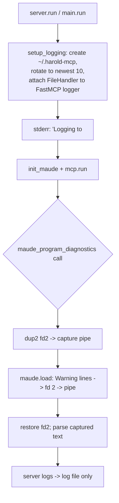

# Research: Logging isolation for stderr warning capture

<!-- Research topic 4 of the PDD project. Spun off from [`maude-bindings.md`](maude-bindings.md):
     the warning capture mechanism redirects fd 2 (stderr), so the server's own logging must
     not write to fd 2 during the capture window. -->

## Problem

- Maude prints `Warning:` diagnostics to **fd 2 (stderr)** via C++, and our capture plan
  (`os.dup2` around the locked `maude.load` call) reads everything written to fd 2 in that
  window (see [`maude-bindings.md`](maude-bindings.md)).
- harold-mcp's loggers come from `fastmcp.utilities.logging.get_logger`, which nests under the
  `FastMCP` logger namespace; FastMCP's default handlers stream to stderr.
- The MCP spec deprecation registry
  (<https://modelcontextprotocol.io/specification/2026-07-28/deprecated>, entry for the
  deprecated *Logging* feature) recommends: *"Log to `stderr` for stdio transports; use
  OpenTelemetry for observability."* The hard invariant for stdio is **never write to stdout**
  (stdout is the transport); stderr is the recommended sink.
- If server logs land on fd 2 while we capture, they would be parsed as fake Maude warnings
  (or crash the parser). Hence: **log to a file instead of stderr**, with a single stderr line
  at startup pointing at the log file. This is a deliberate, documented deviation from the
  spec's "log to stderr" recommendation, justified by the capture requirement; stdout stays
  clean either way.

## Plan (v1, decided with the user)

New `setup_logging()` in `src/harold_mcp/logging.py`, called early in `main.run()` /
`server.run()` (before `init_maude()` and `mcp.run()`):

1. **Log directory**: `~/.harold-mcp/` (created if missing). Overridable via an environment
   variable (`HAROLD_LOG_DIR`).
2. **Log file**: one file per server start, name unique across concurrent sessions —
   `harold-mcp-<UTC timestamp>.log` (a date-only name would collide when several AI coding
   sessions run the server on the same day).
3. **Rotation**: on startup, delete old `harold-mcp-*.log` files beyond the newest 10.
4. **Handler**: attach a `logging.FileHandler` to the `FastMCP` namespace logger (harold-mcp
   loggers propagate to it). No stream handler, so nothing is written to stderr by logging.
   Level from `HAROLD_LOG_LEVEL` (default `INFO`).
5. **Startup notice**: print exactly one line to stderr with the resolved log file path
   (before `mcp.run()`), so a human debugging the MCP client can find the logs. Everything
   after that goes to the file.

## API notes

- `fastmcp.utilities.logging.configure_logging(level, logger=None, enable_rich_tracebacks=..., **rich_kwargs)`
  installs a `RichHandler` (stderr stream) — it has **no file-handler parameter**. So for the
  file-logging plan we configure handlers directly (standard `logging`), not via
  `configure_logging`. (Docs: <https://gofastmcp.com/python-sdk/fastmcp-utilities-logging>.)
- `get_logger(name)` prefixes names with `FastMCP.` — harold-mcp loggers are therefore children
  of the `FastMCP` logger; configuring that parent (level + file handler) covers both FastMCP's
  own output (e.g. "Server running on stdio") and harold-mcp's.

## Env-var configuration options (for requirements/design)

- Simplest v1: plain `os.getenv("HAROLD_LOG_DIR")` / `os.getenv("HAROLD_LOG_LEVEL")`.
- The user suggested Pydantic settings: `pydantic-settings` is **not** currently a dependency
  (fastmcp pulls `pydantic` but not `pydantic-settings`); adding it requires a `uv.lock`
  update. Decide in the requirements phase: new dependency vs. plain `os.getenv` for v1.

## Residual risks (documented for the design)

- Direct `print()`/`sys.stderr.write` in our own code would still land on fd 2 during the
  capture window → avoid prints in the runtime/tool layers (ruff already flags `T20` print).
- Python's `warnings` module defaults to stderr → not used in the capture path.
- The capture window is tiny and holds `MaudeRuntime`'s lock; with file logging, the only fd-2
  writer inside the window is Maude itself.

## Sources

- MCP spec deprecation registry: <https://modelcontextprotocol.io/specification/2026-07-28/deprecated>
- FastMCP logging API: <https://gofastmcp.com/python-sdk/fastmcp-utilities-logging>
- `src/harold_mcp/logging.py` (current re-export of `fastmcp.utilities.logging.get_logger`)
- [`maude-bindings.md`](maude-bindings.md) (capture mechanism)
