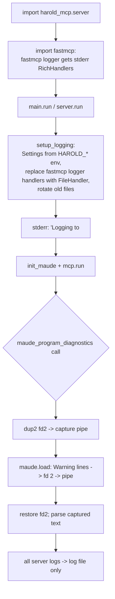

# Research: Logging isolation for stderr warning capture

> **Status: CONDITIONAL.** This plan applies only if Maude stays **in-process** (option A).
> The alternative — a dedicated Maude worker process (see
> [`worker-process-architecture.md`](worker-process-architecture.md)) — isolates the fd-2
> capture to a separate process, lets the main process keep its default stderr logging
> (which the MCP spec recommends for stdio servers), and makes this file-logging plan
> unnecessary. Decision recorded in [`../idea-honing.md`](../idea-honing.md) (Q1).

<!-- Research topic 4 of the PDD project. Spun off from [`maude-bindings.md`](maude-bindings.md):
     the warning capture mechanism redirects fd 2 (stderr), so the server's own logging must
     not write to fd 2 during the capture window. Verified against the installed fastmcp 3.4.7
     source in `.venv/lib/python3.14/site-packages/fastmcp/`. -->

## Problem

- Maude prints `Warning:` diagnostics to **fd 2 (stderr)** via C++, and our capture plan
  (`os.dup2` around the locked `maude.load` call) reads everything written to fd 2 in that
  window (see [`maude-bindings.md`](maude-bindings.md)).
- FastMCP itself logs to stderr by default — e.g.
  `INFO Starting MCP server 'Harold' with transport 'stdio'` from
  `fastmcp/server/mixins/transport.py:242`. If such a message lands on fd 2 while we capture,
  it would be parsed as a fake Maude warning (or crash the parser). Hence: **log to a file
  instead of stderr**, with a single stderr line at startup pointing at the log file.
- MCP spec context: the deprecated *Logging* feature's migration path is
  *"Log to `stderr` for stdio transports"*
  (<https://modelcontextprotocol.io/specification/2026-07-28/deprecated>). File logging is a
  deliberate, documented deviation justified by the capture requirement. The hard invariant
  for stdio is **never write to stdout** (stdout is the transport); that stays clean.

## How FastMCP logging actually works (verified in fastmcp 3.4.7)

- `fastmcp/__init__.py` runs **at import time**:

  ```python
  settings = Settings()  # env prefix FASTMCP_
  if settings.log_enabled:  # default True
      _configure_logging(level=settings.log_level, enable_rich_tracebacks=...)
  ```

- `fastmcp.utilities.logging.configure_logging` (source read) then, on the **`fastmcp`**
  logger: sets `propagate = False`, **removes existing handlers**, and adds two
  `RichHandler`s writing to **stderr** (`Console(stderr=True)`). It has **no file-handler
  parameter**.
- `get_logger(name)` returns `logging.getLogger(f"fastmcp.{name}")` (lowercase `fastmcp.`),
  so harold-mcp loggers (`get_logger("harold_mcp.server")`) are children of the `fastmcp`
  logger and inherit its handlers/propagation.
- Nothing re-configures logging at `run()` time: the `transport.py:242` "Starting MCP server
  ..." message is just a log record through the `fastmcp` logger. The import-time
  configuration is the only one.

### Consequences for our plan

1. **Keep using `from fastmcp.utilities.logging import get_logger`** — it is just a namespaced
   logger factory; the problem is only FastMCP's default *handlers* (stderr), not the factory.
2. Our `setup_logging()` (called at the top of `run()`, i.e. *after* the import-time
   configuration has happened) must **replace** the handlers on the `fastmcp` logger:
   - `logger = logging.getLogger("fastmcp")`
   - remove existing handlers (the stderr RichHandlers),
   - set `logger.propagate = False` and the level,
   - add a `logging.FileHandler` pointing at the session log file (optionally a
     `RichHandler(console=Console(file=...))` for pretty logs in the file).
   Because nothing reconfigures logging after import, this sticks for the whole server
   lifetime — FastMCP's own messages ("Starting MCP server ...", transport errors, etc.)
   then go to the file too.
3. `FASTMCP_LOG_ENABLED=false` in the client's env would skip the import-time stderr handlers,
   but our handler-replacement approach works regardless of that setting (it replaces
   whatever is there), so we do not depend on it.

## Configuration via pydantic-settings (decided)

- Add **`pydantic-settings`** as a direct dependency (`uv add pydantic-settings`; it is
  already present in the venv as a transitive dependency of fastmcp, version 2.15.0, so the
  lockfile change is small).
- New `Settings(BaseSettings)` in `src/harold_mcp/logging.py` (or a dedicated module), with
  `env_prefix = "HAROLD_"`:

  | Env var | Field | Default | Meaning |
  | --- | --- | --- | --- |
  | `HAROLD_LOG_DIR` | `log_dir: Path` | `~/.harold-mcp` | directory for log files (created if missing) |
  | `HAROLD_LOG_LEVEL` | `log_level: str` | `INFO` | logging level |
  | `HAROLD_MAX_LOG_FILES` | `max_log_files: int` | `10` | how many log files to keep |

- The resolved log file path is printed **once to stderr** at startup (before `mcp.run()`);
  everything after that goes to the file.

## Rotation: TimedRotatingFileHandler vs. per-session file + sweep

The user proposed `logging.handlers.TimedRotatingFileHandler` with `backupCount`
(<https://docs.python.org/3/library/logging.handlers.html#logging.handlers.TimedRotatingFileHandler>).
Analysis:

| Aspect | `TimedRotatingFileHandler` + `backupCount` | Per-session file + startup sweep |
| --- | --- | --- |
| File count control | ✅ `backupCount` caps backups | ✅ delete beyond newest `HAROLD_MAX_LOG_FILES` at startup |
| Concurrent sessions (a stated goal) | ⚠️ all sessions append to **one** base file → interleaved logs | ✅ one file per server start (timestamp in name) → clean per-session logs |
| Rotation race | ⚠️ at interval rollover each process calls `doRollover()`; the loser hits a missing base file → `handleError` → traceback printed to **stderr** — exactly the fd-2 pollution we are eliminating (it would be captured as fake Maude warnings if it fires during a capture window) | ✅ no rotation at runtime; sweep runs once at startup, outside capture windows |
| Intra-session size bound | ❌ rotates only on time boundaries; a busy session can grow a huge file within one interval | ❌ one file per session grows unboundedly (acceptable for v1; local server, modest volume) |

**Recommendation**: per-session file (`harold-mcp-<UTC timestamp>.log`) + startup sweep.
Deterministic, race-free, and gives clean per-session logs for concurrent AI-coding sessions.
`TimedRotatingFileHandler` remains the right tool later if single-process guarantees emerge or
we add size-based rotation. (Decision to be confirmed in the requirements phase.)

## Startup flow



## Residual risks (documented for the design)

- Direct `print()`/`sys.stderr.write` in our own code would still land on fd 2 during the
  capture window → avoid prints in the runtime/tool layers (ruff flags `T20`).
- Python's `warnings` module defaults to stderr → not used in the capture path.
- Third-party libraries writing to fd 2 inside the window: after the file-logging change, the
  only expected writer is Maude itself; the window is tiny and holds `MaudeRuntime`'s lock.

## Sources

- Installed fastmcp 3.4.7 source: `fastmcp/__init__.py`, `fastmcp/utilities/logging.py`,
  `fastmcp/server/mixins/transport.py` (verified 2026-08-22).
- MCP spec deprecation registry: <https://modelcontextprotocol.io/specification/2026-07-28/deprecated>
- FastMCP logging API docs: <https://gofastmcp.com/python-sdk/fastmcp-utilities-logging>
- Python logging handlers: <https://docs.python.org/3/library/logging.handlers.html#logging.handlers.TimedRotatingFileHandler>
- `src/harold_mcp/logging.py` (current re-export of `fastmcp.utilities.logging.get_logger`)
- [`maude-bindings.md`](maude-bindings.md) (capture mechanism)
