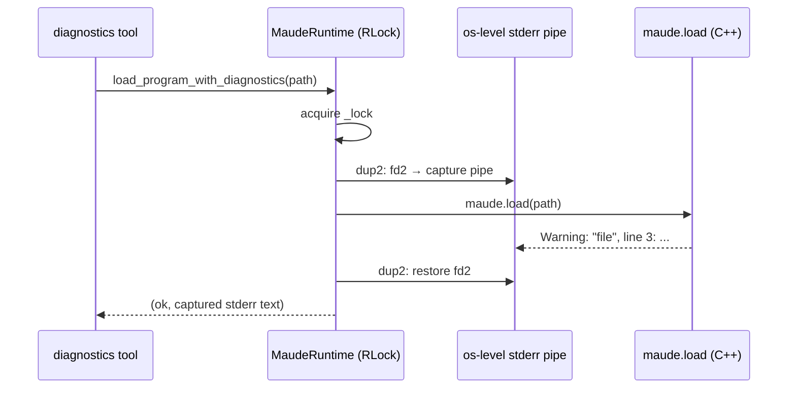

# Research: Detecting load failures and capturing warnings in the `maude` bindings

<!-- Research topic 2 of the PDD project. Empirical experiments run on 2026-08-22 in the
     harold-mcp environment against the installed `maude` package (bindings source inspected
     at the sibling repo `../../../../maude-bindings/`). -->

## Questions (from the rough idea)

1. Does the `maude` package provide a boolean for "the program is fully well formed"?
2. Can we capture the warning output that `maude.init(advise=...)` / `maude.load(...)`
   produce, to build the output of `maude_program_diagnostics`?

## 1. What `maude.init(advise=...)` actually controls

Bindings source: `maude-bindings/src/maude_wrappers.cc` (`init`), exposed in
`maude-bindings/swig/maude.i`:

```cpp
bool init(bool loadPrelude=true, int randomSeed=0, bool advise=true, bool handleInterrupts=false);
```

The flag is stored into Maude's `globalAdvisoryFlag`:

```cpp
RandomOpSymbol::setGlobalSeed(randomSeed);
globalAdvisoryFlag = advise;
```

- `globalAdvisoryFlag` gates **advisories only** (`Advisory: redefining module X.`).
- **`Warning:` messages are NOT gated by it.** Empirically, harold-mcp's `init_maude()`
  (which calls `maude.init(advise=False)`) still printed all 14 warnings when loading the
  broken fixture. So the docstring "Whether debug messages should be printed" is misleading:
  it's the *advisory* flag.

## 2. What `maude.load(path)` returns

Bindings source: `maude-bindings/src/maude_wrappers.cc` (`load`):

```cpp
bool load(const char * name) {
  ...
  if (findFile(name, directory, fileName, lineNr) &&
      includeFile(directory, fileName, true, lineNr)) {
    UserLevelRewritingContext::ParseResult parseResult = NORMAL;
    while (parseResult == NORMAL) {
      if (yyparse(&parseResult))   // only unrecoverable parser failures
        return false;
    }
    return true;
  }
  return false;
}
```

- Returns `false` only when the file **cannot be found/included** or the bison parser
  hits an **unrecoverable** failure.
- The parser has error-recovery productions, so **syntactically broken files still return
  `true`** while emitting warnings.

### Empirical verification (2026-08-22, harold-mcp venv)

```python
import maude

maude.init(advise=False)
r = maude.load("tests/integration/fixtures/broken-non-recoverable.maude")
print("LOAD_RESULT =", r)  # → True (!)
m = maude.getModule("HELLO-WORLD")
print("MODULE =", m)  # → None
```

with stderr redirected to a file:

```
LOAD_RESULT = True
MODULE = None
=== STDERR ===
Warning: <standard input>, line 1: skipped unexpected token: fmo
Warning: <standard input>, line 1: skipped unexpected token: HELLO-WORLD
Warning: "broken-non-recoverable.maude", line 2: skipped unexpected token: pr
Warning: "broken-non-recoverable.maude", line 2: skipped unexpected token: NAT
Warning: "broken-non-recoverable.maude", line 3: skipped unexpected token: f
... (14 warnings total)
```

**Conclusion**: `maude.load`'s bool is NOT a "well-formed" indicator. Failure must be
detected by combining **only**:

1. `maude.load(path) == False` → hard failure (missing file / unrecoverable parse failure).
2. Captured `Warning:` lines → recoverable issues, which the diagnostics tool must still
   surface (per the rough idea: Maude can work with ill-formatted files, but the AI agent
   should be told to fix them).

**Explicitly rejected**: detecting failure via changes in the set of loaded modules. A Maude
program may legitimately define **no modules at all** and just run commands against predefined
modules (e.g. the fixture `tests/integration/fixtures/no_new_module.maude`:
`red in NAT : 1 + 2 .` — loads fine, defines nothing). Module-set heuristics are therefore
unreliable; do not use them.

## 3. Where warnings go, and how to capture them

- All `Warning:` lines are printed by Maude's C++ `IssueWarning(...)` (many call sites,
  e.g. `maude-bindings/src/easyTerm.cc`, `model_checking.cc`) to **stderr** — verified
  empirically: with `2>/tmp/err.txt`, every warning landed in the stderr file and stdout
  only contained the Python prints.
- Because the writes go to the C++ stream (fd 2) directly, Python-level redirection
  (`contextlib.redirect_stderr`, `capsys`) **cannot** capture them. OS-level fd redirection
  is required.
- The bindings expose **no warning hook**: `swig/maude.i` / `swig/misc.i` expose `load`,
  `input`, `init`, `getModule`, `getCurrentModule`, `tokenize`, `getModules`, `getView(s)`,
  `setRandomSeed`, etc. — nothing warning-related. `src/hooks.cc` is only for term-level
  special operators.

### Capture options

| Option | How | Assessment |
| --- | --- | --- |
| **A. fd-level stderr capture** | Around the locked `maude.load` call: `os.dup2` fd 2 to a pipe/`tempfile`, read back, restore. | **Recommended for v1.** Works because C++ writes to fd 2. Risks: process-global (can capture unrelated stderr from other threads); mitigated by holding `MaudeRuntime`'s lock during capture and keeping the window tiny. |
| B. Patch/vendor the bindings | Add a warning callback in `maude_wrappers.cc` / SWIG interface | Cleanest long-term, but harold-mcp depends on the **pip-installed** `maude` package — out of scope for v1. |
| C. Subprocess CLI | Run the `maude` binary (`load file.maude`) and parse output | Heavyweight (process spawn, prelude reload per call), duplicates interpreter state. Not needed. |

Option A design sketch (to be detailed in the design phase):



Notes for the design phase:

- The first-line warnings were attributed to `<standard input>` in the Python API run but to
  the file name in the REPL run (see rough idea). Parsing must tolerate both, and may
  fall back to the input file path.
- The parser is shared and stateful (redefining modules is "last load wins"); a diagnostics
  call mutates the interpreter state like any `load_program` call. Acceptable — consistent
  with the existing `load_program` semantics, but worth documenting in the tool description.

## 4. Warning formats observed

```
Warning: "<file>", line <N>: <message>
Warning: "<file>", line <N> (<context>): <message>      # e.g. (fmod HELLO-WORLD)
Warning: <standard input>, line <N>: <message>
```

Messages observed: `skipped unexpected token: <tok>`, `syntax error`,
`missing is keyword.`. A regex like
`Warning:\s+(\S[^:]*),\s+line\s+(\d+)\s*(?:\([^)]*\))?:\s*(.*)` handles the variants.

## 5. Key findings summary

1. `advise=False` suppresses advisories, **not** warnings — warnings always print to stderr.
2. `maude.load` returns `True` for garbage input; the bool only signals hard failures.
3. Program well-formedness must be inferred from (a) the `maude.load` bool and (b) captured
   warnings. Module availability is NOT used (programs may define no modules; see the
   `no_new_module.maude` fixture).
4. Warning capture requires **os-level stderr redirection** inside the runtime lock (no
   binding-level hook exists); parse lines into severity/line/message.
5. "Error" severity is synthesized for the hard-failure case; Maude itself only emits
   `Warning:` (and `Advisory:`, suppressed).

## Sources

- `maude-bindings` checkout at the repo root sibling directory (`/home/juanrh/git/demiourgoi/maude-bindings`):
  `src/maude_wrappers.cc`, `src/hooks.cc`, `swig/maude.i`, `swig/misc.i`.
- Empirical runs in the harold-mcp venv (2026-08-22).
- Rough idea experiments: `../rough-idea.md`.
- Bindings API docs: <https://fadoss.github.io/maude-bindings/> (referenced in the rough idea).
