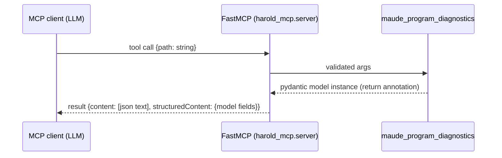

# Research: Tool output schema for `maude_program_diagnostics`

<!-- Research topic 1 of the PDD project. Sources cited inline. -->

## Question

What should the output schema of the `maude_program_diagnostics` MCP tool be?
(Open question in [`../rough-idea.md`](../rough-idea.md), "Tool schema" section.)

## 1. Inspiration: the Zed "diagnostics" MCP tool

The rough idea points to three Zed sources:

- <https://raw.githubusercontent.com/zed-industries/zed/refs/heads/main/docs/src/diagnostics.md> (docs)
- <https://raw.githubusercontent.com/zed-industries/zed/refs/heads/main/crates/diagnostics/src/diagnostics.rs> (implementation)
- <https://raw.githubusercontent.com/zed-industries/zed/refs/heads/main/crates/diagnostics/src/diagnostic_renderer.rs> (renderer)

### Observed behavior (from the rough idea)

The generic Zed diagnostics tool takes `path: str | null` and returns **plain text**:

```
Diagnostics successfully refreshed.

warning at line 15: Stub file not found for "maude"
warning at line 89: Return type is Any
...
```

Each entry carries **severity** (`warning` / `error`), **line number**, and a **possibly
multi-line message**. No column, no file name (implied by the query), no structured codes.

### Structured data model behind Zed's UI (LSP-style)

The Zed sources show the richer underlying model (`Diagnostic` / `DiagnosticEntry` from the
`language` crate, LSP `DiagnosticSeverity`):

| Field | Notes |
| --- | --- |
| `severity` | `ERROR`, `WARNING`, `INFORMATION`, `HINT` (`lsp::DiagnosticSeverity`) |
| `range` | `start`/`end` points with `row` **and** `column` (0-based) |
| `message` | primary message text; may be Markdown (`markdown` field) |
| `source` | optional diagnostic source (e.g. tool name) |
| `code` / `code_description` | optional structured code + URL |
| `is_primary` | marks the primary entry of a group |
| `group_id` | related diagnostics are grouped (e.g. one error with related hints) |

**Takeaway**: the text format is a lossy rendering of a richer structured model. For a tool
whose consumer is an LLM, structured data is more useful than text it would have to re-parse.

## 2. FastMCP: how the output schema is determined

Source: <https://gofastmcp.com/llms.txt> → [Tools](https://gofastmcp.com/servers/tools.md).

- **Input schema** comes from parameter type annotations (pydantic types supported).
- **Return type annotation → output schema**. FastMCP generates a JSON Schema from the
  return annotation and validates/serializes the result.
- **Object-like results** (`dict`, pydantic models, dataclasses) automatically become
  **`structuredContent`** in the MCP tool result *and* a JSON text `content` block —
  so the LLM gets both machine-readable JSON and human-readable text for free.
- **Primitive returns** (`str`, `int`, `list`) are wrapped under a `"result"` key when an
  output schema exists.
- **`ToolResult`** gives full manual control (`content`, `structured_content`, `meta`).
- **Annotations**: `@mcp.tool(annotations=ToolAnnotations(readOnlyHint=..., openWorldHint=...))`
  let us declare the tool's safety profile. Clients use these hints to skip confirmation
  prompts. → Consider `readOnlyHint=True` (the tool does not modify the user's files or the
  outside world) even though it *does* load the program into the server-side Maude
  interpreter.

### Relevant flow



## 3. What data can the Maude layer actually provide?

From the sibling research note [`maude-bindings.md`](maude-bindings.md) and the empirical
experiments in the rough idea, each Maude diagnostic line carries:

- **severity**: `Warning` (Maude warnings are not distinguished by severity; the only other
  flavor is `Advisory`, which harold-mcp already suppresses via `advise=False`). "Error" can
  be synthesized for the unrecoverable-failure case (`maude.load` → `False`).
- **line number**: integer, 1-based (e.g. `line 3: skipped unexpected token: f`).
- **file name**: usually quoted (`"broken-non-recoverable.maude"`), sometimes
  `<standard input>` (observed for line-1 warnings when loading via the Python API).
- **message**: free text, sometimes multi-line (e.g. `Type of "getModule" is ...` in the
  generic tool; for Maude, messages like `missing is keyword.` can carry a context fragment
  `(fmod HELLO-WORLD)`).
- **No column, no code/ID** — Maude warnings are not structured beyond line + message.

## 4. Proposed schema direction (for the design phase)

A pydantic output model (structured output), because:

1. MCP clients get `structuredContent` (JSON) — an LLM can act on it without fragile text
   parsing; FastMCP also emits a JSON text block for display.
2. It matches the richer Zed `Diagnostic` model (range-shaped positions, like Zed/LSP), minus
   fields Maude cannot provide (columns, codes) — those become nullable/absent.
3. FastMCP derives the JSON Schema from the annotations automatically.

Sketch (refined after requirements feedback; to be finalized during design):

```python
class MaudePosition(BaseModel):
    line: int  # 1-based line number
    column: int | None = None  # Maude does not report columns; reserved for future sources


class MaudeRange(BaseModel):
    start: MaudePosition
    end: MaudePosition | None = None  # Maude reports no span; None = unknown end


class MaudeDiagnostic(BaseModel):
    severity: Literal["warning", "error"]  # Maude emits warnings; error = synthesized hard failure
    range: MaudeRange  # Zed/LSP-style range (columns null for now)
    message: str


class MaudeProgramDiagnosticsResult(BaseModel):
    path: str  # echo of the input file path
    success: bool  # True iff there are NO warnings and NO errors
    diagnostics: list[MaudeDiagnostic]
```

Decisions reflected in the sketch (from requirements feedback):

- **`success` semantics**: `True` **only if there are no warnings and no errors** — a
  recoverable warning (Maude still loads the file) makes `success` false, because the tool's
  purpose is to point out anything the AI agent should fix.
- **Range instead of a bare line number**: Zed/LSP diagnostics use `range` with `start`/`end`
  positions; using the same shape makes the output familiar to LLMs trained on LSP-style
  diagnostics. Maude reports only line numbers, so `column` stays `None` and `end` stays
  `None` (future-proof if a richer source ever provides spans).
- **No module detection**: the result carries no module list; detection relies solely on the
  `maude.load` return value plus captured warnings (a program may define no modules at all —
  e.g. the `no_new_module.maude` fixture with only `red in NAT : 1 + 2 .` — so module-set
  heuristics are unreliable; see [`maude-bindings.md`](maude-bindings.md)).

Alternatives considered (to be documented in the design appendix):

- **Plain text** mimicking the generic Zed diagnostics tool (status line + entries). Simple,
  LLM-friendly prose, but the LLM must re-parse to count/filter severities.
- **`ToolResult`** with structured JSON + a custom human-readable text rendering — possible
  middle ground; the pydantic-model approach already provides both automatically.

## 5. Open considerations for the requirements phase

- Should the tool return only diagnostics, or also a derived convenience summary (e.g. counts
  per severity) alongside the `diagnostics` list?
- Include the `Advisory:` channel (currently suppressed) or keep it out?
- stderr isolation: solved by the dedicated Maude worker process (decision Q1) — see
  [`worker-process-architecture.md`](worker-process-architecture.md); the file-logging plan in
  [`logging.md`](logging.md) is not needed for v1.
- Related future directions from the rough idea: program slicing
  (<https://en.wikipedia.org/wiki/Program_slicing>) — out of scope for v1.

## Sources

- Zed diagnostics docs/source (URLs above; fetched 2026-08-22).
- FastMCP tools docs: <https://gofastmcp.com/servers/tools.md> (fetched 2026-08-22).
- Rough idea experiments: `../rough-idea.md`.
