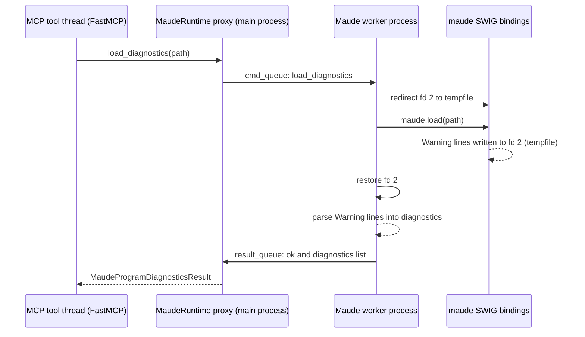

# Research: Dedicated Maude worker process (CHOSEN architecture for v1)

> **Status: CHOSEN for v1** (decision in [`../idea-honing.md`](../idea-honing.md), Q1,
> 2026-08-22). Maude runs in a dedicated long-lived worker subprocess; the MCP server talks
> to it over `multiprocessing` queues. This supersedes the in-process fd-2 capture and the
> file-logging plan ([`logging.md`](logging.md)).

<!-- Research topic 5. Emerged from review of [`maude-bindings.md`](maude-bindings.md) and
     [`logging.md`](logging.md): the fd-2 capture is process-global, and the user proposed
     isolating Maude in a dedicated subprocess instead. -->

## Problem recap (why the worker)

- `os.dup2(write_fd, 2)` redirects **fd 2 for the whole process**. The MCP server is
  multithreaded (FastMCP runs sync tools in a thread pool), so concurrent tool calls /
  FastMCP log records / library output on stderr can interleave into the capture pipe while
  `maude.load` runs — and the redirect also *steals* those threads' stderr for the window.
- File-logging ([`logging.md`](logging.md)) reduces, but cannot eliminate, other fd-2
  writers; it is also based on reverse-engineered FastMCP internals.
- The `maude` bindings have a documented SIGSEGV history (see
  `.agents/planning/sigsegv-under-load/issue.md`): an in-process segfault would kill the
  entire MCP server. This tool feeds arbitrary, LLM-generated, possibly broken Maude files
  to the interpreter in a long-running server.

## Architecture (v1)

The Maude interpreter lives in a **dedicated long-lived worker process**. The worker is
single-threaded, imports only `maude` + stdlib, and serves RPC-style requests over
`multiprocessing` queues. `MaudeRuntime` in the MCP server becomes a thin **proxy** that
forwards calls and returns serializable results.

### Worker command protocol (v1)

- Request: `{"op": str, ...}` — a small op registry, so future tools can add ops without
  restructuring.
- **v1 ops** (with the `greet` placeholder removed, decision Q2, no term ops are needed):
  - `load_diagnostics` `{path: str}` → `{ok: bool, diagnostics: [{line: int | null, message: str}, ...]}`
    or `{error: str}` on worker failure.
- Response: JSON-able dict; sentinel `None` request = shutdown.
- Worker startup: `maude.init(advise=False)` once; if it fails, the worker reports the error
  so the server can fail fast.
- All Maude access happens in the worker's single thread → no interpreter locking needed;
  the queue provides serialization ("last load wins" semantics preserved, as in the current
  `load_program`).

### Warning capture in the worker

Same fd-2 trick as [`maude-bindings.md`](maude-bindings.md), but scoped to the worker:

1. `saved = os.dup(2)`
2. `os.dup2(tmpfile.fileno(), 2)` (regular file — no 64 KB pipe-buffer blocking; the worker
   is single-threaded so no reader thread is needed)
3. `maude.load(path)`
4. restore fd 2; `tmpfile.seek(0)`; read text; parse `Warning:` lines
   (see [`maude-bindings.md`](maude-bindings.md) §4 for formats).

### Lifecycle

- Proxy starts the worker in `server.run()` **before** `mcp.run()` — this replaces the
  current `init_maude()` fail-fast call: worker startup reports Maude-init failure, so the
  server still fails fast at startup.
- Shutdown: sentinel + `join()` on server exit (or FastMCP lifespan).
- Crash detection: `result_queue.get(timeout=...)` failing / `proc.is_alive()` false → the
  current call returns an error ("Maude worker crashed"), and the proxy restarts the worker
  for subsequent calls.
- Start method: **not `fork`** (the parent is threaded — fork+threads is hazardous).
  Use explicit `multiprocessing.get_context("spawn")` (portable; macOS default) or
  `forkserver` (Python 3.14's Linux default).

### Critical invariants

- The worker inherits the parent's **stdout**, which is the MCP stdio transport: the worker
  must **never write to stdout**. stderr only, and only Maude's own output during capture
  windows.
- Worker-side Python code must not `print(...)`/log to stderr during `maude.load` (nothing to
  capture besides Maude); keep worker logging minimal or routed elsewhere.

## Benefits

1. **stderr isolation for free**: the main process keeps FastMCP's default stderr logging
   (what the MCP spec recommends for stdio servers); [`logging.md`](logging.md) is not needed;
   no fd manipulation in the main process.
2. **Crash containment**: a Maude segfault kills only the worker; the server survives,
   reports the failure, and restarts the worker. Strategically important given the SIGSEGV
   history and adversarial inputs.
3. **Simpler concurrency story**: single-threaded worker replaces the RLock serialization
   rationale (the in-process lock disappears).
4. **Controlled environment**: the worker imports only `maude` + stdlib, so nothing else can
   pollute the capture.

## Costs / risks

1. **API change**: SWIG wrapper objects cannot cross the process boundary. The
   wrapper-returning methods (`get_module`, `load_module`) disappear; `MaudeRuntime` becomes a
   proxy. With `greet` removed (Q2), there is **no migration** — only new proxy code. The
   old `tests/unit/test_maude.py` is replaced by worker/proxy tests.
2. **Lifecycle complexity**: spawn/forkserver setup, queue EOF/crash detection, restart
   policy, shutdown hooks, timeouts. (Standard `multiprocessing` ground, but real code.)
3. **Slight per-call latency**: one queue round-trip — negligible vs. file loading + parsing.
4. **Two processes to debug**; ensure the worker never inherits/uses stdout.

## Comparison: in-process vs. worker

| Aspect | In-process + fd capture + file logging | Dedicated worker process (chosen) |
| --- | --- | --- |
| stderr isolation | partial (defensive parsing needed; can lose other threads' stderr lines) | complete (capture scoped to worker) |
| Main-process logging | rework required (file logging, reverse-engineered FastMCP internals) | default stderr logging kept (spec-recommended) |
| Crash containment | none — segfault kills the MCP server | worker restarts; server survives |
| Concurrency | RLock serialization in-process | queue-serialized single-threaded worker |
| API surface | unchanged (live SWIG wrappers) | proxy with serializable results (greet removed, so no migration) |
| Scope for v1 | smaller diff | larger diff (protocol, lifecycle) but no throwaway fd/logging work |

## Sources

- User proposal (worker process + queue + fd-2 capture snippets), conversation 2026-08-22.
- `.agents/planning/sigsegv-under-load/issue.md` (SIGSEGV history in these bindings).
- [`maude-bindings.md`](maude-bindings.md), [`logging.md`](logging.md).
- Python docs: `multiprocessing` (start methods, queues), `os.dup2`.
