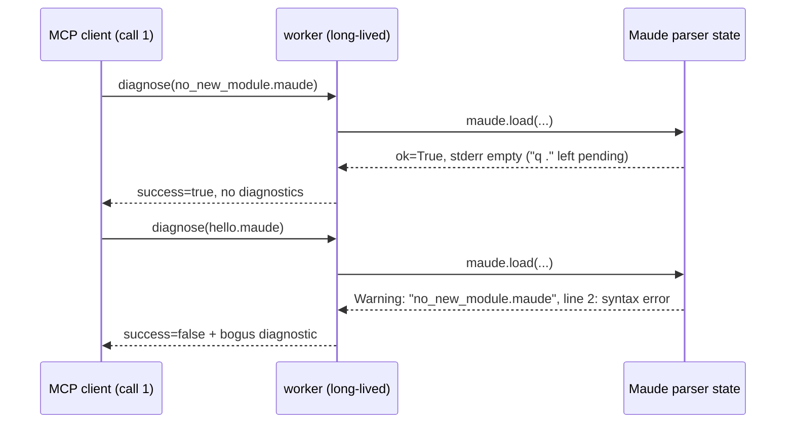

# The deferred `q .` warning quirk (`no_new_module.maude`)

Status: research record — **no fix implemented** (harold-mcp `0.0.4.dev0`, 2026-09-29).
Found while integrating the heuristic linter into `maude_program_diagnostics`; the
integration tests carry a workaround (a dedicated worker for the fixtures the
heuristic provider asserts on) that hides the quirk from the test suite but not
from production. This document records the reproduction, the analysis, and the
options; the experiments live next to it in this directory.

## TL;DR

- Loading a Maude file that contains a top-level `q .` (the REPL quit command)
  leaves the bindings' parser in a **half-parsed state**: `maude.load` returns
  `True` with an empty stderr, but the interrupted command stays pending.
- The pending command is consumed by the **next `maude.load` in the same process**
  (a long-lived worker), and its diagnostic output lands in that call's fd-2
  capture. `worker._parse_warnings` drops the file name embedded in the warning,
  and `InterpreterDiagnosticProvider` attributes every captured warning to the
  file being diagnosed — so a clean program is reported as `success=false` with a
  bogus `syntax error` at the previous file's `q .` line.
- The leaked state is **more than a stray warning**: the interrupted command also
  keeps its file context, so a *relative* path in the next load is resolved
  against the previous file's directory and fails (`unable to locate file`,
  `ok=False` → the tool synthesizes a hard failure error).
- The trigger is narrow (a file containing a live `q .`) but the failure is
  silent, misattributed, and call-order-dependent — a correctness bug of the
  tool's output, not just cosmetic noise.
- Recommended fix: flush the residue **inside the worker** after each load (load
  a dummy empty file, discard its capture) — measured to clear both symptoms,
  keeps the warm pool, sub-millisecond cost. Complement it with a heuristic rule
  flagging REPL-only commands so the `q .` line is reported by the layer that can
  point at it exactly.
- `max_tasks_per_child=1` (the proposal in the issue) also fixes the quirk by
  isolation, but at ≈0.34 s per call (spawn + prelude init) versus ~0 ms on the
  warm pool, and it changes the semantics from "persistent session" to "fresh
  interpreter per call". It is the right lever only if hermetic calls are wanted
  for their own sake (see [Options](#options)).

## Observed behavior

Reproduced with the pinned `maude==1.6.0` bindings (Maude 3.5.1) on Python
3.14.2, in this repo's environment. `no_new_module.maude` is the only fixture
with live REPL commands:

```maude
red in NAT : 1 + 2 .
q .
```

Worker-level raw stderr (`repro_q_quirk.py`):

```text
--- hello.maude: ok=True
    raw stderr: ''
--- no_new_module.maude: ok=True
    raw stderr: ''
--- hello.maude: ok=True
    raw stderr: '\x1b[31mWarning: \x1b[0m"no_new_module.maude", line 2: syntax error\n'
--- hello2.maude: ok=True
    raw stderr: ''
--- no_new_module.maude: ok=True
    raw stderr: ''
--- hello.maude: ok=True
    raw stderr: '\x1b[31mWarning: \x1b[0m"no_new_module.maude", line 2: syntax error\n'
```

Tool-level sequence through `maude_program_diagnostics` on one warm worker
(`scratch_mtc.py`, "warm pool" section):

```text
[warm] hello.maude: success=True diags=[]
[warm] no_new_module.maude: success=True diags=[]          <- the q-file itself is clean
[warm] hello.maude: success=False diags=[('interpreter', 'warning', 'syntax error')]
[warm] hello.maude: success=True diags=[]                  <- one-shot: clean again
```

Notes:

- The stale warning is flushed exactly once, by whichever load comes next; the
  load after that is clean. Loading the q-file again schedules a new one.
- Because `_parse_warnings` keeps only line + message
  (`_WARNING_RE` in `src/harold_mcp/maude/worker.py`), the tool reports the
  warning against the file it just diagnosed — `hello.maude`, a clean 8-line
  program — at line 2, which in that file is `pr NAT .` (a plausible-looking but
  wrong location, which makes the phantom extra believable).
- The trigger is not `maude.load` returning `False`: `ok=True` in every case
  above; the contamination travels only through stderr.

### The relative-path variant

If the *next* load uses a relative path, the pending command also poisons path
resolution: it is resolved against the previous file's directory and fails
(`scratch_flush2.py relative_after_q`):

```text
load q: result=True stderr=''
load relative clean: result=False
    stderr='Warning: "no_new_module.maude", line 2: unable to locate file: tests/integration/fixtures/hello.maude'
```

Control (`relative_after_clean`): after a normal load, the same relative path
loads fine — so this is quirk-specific state corruption, not Maude include
semantics. Through the tool (which documents an absolute-path parameter and does
not enforce it), an `ok=False` result synthesizes the whole-file
`Failed to load Maude program: unrecoverable parse error.` diagnostic — a bogus
hard failure on a perfectly valid file.

## Mechanism

What we know:

- `q .` is the REPL quit token. In the bindings' `load()` (wrapped in
  `maude-bindings/src/maude_wrappers.cc`), the parse loop
  `while (parseResult == NORMAL) { yyparse(&parseResult); }` stops when the
  parser reports a non-`NORMAL` result; `load` then returns `True` without
  consuming the remainder. The interrupted command — with its position and its
  file's directory context — stays pending in the parser state.
- The next `maude.load` consumes the residue: the warning is reported against
  the file being parsed when it surfaces. With a token-bearing next file
  (`hello.maude`), the warning carries the *old* file/line
  (`"no_new_module.maude", line 2`); with an empty next file it carries the
  *current* file at line 1 (`"empty.maude", line 1`) — both observed.
- The residue is one-shot and per process. With `maude_workers > 1`, whichever
  worker handled the q-file contaminates *its* next task (inferred from the
  mechanism; not measured — the tool-level experiments ran with one worker).

The exact parser internals are not visible from this repo (the pip package ships
the compiled Maude core, not its sources); the observations above are the
reliable part. The bindings expose no parser-reset API: the only candidate,
`maude.input`, is a dead end — it misbehaves even in normal state
(`input("red in NAT : 1 .")` → `False`, "unexpected end-of-input.") and
**segfaults** (exit 139) when called after a load that left the pending state
(`scratch_flush2.py input_empty_after_q`, `input_space_after_q`; the same crash
ends `scratch_flush.py`). Do not use it.



## Impact (is this a relevant problem?)

Yes — the tool's output is silently wrong when it fires:

- **False positive, misattributed, and order-dependent.** A clean file is
  reported `success=false` with a `syntax error` pointing at a line of an
  unrelated earlier file. In a diagnose → fix loop an agent may chase the
  phantom, or "fix" a correct line to appease it.
- **Hard-failure variant for relative paths** (above): a valid file gets the
  synthesized unrecoverable-parse-error diagnostic.
- **No signal about the real culprit.** The q-file itself is reported clean
  (`success=true`, no diagnostics), because Maude defers the error — so the user
  never learns their file contains a REPL command.
- **Worker-lifetime coupling.** The contamination surfaces on the worker's next
  task, which with `maude_workers > 1` is not predictable from the client's
  call order (inference). This makes the phantom look non-deterministic.
- **The test suite's protection is fragile.** `test_program_without_modules`
  loads the q-file on the shared `executor` fixture; the suite stays green only
  because the next strict user of that worker happens to be the
  warning-tolerant binary-file test. Reordering tests (or adding one that
  asserts interpreter silence) can make the suite flaky without any code change.
- **Trigger frequency is unknown but not zero.** The repo's own fixtures were
  written with the `red`/`q .` lines commented out (`hello.maude`,
  `hello2.maude`, `broken-recoverable.maude`) — awareness of the pattern; the
  linter fixtures added later kept one live on purpose for
  `no_new_module.maude`. LLM-generated Maude snippets frequently end with
  `q .` because the Maude manual shows it in interaction transcripts.

Untested, but worth keeping in mind: the class of problems is "parse residue
survives across loads in one process". We have evidence for `q .` only; other
REPL-only constructs (`quit .`) or malformed endings were not probed.

## Options

### A. `max_tasks_per_child=1` on the `ProcessPoolExecutor` (the issue's proposal)

Verified with `scratch_mtc.py` (same `MaudeExecutor`, custom `executor_factory`):
the tool-level sequence is clean throughout — each task gets a fresh process, so
the residue dies with the worker and cannot reach another call.

Measured cost (same run):

| Mode | 4 sequential clean diagnostics | Per call |
| --- | --- | --- |
| Warm pool (current) | ~0.00 s total | ~milliseconds |
| `max_tasks_per_child=1` | 1.38 s total | ≈0.34 s (spawn + `maude.init(loadPrelude=True)`) |

Other consequences:

- The lifespan warm-up (`start()` pings) no longer warms anything: every ping's
  worker is recycled immediately, so *every* diagnostics call pays the full
  spawn + prelude init. The parallel-workers integration test still passes but
  with less margin: two 1.0 s sleeps on two recycled workers took 1.47–1.48 s
  against the 1.8 s budget (spawn+init ≈ 0.48 s per worker).
- Semantics change: the interpreter becomes fresh per call. Today the tool
  documents "loading the file updates the interpreter's loaded modules (last
  load wins), like the Maude CLI"; with recycling, cross-call module state
  disappears. For diagnostics that is arguably *better* (a file relying on a
  module another file loaded currently passes spuriously), but it must be a
  documented, deliberate decision — and a future term-evaluation/run tool may
  want session persistence, in which case per-call recycling should not be the
  global pool policy.
- No new failure modes: crash/timeout handling, `kill_workers`, and the
  `Future`-per-call model are unaffected; the initializer simply runs in each
  replacement process.

Verdict: it works, and it is the only option that also isolates *unknown* future
state leaks. But it is a large, permanent performance and semantics change
motivated by a narrow quirk; prefer it as a deliberate architecture choice
(e.g. when a "run untrusted program" tool arrives), not as this bug's fix.

### B. Flush the residue inside the worker (recommended short term)

Verified (`scratch_flush2.py`): after the real `maude.load`, loading a dummy
empty file consumes the pending command — the stale warning is emitted *into the
dummy load's capture* and the next real load is clean. The relative-path variant
is fixed by the same flush (`relative_after_q_flush`: the relative load succeeds
afterwards). Repeatable across repeated q-file loads
(`same_call_flush_empty_twice`).

Design sketch (implementation not done):

- In `worker.load_diagnostics`, after the main capture has been read and fd 2
  restored, run one extra `maude.load(<empty temp file>)` with fd 2 redirected to
  a scratch tempfile whose contents are **discarded**. Nothing from the flush
  can reach the diagnosed file's diagnostics.
- Create the empty file once per worker (e.g. next to the existing tempfile use,
  cached in a module constant); it must be a regular file, not `/dev/null`
  (`findFile` would warn).
- Do it **unconditionally** after every load: it is one extra empty parse
  (sub-millisecond), it needs no detection logic, and it covers the general
  "residue class" instead of the `q .` case only. (Flushing only when the text
  contains `q .` would require shipping the linter's lexical mask into the
  worker — coupling for no benefit.)
- Keep the main capture logic unchanged; the flush never runs while the main
  capture is active.
- Note the deliberate trade-off: the residue is swallowed, so the q-file is
  still reported clean. Option D restores the signal in the right layer.

Caveats: this relies on observed (undocumented) Maude behavior — but only
through the supported `maude.load` path, the same one that already provokes the
flush today. Untested: content *after* the first `q .` in a file (with the flush,
it is consumed as part of the residue and never parsed; without it, the same
lines were never parsed either).

### C. Filename-aware warning filtering

`_WARNING_RE` already matches the embedded file name (`\S[^:]*`) and throws it
away. The worker could compare it against the file being loaded and drop
warnings attributed to other files. This fixes the misattribution *and* the
latent related bug where warnings about included files (or the documented
`<standard input>` attribution of some first-line warnings, see
`maude-diagnostics-tool-v1/research/maude-bindings.md` §3–4) are reported as if
they belonged to the diagnosed file.

Caveats: warnings that legitimately belong to the diagnosed file can be
attributed to `<standard input>` (must be kept, so the filter cannot be "keep
only my basename"); names are basenames, so same-named files in different
directories collide; and — decisively — dropping the warning does not stop the
*state leak*: the pending command's file context still breaks the next
relative-path load, and any other residue would stay silent. Filtering hides
symptoms; it is a useful hardening *on top of* B, not a substitute.

### D. Heuristic rule for REPL-only commands (complement)

The linter runs over the masked text with exact columns
(`heuristic/lexical.py` + `heuristic/rules.py`), so it can detect a top-level
`q .`/`quit .` command deterministically and report it at the right location,
with a report-only fix (delete the line) using the existing `fix` machinery.
This is the layer that should tell the user about the `q .` line — the
interpreter cannot, and option B deliberately discards its residual message.
Product decision (new rule, severity, message wording); the evidence for it is
this quirk.

### E. Status quo + test workaround

Not acceptable for production: the workaround documents the quirk but only
protects the test suite; clients still get the contaminated results described
above. Keep as interim only.

### Comparison

| Option | Fixes stray warning | Fixes leaked file context | Keeps warm pool | Cost | Semantics change |
| --- | --- | --- | --- | --- | --- |
| A. `max_tasks_per_child=1` | yes (isolation) | yes (isolation) | no (defeated) | ≈0.34 s/call | fresh interpreter per call |
| B. Dummy-load flush in worker | yes | yes | yes | sub-ms | none visible |
| C. Filename-aware filtering | yes | no | yes | none | drops some warnings |
| D. Linter rule | n/a | n/a | yes | none | new diagnostic |

## Recommendation

1. **Short term — implement B + D.** Flush the parser residue in
   `worker.load_diagnostics` (discarded dummy load, unconditional) and add a
   heuristic rule that flags REPL-only commands so the `q .` line is reported by
   the linter with an exact location and a fix. Together they remove the
   contamination *and* keep the signal. Update the integration tests: the
   `heuristic_executor` workaround comment (`test_diagnostics_integration.py`
   L40–53) can be revisited, and `no_new_module.maude` may start reporting the
   lint finding (decide whether the fixture keeps its live `q .` or moves it to a
   dedicated fixture, as the linter tests do per rule).
2. **Consider C separately** as attribution hardening once B is in place; it
   fixes a real latent misattribution but must keep `<standard input>` and
   included-file cases in mind.
3. **Keep A on the table as an architecture option**, not as this fix: if/when
   Harold wants hermetic per-call execution (untrusted programs, future run
   tool), `max_tasks_per_child=1` is the clean lever — revisit its ~0.34 s/call
   cost and the "last load wins" documentation at that point.

## Experiment files

All scripts run from the `harold-mcp` root with the project environment, e.g.
`uv run python .agents/planning/no_new_module_quirk/repro_q_quirk.py`.

| File | What it shows |
| --- | --- |
| `repro_q_quirk.py` | Worker-level raw stderr: the deferred warning, its one-shot nature, and the old-file attribution. |
| `scratch_mtc.py` | Tool-level sequence on a warm pool (quirk) vs `max_tasks_per_child=1` (clean); timing of both; the parallel-workers budget. |
| `scratch_flush2.py` | One flush scenario per process: controls (`empty_load_alone`, `relative_alone`, `relative_after_clean`), unsafe `maude.input` candidates (segfault: exit 139), dummy-load flush (`same_call_flush_*`, `dummy_load_after_q`), and the relative-path leak (`relative_after_q`, `relative_after_q_flush`). |
| `scratch_flush.py` | First, unsafe attempt: loops `maude.input` candidates and dies with SIGSEGV at `input('')`; kept as the record of why `maude.input` is not the fix. |

## References

- Workaround in the tests: `tests/integration/test_diagnostics_integration.py`
  (`heuristic_executor`, L40–53; `test_program_without_modules`, L100–103).
- Worker capture and parsing: `src/harold_mcp/maude/worker.py`
  (`load_diagnostics`, `_parse_warnings`, `_WARNING_RE`).
- Provider mapping (drops the file name, attributes to the diagnosed file):
  `src/harold_mcp/maude/provider.py`.
- Executor / pool factory: `src/harold_mcp/maude/executor.py` (`_default_executor`).
- Binding-level research on warning capture and attribution, including the
  `<standard input>` caveat:
  `.agents/planning/maude-diagnostics-tool-v1/research/maude-bindings.md`.
- `ProcessPoolExecutor.max_tasks_per_child` semantics:
  <https://docs.python.org/3/library/concurrent.futures.html#processpoolexecutor>
