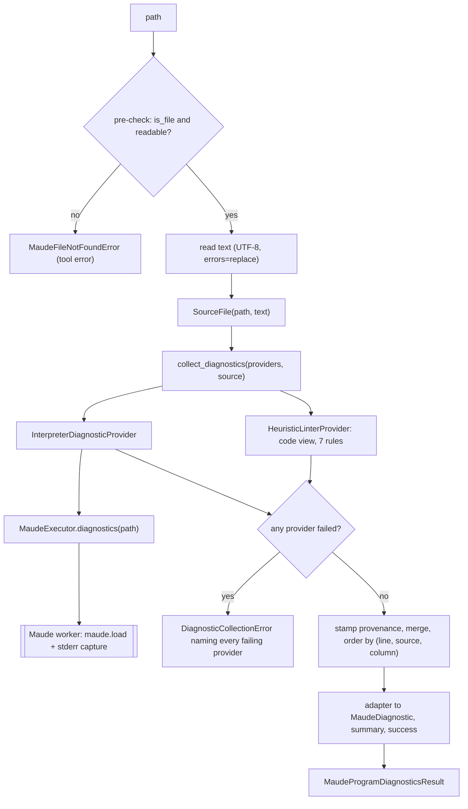
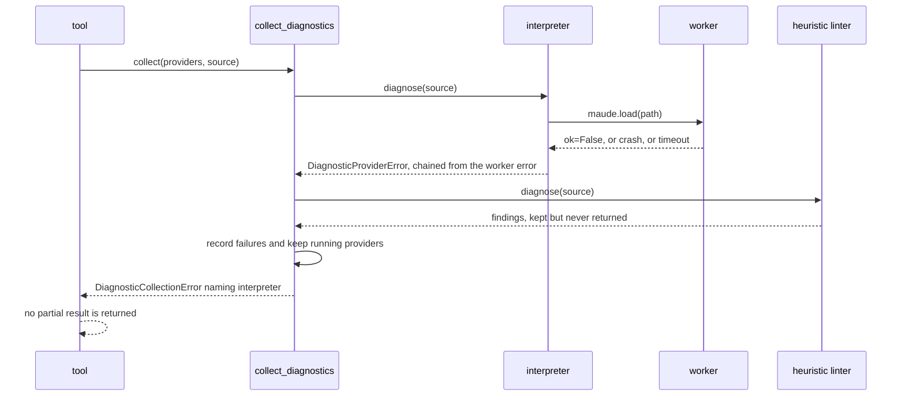
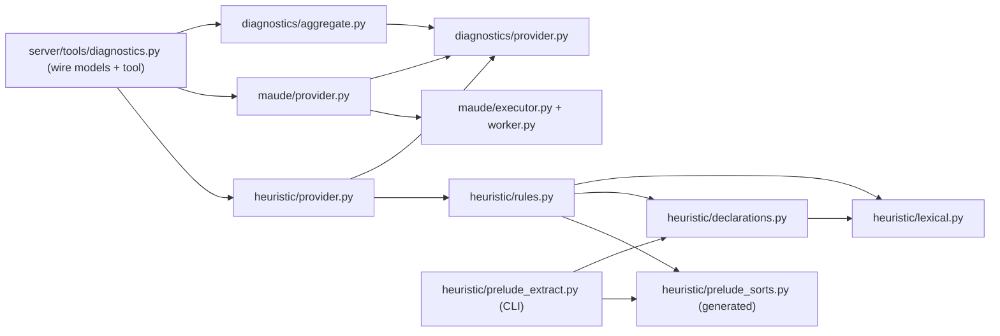
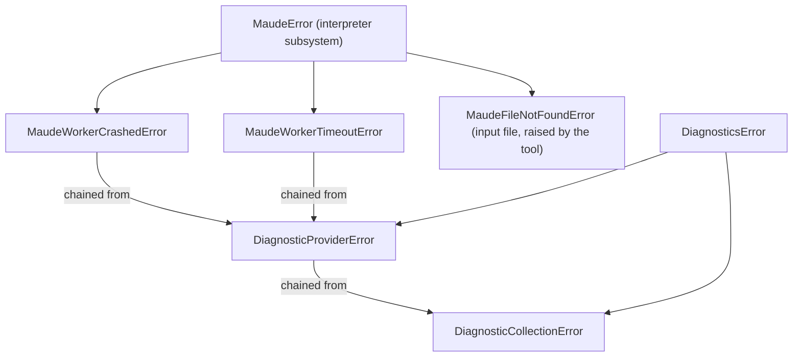

# Detailed Design — Heuristic linter port into `maude_program_diagnostics` (v2)

> Standalone design document. Consolidates the requirements Q&A (`../idea-honing.md`,
> Q1–Q11) and the research notes (`../research/`). Dates in this document are the
> decision dates recorded in those files; findings marked **verified (2026-09-15)**
> were re-checked while writing this design, with the probes in
> `../research/probes/` (see Appendix B).

## 1. Overview

`maude_program_diagnostics` (v1) loads a Maude source file into the interpreter and
reports the problems Maude finds. This design adds a **second, independent producer of
diagnostics**: the heuristic linter distilled in `improve-rag/improvement/linter.py`,
plus one new rule (redeclared prelude sorts). Both producers run in **one tool call**,
their findings are merged into one list, and every diagnostic is now attributed
(`source`, `code`) and, where known, precisely positioned — with an optional,
**report-only** deterministic fix.

Three contributions of the source linter are ported (research `linter-py-analysis.md` §1):

1. a **failure taxonomy** of six textual heuristics for mistakes that Maude either
   reports laconically (`parsing error`) or accepts silently (non-linear patterns);
2. the **Unicode-punctuation normalization** (8 substitutions) — as a *suggested fix*,
   never applied (LP1);
3. **model-facing messages** in English, stating what is wrong and how to write it
   correctly in Maude.

The interpreter remains the authority on whether a program loads; the heuristic linter
is a *complement*, and its findings are labelled as heuristics that may be false
positives (LP7). The two subsystems stay decoupled behind a small internal seam, so
future Maude linters and static analyses (the rough idea's motivation) plug in without
touching the tool: the tool is rewritten as an **aggregator over diagnostic providers**
(§3, §4).

### Scope

In scope:

- The diagnostics layer: `harold_mcp/diagnostics/` (provider seam, aggregator, error
  vocabulary), `harold_mcp/maude/provider.py` (the interpreter adapter) and
  `harold_mcp/heuristic/` (the heuristic linter: provider, rules, lexical layer,
  declaration reader, prelude-sort snapshot, maintenance CLI).
- Result-model changes: `severity`, `source`, `code`, `fix`, column/end positions, the
  `info` summary count, and the rewritten tool description.
- The snapshot-maintenance CLI and the fixtures/tests that pin all of it down.
- Documentation hygiene (README, module docs, developer guide, changelog, version).

Out of scope (explicitly):

- A separate lint-only tool (`maude_program_lint`) — resolved against in Q3. The seam
  keeps that door open: a future tool calls the same providers.
- Writing to the diagnosed file, or any mutating tool (Q1).
- New heuristic rules beyond the 6 + 1 (Q9); a Maude parser; type checking; strategy
  modules-specific analysis.
- Runtime discovery of `prelude.maude` or a configuration setting for it (Q10).
- Changes to `improve-rag/improvement/linter.py` (the port is independent).
- Worker-protocol changes: the linter needs no interpreter access, so
  `harold_mcp/maude/worker.py` and the executor are untouched.

## 2. Detailed Requirements

Consolidated from `../idea-honing.md` (Q1–Q11). Identifiers are local to this document
(`LP#`); v1's requirements are cited as `v1-R#`.

| ID | Requirement | Source |
| --- | --- | --- |
| LP1 | **Report-only.** The tool never modifies the diagnosed file. Fixes are returned as data. The `ToolAnnotations` profile stays `readOnlyHint=True`, `destructiveHint=False`, `idempotentHint=True`, `openWorldHint=False`. | Q1 |
| LP2 | **Fix payload.** A diagnostic may carry `fix: {description: str, edits: [{range, new_text}]}`. Only deterministic corrections carry one (today: the 8 Unicode punctuation substitutions). The explanation stays in `message`; `fix.description` is a short restatement. | Q2 |
| LP3 | **Positions.** Heuristic diagnostics carry 1-based `column` for `range.start` and a populated, **exclusive** `range.end`. Interpreter diagnostics keep `column=null` and `end=null` (Maude reports no columns). `range=null` continues to mean a whole-file problem. | Q2 (extended, D1) |
| LP4 | **One composite tool.** `maude_program_diagnostics` runs the interpreter provider *and* the heuristic provider in a single call; no separate lint tool. **All** providers are attempted; if **any** provider fails, the whole call fails (`isError`), the successful providers' diagnostics are **not** returned, and the error names every failing provider and its cause (crash vs. timeout). The failure-handling site carries a code comment stating that partial results are deliberately not returned because MCP cannot express "error + content" (spec 2025-06-18; FastMCP surfaces errors by raising). | Q3 |
| LP5 | **Provider seam.** A `DiagnosticProvider` `Protocol` (read-only `name` property, `diagnose(source) -> list[ProviderDiagnostic]`) with two initial implementations: `interpreter` (in `harold_mcp/maude/`, executor-backed, crosses the worker boundary) and `heuristic-linter` (in `harold_mcp/heuristic/`, pure text, server process, no `maude` import, no worker dependency). Provider failures use a diagnostics-subsystem error hierarchy (`DiagnosticsError`, `DiagnosticProviderError`) that is **independent of `MaudeError`**; a provider that fails for an interpreter reason wraps it with `raise ... from`, so the Maude vocabulary stops at the provider boundary. | Q4 |
| LP6 | **Provenance.** Every diagnostic requires `source` (the provider's stable name — the single source for that string) and `code`. The interpreter provider stamps its single code `compiler`; the heuristic provider stamps one code per rule. | Q5 |
| LP7 | **Severity.** Vocabulary `info` \| `warning` \| `error`, defined per source (table in §5.3). Heuristic `error` is reserved for findings that *cannot* be false positives (none of today's rules qualifies: rules 1 and 7 are `info`, rules 2–6 are `warning`). `MaudeDiagnosticsSummary` gains `info`. | Q6 + amendment |
| LP8 | **Success.** `success = true` iff no diagnostic from any source has severity `warning` or `error`. `info`-only results are successful. | Q8 |
| LP9 | **Rule scope.** Port the 6 rules of `linter.py` as-is in detection intent, plus the new `prelude-sort-redeclared` rule, with **minimal false-positive hardening** (string/quoted-identifier/declaration/label awareness, rule 6 allow-list) and **no taxonomy expansion**. | Q9, Q7 |
| LP10 | **Codes and severities** are fixed as in the §5.2 table (kebab-case, LSP-style). | Q5 (settled here) |
| LP11 | **Prelude snapshot.** A bundled, generated Python module lists every sort the prelude declares, with provenance (Maude version hint, source path, source SHA-256, extraction date). Regeneration is a maintenance CLI (the `harold-update-prelude-sorts` console script, cyclopts-based, with `--check`) taking the absolute path to a `prelude.maude`; no runtime discovery and no new setting. Only real declarations count (views/renaming mappings/comments/`set` commands/`sorts none .` excluded), and sorts declared by theory modules (`fth`/`th` — in the prelude, `Elt`) are excluded as well. | Q10 |
| LP12 | **Deterministic order.** Merged diagnostics are ordered by file position, then by source (`interpreter` first), with whole-file problems last (§5.4). | Appendix E D4 |
| LP13 | **Docs and hygiene.** Tool description explains both sources and their severity meanings; README tool list updated; new modules in `docs/modules.md`; snapshot maintenance documented in `DEVELOPER_GUIDE.md`; `CHANGELOG.md` entry + suggested version bump; user prompted to refresh the knowledge base; one positive fixture per rule plus negative fixtures. | Q11.8 |
| LP14 | **Non-goals.** No separate lint tool (Q3); no file mutation (Q1); `improve-rag` untouched; English-only messages, no locale mechanism; line-oriented heuristics, not a parser; no new dependencies. | Q11.9 |

## 3. Architecture Overview

### 3.1 Tool call flow



The two providers are independent: the heuristic one never crosses the process boundary,
never imports the `maude` bindings, and does not touch interpreter state; the interpreter
one is the v1 path unchanged (executor → worker → `maude.load` + stderr capture).

### 3.2 Why a seam instead of inline linting

The v1 tool already does "read file → worker → map to result". Adding linting inline
would have been a smaller diff today, but the rough idea explicitly asks for a design
that extends well ("keeping the code cohesive, simple and extensive and with low
coupling"). The seam buys:

- **Independent evolution**: a future `maude_program_lint` tool, a RAG-aware checker, or
  an interpreter-backed analysis (e.g. module introspection) is a new provider + a new
  tool that reuses the aggregator and the wire adapter.
- **Uniform provenance/severity/position handling**: one place decides what `source`,
  `code`, `severity` and `range` mean, so the wire model does not grow per producer.
- **Testability**: the heuristic rules are pure functions over text; providers are
  testable without the interpreter; the aggregator is testable without either.

The cost is three small value types and one Protocol — no framework, no plugin registry,
no dynamic loading. Providers are constructed explicitly by the tool (§4.8).

### 3.3 Failure semantics (LP4)



Consequences that the implementation must preserve:

- Providers are attempted **in order** (interpreter first, then the heuristic linter — the
  same order the diagnostics are merged in), and a failure never short-circuits the
  remaining providers, so the error message can name *all* failing providers (Q3).
- A provider failure is any exception, including unexpected ones (a rule bug): the
  aggregator catches `Exception`, records `(provider name, exception)`, continues, and
  re-raises an aggregate error at the end (`raise ... from first_failure.error` so the
  original traceback stays visible in logs).
- Because the whole call fails, the heuristic findings computed before the interpreter
  failure are **discarded** — deliberately, and with the comment required by LP4.

## 4. Components and Interfaces

### 4.0 Package layout

The heuristic linter is a capability of its own, so it gets its own package, exactly like
the Maude interpreter subsystem; the provider seam and its aggregation stay
provider-agnostic in `diagnostics/`.

```text
src/harold_mcp/
├── diagnostics/             # the provider seam (no concrete provider)
│   ├── __init__.py          # public surface: seam types, errors, aggregation
│   ├── provider.py          # DiagnosticProvider protocol, seam value types, errors
│   └── aggregate.py         # collect_diagnostics: run, order, fail loudly
├── maude/                   # interpreter subsystem (unchanged) + its diagnostics provider
│   ├── __init__.py          # + InterpreterDiagnosticProvider
│   ├── executor.py
│   ├── worker.py
│   └── provider.py          # InterpreterDiagnosticProvider (executor-backed)
├── heuristic/               # the heuristic linter, all of it in one package
│   ├── __init__.py          # HeuristicLinterProvider
│   ├── provider.py          # runs the rule registry over the source text
│   ├── rules.py             # the 7 rules + Rule registry (codes, severities, messages)
│   ├── lexical.py           # code view (comments/strings/quoted ids/labels), declarations
│   ├── declarations.py      # module/view-aware `sort`/`sorts` declaration reader
│   ├── prelude_sorts.py     # GENERATED snapshot: PRELUDE_SORTS + PRELUDE_SORT_BASES
│   └── prelude_extract.py   # extractor + renderer + cyclopts CLI (console script)
└── server/tools/diagnostics.py   # tool + wire models + adapter (rewritten)
tests/
├── unit/                    # rules, lexical layer, providers, aggregator, tool mapping
└── integration/             # real interpreter + fixtures (+ MCP smoke test)
```

Each capability package exposes its diagnostic provider in `provider.py`; the abstract
contract (protocol, value types, error vocabulary) lives in `diagnostics/provider.py`.



Dependency rules: `diagnostics/` is pure (stdlib only — it never imports `maude/`,
`heuristic/`, `fastmcp`, `mcp` or the wire models); each capability package depends on the
seam, never on another capability; the tool depends on all of them and nothing depends on
the tool. The interpreter provider is what makes `maude/` a diagnostics-capable package;
the heuristic package depends on the seam only.

Package surfaces (what the tool and tests import from):

```python
# harold_mcp/diagnostics/__init__.py — the seam
from harold_mcp.diagnostics.aggregate import DiagnosticCollectionError, ProviderFailure, collect_diagnostics
from harold_mcp.diagnostics.provider import (
    DiagnosticProvider,
    DiagnosticProviderError,
    DiagnosticSource,
    DiagnosticsError,
    FixEdit,
    FixSuggestion,
    ProviderDiagnostic,
    Severity,
    SourceFile,
)

# harold_mcp/maude/__init__.py — existing exports plus:
from harold_mcp.maude.provider import InterpreterDiagnosticProvider

# harold_mcp/heuristic/__init__.py — the heuristic linter
from harold_mcp.heuristic.provider import HeuristicLinterProvider
```

### 4.1 `harold_mcp/diagnostics/provider.py` — the seam

```python
Severity = Literal["info", "warning", "error"]
DiagnosticSource = Literal["interpreter", "heuristic-linter"]


@dataclass(frozen=True, slots=True)
class SourceFile:
    """One Maude source file: where it is, and its decoded text."""

    path: str
    text: str


@dataclass(frozen=True, slots=True)
class FixEdit:
    """One replacement in the source text; `end_column` is exclusive."""

    line: int
    start_column: int
    end_column: int
    new_text: str


@dataclass(frozen=True, slots=True)
class FixSuggestion:
    """A deterministic correction: what it does, and the edits that apply it."""

    description: str
    edits: tuple[FixEdit, ...]


@dataclass(frozen=True, slots=True)
class ProviderDiagnostic:
    """A problem reported by a provider, in provider-native terms."""

    source: DiagnosticSource
    severity: Severity
    code: str
    message: str
    line: int | None = None  # 1-based; None = whole-file
    column: int | None = None  # 1-based start; None = unknown
    end_column: int | None = None  # 1-based exclusive end; None = unknown
    fix: FixSuggestion | None = None


class DiagnosticsError(RuntimeError):
    """Base error for failures of the diagnostics subsystem."""


class DiagnosticProviderError(DiagnosticsError):
    """A provider could not produce diagnostics; wraps the underlying failure."""

    def __init__(self, source: DiagnosticSource, reason: str) -> None:
        self.source = source
        self.reason = reason
        super().__init__(f"{source}: {reason}")


class DiagnosticProvider(Protocol):
    """A producer of diagnostics for one Maude source file.

    Implementations raise `DiagnosticProviderError` when they cannot produce
    diagnostics, chaining the underlying failure (`raise ... from`).
    """

    @property
    def name(self) -> DiagnosticSource: ...
    def diagnose(self, source: SourceFile) -> list[ProviderDiagnostic]: ...
```

- `ProviderDiagnostic.__post_init__` validates the position invariants
  (`line is None ⇒ column is None`; `end_column` set ⇒ `column` set; columns ≥ 1) and
  raises `ValueError` on violation, so a rule that miscounts columns fails loudly in
  tests instead of producing nonsense positions.
- `column`/`end_column` are provider-native coordinates: the adapter (§4.8) is the only
  place that knows about `MaudePosition`/`MaudeRange`.
- `DiagnosticSource` and `Severity` are closed `Literal`s shared by the seam and the
  wire model, so each vocabulary is defined exactly once; extending the provider set is a
  one-line change in the alias plus the provider itself.
- Providers stamp `source=self.name` on their diagnostics, so the name string exists once
  per provider and the aggregator needs no side table (§4.2).
- **Error layering**: `DiagnosticsError` is independent of the `MaudeError` hierarchy. A
  provider that fails because the interpreter failed raises
  `DiagnosticProviderError(...) from maude_error`, so the Maude vocabulary stops at the
  provider boundary and the automatic exception chain (`__cause__`) keeps the original
  `MaudeWorkerCrashedError` visible for logs and debugging. `MaudeError` itself is left
  untouched.

### 4.2 `harold_mcp/diagnostics/aggregate.py` — run, order, fail loudly

```python
@dataclass(frozen=True, slots=True)
class ProviderFailure:
    """A provider that failed during a collection run, with what it raised."""

    provider: DiagnosticSource
    error: BaseException


class DiagnosticCollectionError(DiagnosticsError):
    """One or more diagnostic providers failed; no diagnostics are returned."""

    def __init__(self, failures: Sequence[ProviderFailure]) -> None:
        self.failures = tuple(failures)
        super().__init__("Diagnostics failed: " + "; ".join(_describe(failure) for failure in self.failures))


def _describe(failure: ProviderFailure) -> str:
    """`interpreter (Maude worker crashed)`; unwrapped bugs keep their type name."""
    error = failure.error
    reason = error.reason if isinstance(error, DiagnosticProviderError) else f"{type(error).__name__}: {error}"
    return f"{failure.provider} ({reason})"


def collect_diagnostics(
    providers: Sequence[DiagnosticProvider],
    source: SourceFile,
) -> list[ProviderDiagnostic]:
    """Run every provider, then return the merged diagnostics in file order."""
```

Behavior:

1. Run providers **in order**; keep the diagnostics of each; on failure record
   `ProviderFailure(provider=provider.name, error=exc)` and continue. A
   `DiagnosticProviderError` is recorded as raised (the interpreter provider has already
   wrapped the Maude error, chaining it); any other exception is the safety net for a
   provider bug and is recorded too, so it can never be silently ignored.
2. If any failure was recorded, raise `DiagnosticCollectionError(failures)`, chained
   (`from failures[0].error`) — **without** returning the successful providers'
   diagnostics, with the comment required by LP4 (§3.3).
3. Otherwise return the concatenation ordered by the key
   `(line is None, line or 0, provider_index, column or 0)` — a stable sort, so
   same-position diagnostics keep provider/rule order (§5.4).

Message format (fixed, because tests assert it and agents read it):

```text
Diagnostics failed: interpreter (Maude worker crashed); heuristic-linter (ValueError: ...)
```

`DiagnosticCollectionError` is a `DiagnosticsError`, **not** a `MaudeError`: a collection
failure is a diagnostics-subsystem failure, and the interpreter's own vocabulary reaches
it only as the chained `__cause__` of the `DiagnosticProviderError` the provider raised.
`harold_mcp/maude/executor.py` is left untouched.

### 4.3 `harold_mcp/maude/provider.py` — Maude interpreter provider

The interpreter provider belongs to the interpreter subsystem (it is *Maude's* way of
producing diagnostics), so it lives in the `maude/` package and re-exports from
`harold_mcp.maude`.

```python
class InterpreterDiagnosticProvider:
    """`DiagnosticProvider` over the Maude interpreter load (v1 behavior)."""

    name: DiagnosticSource = "interpreter"

    def __init__(self, executor: MaudeExecutor) -> None: ...

    def diagnose(self, source: SourceFile) -> list[ProviderDiagnostic]:
        try:
            result = self._executor.diagnostics(source.path)
        except MaudeWorkerError as exc:
            # The Maude vocabulary stops here: the diagnostics layer reports a provider
            # failure, and `__cause__` keeps the worker error for logs and debugging.
            raise DiagnosticProviderError(self.name, exc.reason) from exc
        diagnostics = [
            ProviderDiagnostic(
                source=self.name,
                severity="warning",
                code=_CODE,  # "compiler"
                message=warning["message"],
                line=warning["line"],
            )
            for warning in result["warnings"]
        ]
        if not result["ok"]:
            diagnostics.append(
                ProviderDiagnostic(source=self.name, severity="error", code=_CODE, message=_HARD_FAILURE_MESSAGE)
            )
        return diagnostics
```

- Only `source.path` is used; the interpreter loads from disk (the text is not pushed
  into the interpreter — `maude.load` semantics are path-based).
- `_HARD_FAILURE_MESSAGE` (the v1 constant) moves here, with the interpreter provider.
- Worker crash/timeout errors (`MaudeWorkerCrashedError`/`MaudeWorkerTimeoutError`, both
  `MaudeWorkerError`) are translated into `DiagnosticProviderError` here (§4.1), so the
  aggregator never handles Maude errors; the original error stays available as
  `__cause__`. No pool logic is duplicated.
- `name` is a class attribute, which satisfies the protocol's read-only property.

### 4.4 `harold_mcp/heuristic/lexical.py` — the code view

The rules are textual; their precision depends on one shared lexical layer.

```python
def is_identifier_char(ch: str) -> bool:
    """Maude identifier material: letters, digits, `_ ' - ? $` and bytes ≥ 0x80.

    Used by `code_view` for the token-boundary test that decides whether `"`
    opens a string literal and whether `'` starts a quoted identifier (a `'`
    after identifier material belongs to the identifier: `A'`, `A'b`).
    """


@dataclass(frozen=True, slots=True)
class CodeLine:
    """One source line, masked (comments, string literals, quoted identifiers and
    statement labels blanked to spaces). The line is the same length as in the
    file, so columns map 1:1 onto the source."""

    number: int  # 1-based
    code: str


def code_view(text: str) -> tuple[CodeLine, ...]:
    """Split `text` into lines and build the masked `code` view of each."""
```

Masking rules (all **length-preserving**, so column arithmetic maps 1:1 to the source):

| Region | Rule | Grounded in |
| --- | --- | --- |
| Comment | `***` or `---` to end of line, wherever it appears outside a string/quoted identifier | v1 `_sans_commentaires`; prelude style |
| String literal | from `"` to the next `"` **on the same line**, blanked (delimiters included) | probe `string_multiline`: strings cannot span lines; `comment_marker_in_string`: `***`/`---`/`--` inside a string are literal text |
| Quoted identifier | from `'` **at a token boundary** to the next whitespace, blanked | probes `apostrophe_in_identifier` (`A'` is one identifier) and `quoted_identifier_range` (`'a b` → `'a` then `b`, i.e. ids end at whitespace) |
| Statement label | the `[...]` slot right after `eq`/`ceq`/`rl`/`crl` | Maude labels are not term tokens; prevents rule 6 flagging `eq [Rewrite] : ...` |

`CodeLine.code` is the only view the rules need: the unmasked text stays available as
`SourceFile.text` for a future rule that needs it (e.g. a whitespace check).

Declaration index for the equation rules (built once per file):

```python
@dataclass(frozen=True, slots=True)
class Declarations:
    variables: frozenset[str]  # `var`/`vars` names + inline `X:Sort` names
    operators: frozenset[str]  # identifier tokens of `op`/`ops` declarations
    sort_references: frozenset[str]  # base names used after `:` (annotations/usages)


def declaration_index(lines: Sequence[CodeLine]) -> Declarations: ...
```

```python
@dataclass(frozen=True, slots=True)
class SourceView:
    """Everything the heuristic rules read from one source file."""

    lines: tuple[CodeLine, ...]
    sort_declarations: tuple[SortDeclaration, ...]
    declarations: Declarations

    @classmethod
    def from_text(cls, text: str) -> SourceView: ...

    @property
    def sort_bases(self) -> frozenset[str]:
        """Declared sort names without their parameters (`List{X}` → `List`)."""
```

`sort_declarations` comes from `declarations.py` (§4.5) and is shared by rule 6 (allow
list), rule 7 (redeclaration check) and the snapshot extractor.

### 4.5 `harold_mcp/heuristic/declarations.py` — sort declaration reader

```python
@dataclass(frozen=True, slots=True)
class SortDeclaration:
    """A `sort`/`sorts` declaration found in Maude source text."""

    name: str  # as declared, e.g. "List{X}" or "Type?"
    line: int  # 1-based line of the name
    column: int  # 1-based column of the name
    module: str | None  # enclosing module name, when the file declares one


def iter_sort_declarations(lines: Sequence[CodeLine]) -> Iterator[SortDeclaration]:
    """Yield the real sort declarations, skipping mappings and placeholders."""
```

Rules, all validated against Maude 3.5.1's own `prelude.maude` (**verified 2026-09-15**,
`../research/probes/extract_prelude_sorts.py`; extraction now yields 164 names from 24
modules, no junk):

1. Track the enclosing module: `fmod|fth|mod|smod|th|view NAME ... is` opens (a module
   opened **and** closed on the same line, e.g. `view TRIV from TRIV to TRIV is endv`,
   opens nothing); `endfm|endfth|endm|endsm|endv|endth` closes.
2. A `sorts` statement is a line starting with `sort`/`sorts` **plus its continuation
   lines** until the terminating `.` (the prelude has one spanning 4 lines, line 2318).
3. Only names matching the Maude sort-name shape
   `[A-Za-z_$][\w'\-?]*(\{[^}]*\})?` are kept: `?` is legal identifier material
   (probe `question_mark_sort_*`), and the shape check drops the tokens `.` and
   `endsth)` splattered by the `(sth ... sorts none . ... endsth)` meta-term line
   (prelude line 2045).
4. Excluded: names in **view bodies** (`view … is … endv`), any statement containing
   ` to ` (a `sort X to Y` **mapping** — covers renamings such as
   `protecting LIST{Nat} * (sort NeList{Nat} to NeNatList, …)`), and the placeholder
   `none`.
5. Excluded: sorts declared in **theory** modules (`fth`/`th`) — in the prelude that is
   only `Elt` (declared by `fth TRIV`). A theory declares interface sorts that user
   modules are expected to redeclare when they instantiate it, so they are not shadowed
   prelude sorts; this is design-review decision D6 (2026-09-15). Consequence: neither
   `prelude-sort-redeclared` nor rule 6's allow-list sees `Elt`; a file that uses `Elt`
   in an annotation is still protected by `sort_references` (§4.6).
6. Module names are the plain first token (`LIST*{X :: TRIV}` → `LIST*`), used only for
   provenance/messages.

### 4.6 `harold_mcp/heuristic/rules.py` — the rules

```python
@dataclass(frozen=True, slots=True)
class RuleFinding:
    """What a rule found: a message and, when known, a precise span."""

    message: str
    line: int
    column: int | None = None
    end_column: int | None = None
    fix: FixSuggestion | None = None


@dataclass(frozen=True, slots=True)
class Rule:
    """One heuristic check: stable code, severity, and the detection function."""

    code: str
    severity: Severity
    detect: Callable[[SourceView], list[RuleFinding]]


RULES: tuple[Rule, ...] = ...  # registry order = evaluation and tie-break order
```

Detection is per `CodeLine.code` (masked) unless noted. "Declaration line" means a line
whose first token is `op|ops|var|vars|sort|sorts|subsort|subsorts` (grounded in probes
`when_operator`, `dashdash_operator`, `prefix_dashdash`).

| # | Code | Sev. | Detection (hardened port) | Fix | Fixture |
| --- | --- | --- | --- | --- | --- |
| 1 | `non-ascii-character` | info | every character with `ord(ch) > 127` in the code view, **one diagnostic per occurrence**, except U+FFFD (the lossy-decode replacement char, §6). Span = the character | ✅ if the char is one of the 8 `UNICODE_FIXES`: one `FixEdit` replacing it | `nonascii_apostrophe.maude` |
| 2 | `when-guard` | warning | every whole-word `when` occurrence, skipping declaration lines. Span = the token | — | `when_guard.maude` |
| 3 | `dash-comment` | warning | every `(^|\s)--(?!-)(\s|$)` occurrence in the code view, skipping declaration lines. Span = the `--` | — | `dash_comment.maude` |
| 4 | `eq-in-term` | warning | inside each `\bif\b(.*?)\bthen\b` span, every `=` not preceded by `= < > ~ / \` and not followed by `=` or `/`; one diagnostic per occurrence. Span = the `=` | — | `eq_in_if.maude` |
| 5 | `non-linear-pattern` | warning | on `eq`/`ceq` lines: tokenize the LHS (before the top-level `=`), count occurrences of declared variables; one finding per variable with count > 1. Span = the variable's **first** occurrence | — | `non_linear_pattern.maude` |
| 6 | `undeclared-identifier` | warning | on `eq|ceq|rl|crl` lines: each `\b[A-Z][\w'-]*\b` token not in `variables ∪ operators ∪ sort_bases ∪ sort_references ∪ PRELUDE_SORT_BASES ∪ MAUDE_KEYWORDS` (case-insensitive). **Deduplicated per token per line** (first occurrence's span), reported in column order | — | `undeclared_identifier.maude` |
| 7 | `prelude-sort-redeclared` | info | each `SortDeclaration` whose name is in `PRELUDE_SORTS` (theory sorts excluded: the snapshot holds no `Elt`, §4.5 rule 5). Span = the declared name | — | `redeclare_prelude.maude` (existing) |

Rule-6 hardening rationale and limits:

- `sort_references` (names used after `:` anywhere in the file) removes the largest
  false-positive class: sorts that are imported from another module or the prelude and
  only *used*, never declared locally.
- `PRELUDE_SORT_BASES` subsumes v1's hardcoded `Bool Nat Int Float String Qid` list, so
  the built-in sorts have one source of truth.
- `MAUDE_KEYWORDS` is the source linter's `MOTS_CLES` renamed and kept **verbatim**
  (including its case-insensitive comparison) to keep behavior traceable; it is not the
  rule's main safety net (tokens are matched capitalized, and Maude keywords are
  lowercase). Known gap, deliberately not fixed here: `True`/`False` are silenced by it
  although Maude spells them `true`/`false` — a candidate for a future dedicated rule.
- Definitions of the helpers: `sort_bases` is `{name.split("{", 1)[0]}` over
  `sort_declarations`; `PRELUDE_SORT_BASES` is the analogous derivation over the snapshot.

Messages (English, model-actionable, fixed here so tests and docs agree):

| Code | Message |
| --- | --- |
| `non-ascii-character` | `Non-ASCII character '’' (RIGHT SINGLE QUOTATION MARK): Maude accepts it in identifiers, but this is usually a typographic-punctuation paste — replace it with an ASCII apostrophe (a fix is available).` (the "use `"`" wording is derived from `UNICODE_FIXES`; without a substitution the tail becomes `— replace it with an ASCII equivalent unless it is intentional.`) |
| `when-guard` | `` `when` is not Maude syntax (it is a Haskell/SML guard): write a conditional equation or rule instead, `ceq <lhs> = <rhs> if <condition> .` `` |
| `dash-comment` | `` `--` does not start a comment in Maude (only `***` and `---` do), so the rest of the line is parsed as code — use `***` or `---`. `` |
| `eq-in-term` | `` A single `=` is not a test in a term: inside `if … then … else … fi` use `==` (the `=` sign only separates the two sides of an equation or rule). `` |
| `non-linear-pattern` | `` The variable `B-ignore` appears 2 times in the left-hand side (non-linear pattern): legal in Maude (it forces the matched subterms to be equal) but often unintentional — use a fresh variable if equality was not intended. `` |
| `undeclared-identifier` | `` `Foo` is used in a statement but is not declared as a variable, operator, or sort: if it is a variable, declare it (`var Foo : Nat .`) or annotate it inline (`Foo:Nat`). `` |
| `prelude-sort-redeclared` | `` The sort `Qid` is already declared by the Maude prelude (module QID): redeclaring it shadows the prelude sort in this module — rename it unless the shadowing is intentional. `` |

### 4.7 `harold_mcp/heuristic/provider.py` — the heuristic provider

```python
class HeuristicLinterProvider:
    """`DiagnosticProvider` running the heuristic rules over the source text."""

    name: DiagnosticSource = "heuristic-linter"

    def __init__(self, rules: Sequence[Rule] = RULES) -> None: ...

    def diagnose(self, source: SourceFile) -> list[ProviderDiagnostic]:
        view = SourceView.from_text(source.text)
        return [
            ProviderDiagnostic(
                source=self.name,
                severity=rule.severity,
                code=rule.code,
                line=finding.line,
                column=finding.column,
                end_column=finding.end_column,
                message=finding.message,
                fix=finding.fix,
            )
            for rule in self._rules
            for finding in rule.detect(view)
        ]
```

- Rules are injected (default `RULES`) so a test can run the provider with a single rule,
  and so future tools can compose a subset.
- The provider is pure: no filesystem, no interpreter, no global state; running it twice
  on the same text returns the same findings (idempotence, matching the tool annotation).
- Unlike the interpreter provider, it does **not** wrap its failures: a rule bug is already
  a diagnostics-subsystem failure, so the aggregator's safety net reports it as
  `heuristic-linter (ValueError: …)`. The interpreter provider wraps because it translates
  another subsystem's vocabulary (`MaudeWorkerError`) across the seam.

### 4.8 `harold_mcp/server/tools/diagnostics.py` — tool, models, adapter

Responsibilities: the MCP surface (models, description, annotations, tags) and the
internal→wire adapter. It is the only module that imports both capability packages. The
flow:

```python
from harold_mcp.diagnostics import SourceFile, collect_diagnostics
from harold_mcp.heuristic import HeuristicLinterProvider
from harold_mcp.maude import InterpreterDiagnosticProvider, MaudeFileNotFoundError, MaudeExecutor, get_maude_executor


def maude_program_diagnostics(
    path: str,
    maude_executor: MaudeExecutor = Depends(get_maude_executor),  # noqa: B008
) -> MaudeProgramDiagnosticsResult:
    if not Path(path).is_file() or not os.access(path, os.R_OK):
        raise MaudeFileNotFoundError(path)
    source = SourceFile(path=path, text=_read_source_text(path))
    providers: tuple[DiagnosticProvider, ...] = (
        InterpreterDiagnosticProvider(maude_executor),
        HeuristicLinterProvider(),
    )
    diagnostics = collect_diagnostics(providers, source)  # raises DiagnosticCollectionError
    return _build_result(path, diagnostics)
```

- `MaudeFileNotFoundError` stays in `harold_mcp.maude` and unchanged: it is about the
  *input file*, raised before any provider runs; the diagnostics-subsystem errors (§4.1)
  are a separate hierarchy.

- `_read_source_text(path)` reads bytes and decodes `utf-8` with `errors="replace"`
  (the same lossy policy the worker uses for captured stderr), so arbitrary input cannot
  crash the tool (§6).
- `_build_result(path, diagnostics)` builds `MaudeDiagnostic` objects (the adapter:
  `line`/`column`/`end_column` → `MaudeRange`), computes the `info`/`warning`/`error`
  counts and `success = no warning/error diagnostic`. `range=None` stays for `line=None`.
- The adapter is the only place that knows both vocabularies; it also converts
  `FixEdit`/`FixSuggestion` → `MaudeTextEdit`/`MaudeFix`.
- Provider construction is inline (two objects): no DI surface is added to the tool, and
  tests keep injecting a `FakeMaudeExecutor` exactly as today (the fake is wrapped by the
  real interpreter provider).

Adapter sketch:

```python
def _to_range(diagnostic: ProviderDiagnostic) -> MaudeRange | None:
    if diagnostic.line is None:
        return None
    start = MaudePosition(line=diagnostic.line, column=diagnostic.column)
    end = (
        MaudePosition(line=diagnostic.line, column=diagnostic.end_column) if diagnostic.end_column is not None else None
    )
    return MaudeRange(start=start, end=end)
```

### 4.9 `harold_mcp/heuristic/prelude_sorts.py` (generated) + `harold_mcp/heuristic/prelude_extract.py` (CLI)

Generated module (never hand-edited), written by the companion CLI:

```python
# Generated by harold-update-prelude-sorts — do not edit by hand.
# Maude version: 3.5.1
# Source: /home/juanrh/systems/maude/Maude-3.5.1-linux-x86_64/prelude.maude
# Source SHA-256: 8f3a…  (sha256 of the source file at extraction time)
# Extracted: 2026-09-15
# Content: 164 sort names declared by 24 modules (theory sorts excluded).

PRELUDE_SORTS: dict[str, str] = {
    "Array{X,Y}": "ARRAY",
    "Assignment": "META-TERM",
    "Bool": "TRUTH-VALUE",
    # … one entry per line, alphabetical …
}

PRELUDE_SORT_BASES: frozenset[str] = frozenset({"Array", "Assignment", "Bool", …})
```

- A **Python module**, not a data file: wheel-safe (no package-data configuration),
  type-checked, import-cheap, and never read from disk at runtime (LP11).
- `dict[str, str]` (name → first declaring module) so the rule-7 message can name the
  prelude module. `PRELUDE_SORT_BASES` is derived by the generator (parameterized names
  stripped) and consumed by rule 6.
- Both literals are emitted in the exploded form with a trailing comma — the layout
  `ruff format` keeps — sorted, ASCII-only, one entry per line, so regeneration is
  byte-stable and `make check` stays green.

`prelude_extract.py` holds the extractor, the renderer and the **cyclopts CLI** — no
logic lives in a script file anymore:

```python
# harold_mcp/heuristic/prelude_extract.py
def extract_prelude_sorts(text: str) -> dict[str, str]: ...
def render_snapshot_module(sorts, *, source_path, source_hash, maude_version, extracted) -> str: ...


app = App(name="harold-update-prelude-sorts", help="Regenerate the bundled Maude prelude sort snapshot.")


@app.default
def main(prelude: Path, *, output: Path = SNAPSHOT_PATH, check: bool = False, maude_version: str | None = None) -> None:
    """Extract the sorts `<prelude>` declares and (re)write the bundled snapshot."""


if __name__ == "__main__":  # pragma: no cover
    app()
```

The extraction reuses `declarations.iter_sort_declarations` (§4.5) — the same code path
rule 7 uses on user code, which is why the snapshot and the lint rule can never disagree
on what a declaration is. `cyclopts` is imported only here: neither the provider nor the
rules depend on the CLI, so importing `harold_mcp.heuristic` (and therefore the server)
stays light.

Console script (added to `[project.scripts]`, next to `harold-mcp`):

```toml
[project.scripts]
harold-mcp = "harold_mcp.main:app"
harold-update-prelude-sorts = "harold_mcp.heuristic.prelude_extract:app"
```

```console
$ uv run harold-update-prelude-sorts /path/to/prelude.maude
Extracted 164 sort names from 24 modules
Wrote src/harold_mcp/heuristic/prelude_sorts.py
$ uv run harold-update-prelude-sorts /path/to/prelude.maude --check
prelude_sorts.py is up to date          # exit 0; exit 1 and a diff hint otherwise
```

Options: positional `prelude` path, `--output` (default: the packaged
`heuristic/prelude_sorts.py`), `--check`, `--maude-version` (default: inferred from the
path when it contains `Maude-<version>`, else `unknown`). `--check` compares the **data** —
it imports the committed module and compares `PRELUDE_SORTS`/`PRELUDE_SORT_BASES` with a
fresh extraction — so it is machine-independent even though the provenance header records
the path used on the machine that last regenerated it (which only changes the header
comment, not the data). Guard rails: the CLI refuses to write a snapshot with fewer than
50 names (the extractor silently breaking is the realistic failure mode), and prints
per-reason exclusion counts.

### 4.10 Documentation and packaging changes

| File | Change |
| --- | --- |
| `src/harold_mcp/diagnostics/{provider,aggregate}.py` | New seam package (protocol, value types, errors, aggregation) |
| `src/harold_mcp/maude/provider.py` | New `InterpreterDiagnosticProvider`; `maude/__init__.py` re-exports it |
| `src/harold_mcp/heuristic/**` | New heuristic-linter package (provider, rules, lexical layer, declarations, generated snapshot, CLI) |
| `src/harold_mcp/server/tools/diagnostics.py` | Models gain `source`, `code`, `fix`, `info` severity/count; description rewritten (§5.6) |
| `docs/modules.md` | Add `::: harold_mcp.diagnostics.{provider,aggregate}`, `::: harold_mcp.maude.provider` and the `harold_mcp.heuristic.*` modules |
| `README.md` | "Harold MCP Tools" entry: both sources, severities, `info`, fixes, ordering |
| `DEVELOPER_GUIDE.md` | New "Maintaining the prelude sort snapshot" section: when to regenerate (Maude upgrade), `uv run harold-update-prelude-sorts <prelude> [--check]` |
| `CHANGELOG.md` | New version section with the ported linter, new rule, model changes (breaking schema change: new fields, `info` severity) |
| `pyproject.toml` | New `harold-update-prelude-sorts` console script; suggested minor bump `0.0.4.dev0` → `0.0.5.dev0` |
| `.agents/summary/`, `AGENTS.md` | Prompt the user to re-run the codebase-summary skill (new packages, new modules) |
| `src/harold_mcp/maude/executor.py`, `improve-rag/improvement/linter.py` | Untouched |

## 5. Data Models

### 5.1 Wire models (`server/tools/diagnostics.py`)

```python
from harold_mcp.diagnostics import DiagnosticSource, Severity


class MaudePosition(_ResultModel):
    """A position in a Maude source file (LSP-style)."""

    line: int
    """1-based line number."""
    column: int | None = None
    """1-based column; `null` when the producer does not report columns (the Maude interpreter)."""


class MaudeRange(_ResultModel):
    """A range between two positions (LSP-style)."""

    start: MaudePosition
    """The position the problem starts at."""
    end: MaudePosition | None = None
    """Exclusive end position; `null` when the producer reports a line only or a whole-file problem."""


class MaudeTextEdit(_ResultModel):
    """One replacement in the source text (LSP-style `TextEdit`)."""

    range: MaudeRange
    """The span to replace; `end` is exclusive and always populated."""
    new_text: str
    """The text to put in its place."""


class MaudeFix(_ResultModel):
    """A deterministic correction for a diagnostic (a suggestion; the tool never applies it)."""

    description: str
    """Short description of the correction, independent of positions."""
    edits: list[MaudeTextEdit]
    """Replacements; they are disjoint, so applying them in any order is safe."""


class MaudeDiagnostic(_ResultModel):
    """A single problem found in a Maude source file."""

    severity: Severity
    """`"info"` for observations that do not affect the load, `"warning"` for problems that may be
    real, `"error"` for definite failures; the meaning depends on `source` (see the tool description)."""
    source: DiagnosticSource
    """Provider that reported it: `"interpreter"` (Maude load) or `"heuristic-linter"` (pattern checks)."""
    code: str
    """`"compiler"` for interpreter diagnostics; for `"heuristic-linter"` findings, the rule that
    fired: `non-ascii-character`, `when-guard`, `dash-comment`, `eq-in-term`,
    `non-linear-pattern`, `undeclared-identifier`, or `prelude-sort-redeclared`."""
    range: MaudeRange | None
    """Where the problem is; `null` means a whole-file problem (no known location)."""
    message: str
    """The problem text, with the explanation and the suggested fix for heuristic findings."""
    fix: MaudeFix | None
    """A deterministic correction, when one exists (never applied by this tool)."""


class MaudeDiagnosticsSummary(_ResultModel):
    """Per-severity counts of the diagnostics."""

    info: int
    """Number of `"info"` diagnostics."""
    warning: int
    """Number of `"warning"` diagnostics."""
    error: int
    """Number of `"error"` diagnostics."""


class MaudeProgramDiagnosticsResult(_ResultModel):
    """Result of diagnosing a Maude source file."""

    path: str
    """The input path, echoed back as given."""
    success: bool
    """`true` only when no diagnostic has severity `"warning"` or `"error"` (`"info"`-only results succeed)."""
    summary: MaudeDiagnosticsSummary
    """Per-severity counts of `diagnostics`."""
    diagnostics: list[MaudeDiagnostic]
    """One entry per problem, ordered by line (whole-file problems last), then source, then column."""
```

Schema notes:

- `source` is a closed `Literal` (`DiagnosticSource`): the provider set is a deliberate,
  small structural axis, so clients get an enum. `code` is an open `str`: rules grow, and
  the current values are enumerated in the `code` field description and in the tool
  description (§5.6).
- `range.end` changes meaning from "always `null`, reserved" to "populated when the
  producer knows a span" — the documented change anticipated in Q2, extended by D1.
- Adding `source`/`code`/`fix` and the `info` value is a **backward-compatible schema
  change** for readers (new fields/values) but a breaking change for exhaustive clients
  (e.g. a `switch` on severity without a default). Called out in `CHANGELOG.md`.

### 5.2 Codes, sources and severities

| source | code | severity | meaning |
| --- | --- | --- | --- |
| `interpreter` | `compiler` | `warning` | a problem Maude reported and recovered from |
| `interpreter` | `compiler` | `error` | unrecoverable load failure (synthesized, whole-file, `range=null`) |
| `heuristic-linter` | `non-ascii-character` | `info` | non-ASCII character in code (usually a typographic paste); Maude accepts it |
| `heuristic-linter` | `when-guard` | `warning` | `when` used as a guard (Haskell/SML habit) |
| `heuristic-linter` | `dash-comment` | `warning` | `--` used as a comment delimiter |
| `heuristic-linter` | `eq-in-term` | `warning` | single `=` inside an `if … then …` term |
| `heuristic-linter` | `non-linear-pattern` | `warning` | declared variable repeated in an equation LHS |
| `heuristic-linter` | `undeclared-identifier` | `warning` | capitalized identifier not declared as var/op/sort |
| `heuristic-linter` | `prelude-sort-redeclared` | `info` | sort already declared by `prelude.maude` |

Design decisions behind the table (from Q5/Q6, settled here):

- Rule 1 is `info`, not `error`/`warning`: Maude 3.5.1 *accepts* non-ASCII identifier
  material (research `maude-lexical.md` §3), so "won't compile" is empirically false; the
  rule is a normalization advisory whose payload is the fix.
- The code is `non-ascii-character` rather than Q5's working name `unicode-punctuation`,
  because the rule fires on any non-ASCII character (`café` has no punctuation to
  replace); "punctuation" describes only the common cause and the fixable subset.
- Rules 2–4 fire on constructs that *are* real parse errors, but line-based regexes can
  still misfire (e.g. a program that declares and uses an operator named `when`), and Q6
  reserves heuristic `error` for findings that cannot be false positives — so all six
  ported rules are `warning`, and no heuristic `error` exists today.
- The interpreter's single `code` (`compiler`) carries no information beyond `source`;
  it exists so `code` can be required for every diagnostic (Q5).

### 5.3 Severity semantics

| source | `error` | `warning` | `info` |
| --- | --- | --- | --- |
| `interpreter` | unrecoverable load failure (synthesized, whole-file) | problem Maude recovers from | — (unused) |
| `heuristic-linter` | findings that cannot be false positives (none today) | findings that may be false positives | non-critical observations |

### 5.4 Ordering

Merged diagnostics are sorted with the stable key
`(line is None, line or 0, provider_index, column or 0)`:

1. file order by line (agents fix top-to-bottom);
2. on the same line, `interpreter` before `heuristic-linter` (provider order in the
   tool) — Maude's line-only positions cannot be interleaved with columns, so provider
   grouping is the honest tie-break;
3. left-to-right by column within a provider;
4. rule-registry order for diagnostics sharing a position;
5. whole-file problems (`line=None`, i.e. the synthesized interpreter error) last, as in
   v1.

### 5.5 `success` and summary

```python
success = all(diagnostic.severity == "info" for diagnostic in diagnostics)
```

equivalent to v1's `ok and not warnings`, because the interpreter provider synthesizes
the `error` diagnostic exactly when `ok` is false (unit-tested as an equivalence, LP8).

### 5.6 Tool description (draft, verbatim)

```text
Diagnose a Maude source file by loading it into the Maude interpreter and running
Harold's heuristic checks on its text.

Use this tool to check whether a Maude program is well formed, and to get a list of
issues to fix when it is not. Diagnostics come from two sources, identified by the
`source` field:

- `"interpreter"`: the Maude interpreter load. `severity` is `"warning"` for problems
  Maude recovers from, and `"error"` for the single whole-file error synthesized when
  the file cannot be loaded at all. `range.start.line` is the 1-based line Maude
  reports; `column` is `null`, because Maude reports no columns.
- `"heuristic-linter"`: pattern-based checks for common mistakes, with `code` naming
  the rule (`non-ascii-character`, `when-guard`, `dash-comment`, `eq-in-term`,
  `non-linear-pattern`, `undeclared-identifier`, `prelude-sort-redeclared`). They are
  heuristics and may be false positives, so `severity` is `"warning"` for suspicious code
  and `"info"` for observations that do not affect the load (e.g. a sort that shadows a
  prelude sort, or non-ASCII punctuation Maude accepts). Their `range` includes exact
  1-based columns.

`success` is `true` only when no diagnostic has severity `"warning"` or `"error"`;
`"info"`-only results still count as success. `summary` counts the diagnostics per
severity, and `diagnostics` lists them in file order (whole-file problems last).

Some diagnostics carry a `fix`: a deterministic correction (for example, replacing
typographic punctuation with ASCII) with a short `description` and applyable `edits`
(`range` plus `new_text`, `range.end` exclusive). This tool never modifies the file —
applying the edits is up to the client.

Loading the file updates the interpreter's loaded modules (last load wins), like the
Maude CLI.

Args:
    path: Absolute path to the Maude source file to diagnose (typically `.maude`).
```

## 6. Error Handling

| Situation | Behavior |
| --- | --- |
| Path missing/unreadable | `MaudeFileNotFoundError` (a `MaudeError`, raised by the tool) before any provider runs (unchanged, v1-R5) |
| Unrecoverable parse error in the file | diagnostic (`interpreter`/`compiler`/`error`, `range=null`), not a tool error |
| Worker crash / timeout during the interpreter provider | the provider raises `DiagnosticProviderError("interpreter", "Maude worker crashed")` **from** the `MaudeWorkerError`, and the aggregator raises `DiagnosticCollectionError` naming `interpreter` and the cause; no partial results; the next call recovers on the recreated pool (v1 behavior preserved) |
| Unexpected exception in a rule | same aggregate failure path, naming `heuristic-linter` (`ValueError: …`) — a rule bug must not silently degrade the tool |
| Undecodable/binary file | lossy UTF-8 decode; rule 1 ignores U+FFFD so binary noise does not produce nonsense findings; interpreter behavior unchanged (existing regression test) |
| Empty file | no interpreter warnings; no heuristic findings |

Error hierarchy, in one picture (note that `MaudeError` does **not** appear in the
diagnostics layer's inheritance):



The comment required by LP4 lives at the failure-handling site in
`collect_diagnostics`:

```python
    if failures:
        # Deliberately no partial result: MCP reports tool errors only through
        # `isError`, which clients read as a failed call, so returning the
        # successful providers' diagnostics alongside the error is not
        # expressible (MCP spec 2025-06-18; FastMCP raises on tool errors).
        raise DiagnosticCollectionError(failures) from failures[0].error
```

## 7. Testing Strategy

Everything below runs in `make test`; `make release` (install + check + test +
docs-test) is the release gate. Unit tests are hermetic (no interpreter, no network);
integration tests use the real interpreter and the real stdio server, as in v1.

### 7.1 Unit tests (`tests/unit/`)

| File | Covers |
| --- | --- |
| `test_heuristic_lexical.py` | `code_view` masking per region (comments `***`/`---`, string literals incl. `***`/`--` inside, quoted identifiers incl. `'--`/`'when`, labels), length preservation, column fidelity; `declaration_index` (vars, inline `X:Sort`, ops, sort references); `SourceView.from_text`/`sort_bases` |
| `test_heuristic_declarations.py` | `iter_sort_declarations`: multi-line statements, parameterized module headers, `view … is endv` on one line, view bodies and `sort X to Y` mappings excluded, theory bodies excluded (`Elt` absent), `sorts none .` and the `endsth)` meta-term junk excluded, `?`-suffixed names accepted, `name`/`line`/`column`/`module` values |
| `test_heuristic_rules.py` | one positive test per rule (code, severity, line, exact column span, message substring, fix presence/edits), and the hardening negatives: `when`/`--`/`=`/non-ASCII inside strings and quoted identifiers, `op when`/`op _--_`/`var when` declarations, capitalized labels, inline `X:List{Nat}` sort references, `True` silenced by the keyword list (documented behavior, Appendix D.3), `sort Elt .` not reported (review D6), and the documented `when`-operator-usage false positive (Appendix D.7) |
| `test_maude_provider.py` | `InterpreterDiagnosticProvider`: warning mapping, synthesized error, `source`/`code` stamping, and that a `MaudeWorkerError` becomes a `DiagnosticProviderError` whose `__cause__` is the worker error |
| `test_heuristic_provider.py` | `HeuristicLinterProvider`: stamping from the registry, custom rule subset, rule-order results, idempotence over the same text |
| `test_diagnostics_aggregate.py` | ordering (file order, provider tie-break, whole-file last), no-failure merged provenance, one and two failing providers → `DiagnosticCollectionError` naming each with its cause, **no partial results**, chained cause, unexpected `ValueError` from a rule, and that none of these errors is a `MaudeError` |
| `test_diagnostics.py` | the tool with a `FakeMaudeExecutor` (as today): tri-state mapping, `info`-only ⇒ `success=True`, warning/error ⇒ `success=False`, summary counts, ordering, `fix` mapping (edits → `range`/`new_text`, `end` exclusive), the file is **not modified** even when fixes are suggested, pre-check fires before any provider, `DiagnosticCollectionError` propagates |
| `test_heuristic_prelude.py` | snapshot invariants (`Qid`→`QID`, `Nat`, `List{X}`, `State`; `Elt` **absent**; no `none`, no `NatList`, no name with whitespace/`.`; > 100 names; bases ⊂ names modulo parameters) and `extract_prelude_sorts` against an inline sample prelude covering every exclusion rule including theory bodies |
| `test_diagnostics_seam.py` | the seam's contracts: `ProviderDiagnostic.__post_init__` position invariants raise `ValueError`, and the `RULES` registry is well formed (codes unique, kebab-case, severities in the vocabulary, one rule per expected code) |
| `test_prelude_extract_cli.py` | the cyclopts app in-process (`app([str(prelude), "--output", str(tmp)]`)): writes a loadable module, `--check` passes on the result and fails on a modified snapshot, refuses a junk extraction (< 50 names) |

### 7.2 Integration tests (`tests/integration/`)

Existing `test_diagnostics_integration.py` extended with per-source assertions, plus the
MCP smoke test updated to assert the new schema (a call on `redeclare_prelude.maude`
returns `success=true`, one `heuristic-linter`/`prelude-sort-redeclared`/`info`
diagnostic, and the tool description mentions both sources).

One existing test changes expectation rather than being extended:
`test_tool_reports_crash_and_recovers` currently asserts that the tool call raises
`MaudeWorkerCrashedError`; after the port the tool raises `DiagnosticCollectionError`
(§4.2) — the test asserts the new type **and** that its message names `interpreter` and
the crash cause (Q11.5), then keeps asserting that the next call recovers on the
recreated pool.

Fixture matrix (`tests/integration/fixtures/`); expectations are asserted for the
heuristic source, the interpreter source, or both:

| Fixture | Rule under test | Heuristic expectation | Interpreter expectation |
| --- | --- | --- | --- |
| `hello.maude` (existing) | — | no findings | no warnings, success=true |
| `broken-recoverable.maude` (existing) | — | no findings | 1 warning, success=false |
| `broken-non-recoverable.maude` (existing) | — | no findings | 12 warnings, success=false |
| `no_new_module.maude` (existing) | — | no findings | no warnings, success=true |
| `redeclare_prelude.maude` (existing) | 7 positive | 1 `prelude-sort-redeclared`/`info` | silent, success=true |
| `elt_sort_declaration.maude` (new) | 7 negative | `sort Elt .` produces no finding (theory sorts excluded, review D6) | silent, success=true |
| `when_guard.maude` (new, from improve-rag `repeated.maude`) | 2 positive | `when-guard` warning | warnings present, success=false |
| `dash_comment.maude` (new, from `simple-list.maude`) | 3 positive | `dash-comment` warning(s) | warnings present, success=false (drop the U+2019 variable name when adapting, so the fixture isolates rule 3; the apostrophe case is covered by `nonascii_apostrophe.maude`) |
| `eq_in_if.maude` (new, research appendix) | 4 positive | `eq-in-term` warning | warnings present (`didn't expect token =`), success=false |
| `non_linear_pattern.maude` (new, from `free-tuples.maude`) | 5 positive | `non-linear-pattern` warning | silent, success=false (heuristic warning alone) |
| `undeclared_identifier.maude` (new) | 6 positive | `undeclared-identifier` warning | warnings present, success=false |
| `nonascii_apostrophe.maude` (new, research appendix) | 1 positive | 1 `non-ascii-character`/`info` with a 1-char fix | silent, success=true |
| `string_with_specials.maude` (new) | 1–4 negative | no findings despite `when`/`--`/`=`/`café` inside a string literal | silent, success=true |
| `quoted_id_when_dash.maude` (new) | 2–3 negative | no findings for `'when`/`'--` | silent, success=true |
| `declarations_when_dash.maude` (new) | 2–3 negative | no findings for **declaration lines only** (`op when : Bool -> Bool .`, `op _--_ : Nat Nat -> Nat .`, unused) | silent, success=true (the known false positive when such an operator is *used* in a statement is pinned by a unit test asserting that `when-guard` fires — Appendix D.7) |
| `capitalized_identifiers_ok.maude` (new) | 6 negative | capitalized label, inline `X:List{Nat}`, capitalized op name → no findings | silent or warnings, no rule-6 finding |
| binary file (existing test, `tmp_path`) | — | interpreter warnings; U+FFFD from the lossy decode produces no rule-1 findings |

Test-level conventions: unit tests call `maude_program_diagnostics(path, maude_executor=fake)`
directly (FastMCP `Depends` defaults do not block direct calls); distinct test-file
basenames across `unit/` and `integration/`; no assertions on diagnostic *counts* that a
rule refinement would legitimately invalidate — prefer per-code assertions.

### 7.3 Snapshot maintenance check

`harold-update-prelude-sorts --check` is the reproducible verification for LP11; it is
run manually when Maude is upgraded (`DEVELOPER_GUIDE.md`), and during this port's
implementation against the installed Maude 3.5.1 prelude to confirm the committed module
confirms the committed data matches a fresh extraction (`--check`; the provenance header
records the source path of the machine that last regenerated it, so it may differ without
the data changing). The committed snapshot is asserted by invariants (not byte equality
with the installation), because CI does not ship a Maude installation file.

## 8. Appendices

### Appendix A — Design decisions and technology choices

| Decision | Chosen | Alternatives | Rationale |
| --- | --- | --- | --- |
| Seam type | `Protocol` + frozen dataclasses | ABC + base class; plain functions/callables | Structural typing keeps providers independent (no inheritance, no import cycles), and `Protocol` reads as the contract (Q4) |
| `source` typing | closed `Literal` alias shared by seam and wire model | `str`; `Literal` only in the model | The provider set is a small, deliberate axis; one alias defines the strings exactly once (Q5) and clients get a JSON-Schema enum |
| `code` typing | open `str`, enumerated in the description | `Literal` of the 8 codes | Rules are content that will grow; a closed enum would need a model change per rule without adding client value |
| Internal positions | `line`/`column`/`end_column` ints (1-based, exclusive end) | LSP `Range` objects in the seam; tuples | Providers stay free of wire/framework types; the adapter (§4.8) is the single conversion point |
| Rule wiring | `Rule(code, severity, detect)` registry | One class per rule; a decorator-based registry | Each rule's metadata is declared once, rules stay plain functions, and the registry order doubles as the deterministic tie-break |
| Prelude list | generated Python module + `dict[str, str]` | JSON/data file; runtime read of the installation; setting for the prelude path | Wheel-safe, type-checked, hermetic, no settings/discovery (LP11, Q10) |
| Snapshot provenance | source path + SHA-256 + date + version hint | version only | A hash makes "same prelude?" checkable even when version strings are missing (`--check`) |
| Declaration sharing | one `iter_sort_declarations` for rule 7 *and* the snapshot | separate regexes in rule and script | The rule and the snapshot must agree on what a declaration is; sharing removes a drift class |
| Error layering | `DiagnosticsError` hierarchy, `MaudeError` untouched, `raise ... from` at the provider boundary | `DiagnosticCollectionError(MaudeError)` | A collection failure is not an interpreter error; chaining keeps the Maude cause for logs while the diagnostics layer stays independent (design review, 2026-09-15) |
| Package layout | capability packages: `maude/` (unchanged, + its provider), `heuristic/` (new), `diagnostics/` (seam only) | a `domain/{maude,heuristic}` umbrella; everything flat in `diagnostics/` | Each capability owns its directory like `maude/` does, the seam stays provider-agnostic, and the existing interpreter package does not move (design review, 2026-09-15) |
| Maintenance CLI | cyclopts `App` in `heuristic/prelude_extract.py` + `harold-update-prelude-sorts` console script | a `scripts/*.py` file; a subcommand of `harold-mcp` | Same CLI style as `main.py`, importable by tests, discoverable through `[project.scripts]`, and no un-packaged script directory (design review, 2026-09-15) |
| Theory sorts | excluded from the snapshot (no `Elt`) | include them (letter of Q7) | User modules are expected to redeclare theory interface sorts when instantiating a theory, so reporting them is noise (D6, amended in review) |
| Rule 1 granularity | one diagnostic per offending character | one per line (source linter) | Spans and single-char fixes are unambiguous; "apply every fix" converges in one pass (review D2) |
| Non-ASCII in strings | not flagged | flagged (source linter) | Maude accepts any bytes in a string literal (probe `comment_marker_in_string`); flagging was the source linter's misattribution (research §3) |
| Fix substitution set | the 8 punctuation chars, per character | none; broader transliteration | Deterministic and safe; anything else would be a guess (Q2) |
| Result order | file order, interpreter first on a line | provider-grouped; interpreter-first everywhere | File order matches how agents fix code; Maude's missing columns make column-only interleaving impossible (review D4) |

### Appendix B — Research findings that shape the design

From `../research/` (as recorded) plus the design-time probes in
`../research/probes/`:

1. **Maude is lenient** (v1, `harold-diagnostics-pipeline.md` §3): `load` returns `True`
   for garbage, so the interpreter's own signal is warnings, and the synthesized error is
   rare.
2. **The heuristic linter is pure text, no `maude` import**, and needs only a file-wide
   view of declarations (`linter-py-analysis.md` §2, §6) — hence a server-process
   provider, no worker op.
3. **Rule 1's premise is empirically false on Maude 3.5.1**: non-ASCII bytes are
   identifier material (`maude-lexical.md` §3) — hence `info`, not `error` (Q6
   amendment).
4. **Lexical facts for masking** (**verified (2026-09-15)**, `probes/lexical_probe.py`):
   string literals cannot span lines (`skipped: "` warnings); `***`/`---`/`--` inside a
   string are literal; `A'`/`A'b` are single identifiers while `'` at a token boundary
   starts a quoted identifier that ends at whitespace; `op when`/`op _--_` are legal
   declarations; `--` in statement position is a real parse error.
5. **Sort names may contain `?`** (`Type?`, `MatchPair?`, …, prelude lines 2248, 2318)
   and one `sorts` statement spans 4 lines — both verified with the probes, both handled
   by the declaration reader (§4.5).
6. **The prelude extraction is executable and junk-free**: 164 names from 24 modules with
the §4.5 rules (view bodies: 99 names excluded, renamings: 52, `none`: 8, theory interface
sorts: 1 (`Elt`), meta-term junk: 2), including
`List{X}`/`Set{X}`/`Map{X,Y}`/`$Split{X}` and the META/LOOP-MODE/CONFIGURATION sorts.
7. **MCP cannot express partial results** (Q3's verification in `../idea-honing.md`):
   errors are `isError`-only, so provider failures must fail the call.

### Appendix C — Alternative approaches considered

| Option | Verdict | Why |
| --- | --- | --- |
| Separate `maude_program_lint` tool (Q3 option B) | Rejected | One call gives the agent the full picture; the interpreter is fast; the seam keeps the option open at near-zero cost |
| Inline linting inside the tool (no seam) | Rejected | Smallest diff today, but the rough idea's goal is a family of Maude linters; the seam costs three value types and one Protocol |
| Applying the autofix in place | Rejected (Q1) | Mutates user files and invalidates the read-only annotation; a report-only `fix` keeps every client in control |
| Runtime read of the installed `prelude.maude` (Q10 option b) | Rejected (Q10) | Path discovery/configuration, unreadable-file modes, and parser work for a maintenance-time concern; the CLI's `--check` mode covers drift |
| Bundling `prelude.maude` for the regeneration test | Rejected | Vendoring ~3 200 lines of GPL Maude text into this package; the extractor is tested against a synthetic prelude and the snapshot by invariants instead |
| Verbatim port, no hardening (Q9 option a) | Rejected (Q9) | `when`/`--`/`=`/non-ASCII inside strings and quoted identifiers, and `op when` declarations, are obvious false positives that would erode trust in a diagnostics tool |
| Expanded taxonomy (Q9 option c) | Deferred (Q9) | The existing 6 + 1 rules are the proven core; new rules are a separate, evidence-driven task |
| Report everything as `warning` (no `info`) | Rejected (Q6) | `info` is needed for findings that Maude accepts (non-ASCII punctuation, prelude shadowing) without failing `success` |
| Line-based `sorts` matching only (no continuations) | Rejected | The real prelude disproves it (§4.5 rule 3) |

### Appendix D — Known limitations (documented, not fixed)

1. **Line-oriented heuristics**: statements spanning several lines are not reassembled for
   rules 2–6, so a guard on a continuation line is caught (the line contains `when`) but a
   multi-line equation LHS is only partially examined.
2. **Sorts from other files**: a capitalized identifier that is a sort of an imported
   module is excluded only if the file also uses it in a `:` annotation or the prelude
   declares it; otherwise rule 6 may warn (message says "if it is a variable, declare
   it").
3. **`True`/`False`**: silenced by the ported keyword allow-list although Maude spells
   them `true`/`false`; a dedicated rule is future work.
4. **Bracket/attribute spans other than labels** are not masked (`[ctor]`, `[_]`-style
   operators), so rule 6 can, in principle, warn on capitalized tokens inside them.
5. **No heuristic `error`** with the current rule set: a real parse error is reported by
   the interpreter path anyway.
6. **Messages are English-only** (no locale mechanism), and the rules' taxonomy is
   English-language Maude practice, not a formal grammar.
7. **Rules 2 and 3 fire on statement lines only by exclusion**: a program that declares an
   operator named `when` (legal Maude) and *uses* it in a statement (`eq when(B) = B .`)
   is reported by `when-guard`, because the rule deliberately keeps the source linter's
   "any `when` on a code line" detection (a Haskell-style guard may sit on a continuation
   line). This false positive is pinned by a unit test (it asserts the finding), so
   refining the rule later is a deliberate, visible change. Same class: near-operator
   `--` usage that the whitespace-delimited regex cannot distinguish.

### Appendix E — Design-review decisions (confirmed 2026-09-15)

All items below were reviewed and confirmed by the user before the implementation plan. D1,
D3 and D7 contradict the *literal* wording of earlier answers (Q2, Q5, Q9) and were
accepted as amendments; D6 was amended *against* the design's initial proposal. The
requirements record in `../idea-honing.md` carries the same list.

1. **D1 (positions)** — *accepted, deviates from Q2*: heuristic diagnostics populate
   `range.start.column` **and** `range.end` for *all* findings, not only fix-carrying ones.
2. **D2 (rule 1 granularity)** — accepted: one diagnostic per offending non-ASCII
   character (single-character fixes apply unambiguously).
3. **D3 (rule 1 code)** — *accepted, deviates from Q5*: `non-ascii-character` instead of
   the working name `unicode-punctuation` (§5.2).
4. **D4 (ordering)** — accepted: file order with `interpreter` first on a line, whole-file
   problems last (§5.4).
5. **D5 (`code` typing)** — accepted: `code: str` (open set), values enumerated in the
   field description and the tool description.
6. **D6 (prelude scope)** — **amended in review**: theory sorts are **excluded** from the
   snapshot, so `Elt` (declared by `fth TRIV`) is not reported and the snapshot holds 164
   names from 24 modules. Meta-level and object sorts stay in.
7. **D7 (rule 6 keyword list)** — *accepted, deviates from Q9(b)*: `MAUDE_KEYWORDS` is kept
   verbatim from the source linter (so `True`/`False` remain silenced, Appendix D.3); rule
   6's hardening is the sort-aware allow-list instead.

Structural decisions taken in the same review (not deviations, but recorded because they
change the file layout promised by the first draft):

8. **Error layering**: `DiagnosticsError`/`DiagnosticProviderError` in the diagnostics
   layer; the interpreter provider wraps `MaudeWorkerError` with `raise ... from`;
   `DiagnosticCollectionError` is **not** a `MaudeError` (§4.1, §4.2, §6).
9. **Package layout**: `maude/` keeps its place and gains `provider.py`; the heuristic
   linter gets its own `heuristic/` package; `diagnostics/` holds only the seam and the
   aggregation (§4.0). No `domain/` umbrella level.
10. **Maintenance CLI**: the snapshot regenerator is a cyclopts app inside
    `harold_mcp/heuristic/prelude_extract.py` with a `__main__` guard, exposed as the
    `harold-update-prelude-sorts` console script; there is no `scripts/` directory (§4.9).

### Appendix F — References

- `../idea-honing.md` — requirements Q&A (Q1–Q11) this design consolidates.
- `../research/linter-py-analysis.md`, `integration-options.md`,
  `harold-diagnostics-pipeline.md`, `maude-lexical.md`, `prelude-sorts.md`.
- `../research/probes/lexical_probe.py`, `../research/probes/extract_prelude_sorts.py` —
  design-time verification against Maude 3.5.1.
- `.agents/planning/maude-diagnostics-tool-v1/design/detailed-design.md` — v1 design
  (worker architecture, worker protocol, error handling, testing conventions).
- `.agents/summary/{architecture,components,interfaces,data_models,workflows}.md` — codebase
  knowledge base.
- Source artifacts: `improve-rag/improvement/linter.py`,
  `improve-rag/improvement/repair.py` (`verifier()`), fixtures under
  `improve-rag/improvement/tests/rag-gemini-2.5-flash/maudec/maude/`.
- Maude: `prelude.maude` of Maude 3.5.1 (`/home/juanrh/systems/maude/Maude-3.5.1-linux-x86_64/`),
  [Maude manual](https://maude.lcc.uma.es/maude-manual/).
- MCP 2025-06-18 [Tools §Error Handling](https://modelcontextprotocol.io/specification/2025-06-18/server/tools#error-handling),
  [FastMCP v3 Tools](https://gofastmcp.com/v3/servers/tools).
