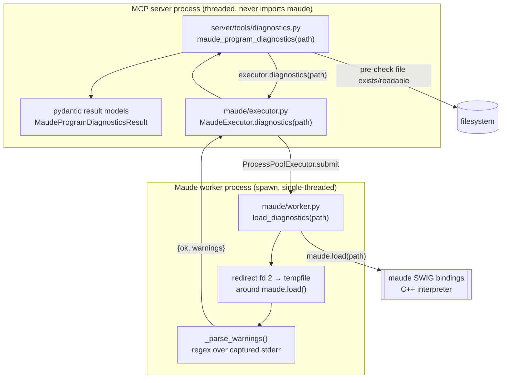
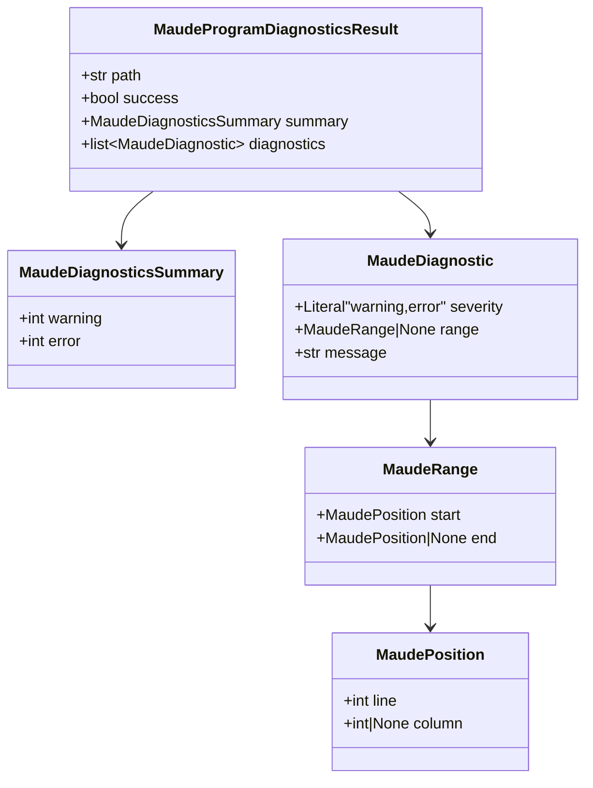

# Research — the current Harold diagnostics pipeline

> Sources: `harold-mcp/src/harold_mcp/server/tools/diagnostics.py`,
> `harold-mcp/src/harold_mcp/maude/{worker,executor}.py`,
> `harold-mcp/.agents/summary/*.md`,
> `harold-mcp/.agents/planning/maude-diagnostics-tool-v1/design/detailed-design.md`, tests.
> Date: 2026-09-13.

## 1. Architecture in one picture

Two processes. The MCP server never imports the `maude` bindings; the interpreter lives in a
`ProcessPoolExecutor`-managed worker. Diagnostics are produced by **loading the file** and
capturing the interpreter's stderr warnings.

Key invariant (R17): **the server process never imports `maude`**; only the worker does
(lazily, inside functions). This is why `worker.py` is importable from anywhere but touches
the bindings only when its functions run.

## 2. The tool (`server/tools/diagnostics.py`)

- Registered with `@mcp.tool(annotations=ToolAnnotations(readOnlyHint=True, destructiveHint=False, idempotentHint=True, openWorldHint=False), tags=harold_tags(DIAGNOSTICS))`.
- Signature: `maude_program_diagnostics(path: str, maude_executor: MaudeExecutor = Depends(get_maude_executor))`.
  The executor is injected, so the **MCP input schema is exactly `{path: str}`**.
- Flow: pre-check `Path(path).is_file()` and `os.access(path, os.R_OK)` → raise
  `MaudeFileNotFoundError` (a **tool error**, `isError`) if not; otherwise call
  `maude_executor.diagnostics(path)` and map via `_build_result`.

### Result model (today)

Mapping (tri-state, `_build_result`):

| Worker outcome | Diagnostics produced | `success` |
| --- | --- | --- |
| `ok=True`, no warnings | `[]` | `True` |
| `ok=True`, warnings | one `warning` per warning (line range, or `None` if no line) | `False` |
| `ok=False` | warnings, **plus one synthesized `error` with `range=None`** | `False` |

`success=True` **iff no warnings and no errors** (R4). `severity="error"` today means
**only** the synthesized unrecoverable-load failure; the message is the fixed
`_HARD_FAILURE_MESSAGE`. `range=None` means a whole-file problem.

## 3. The worker protocol

- `WarningDict = {line: int | None, message: str}`
- `LoadDiagnosticsResult = {ok: bool, warnings: list[WarningDict]}`
- `load_diagnostics(path)`:
  1. lazy `import maude`;
  2. `os.dup2` fd 2 to a `TemporaryFile`, call `maude.load(path)`, restore fd 2;
  3. decode captured bytes **lossily** (`utf-8`, `errors="replace"`) — Maude may echo arbitrary
     file bytes;
  4. `_parse_warnings` strips ANSI CSI sequences, then matches
     `Warning:\s+\S[^:]*,\s+line\s+(\d+)\s*(?:\([^)]*\))?:\s*(.*)`.
- `init_maude` runs `maude.init(advise=False)` and disables Maude IO
  (`setAllowDir/File/Processes(False)`).

Empirical fact (v1 research): `maude.load` returns `True` for **every parseable input**,
including 12-warning garbage and binary files; the `ok=False` path fires for missing files
(which the tool pre-checks away) and unrecoverable bison failures. So in practice the
synthesized `error` is mostly exercised by unit tests.

## 4. The executor (`maude/executor.py`)

- `MaudeExecutor.diagnostics(path)` → `_run_task(worker.load_diagnostics, path)`, with
  `BrokenProcessPool → MaudeWorkerCrashedError` and `TimeoutError → MaudeWorkerTimeoutError`,
  replacing the pool exactly once via `_reset_executor` (identity check under an RLock).
  The failed call is **never auto-retried** (idempotent; the client retries).
- `start()` warms up the pool (one `ping` per worker) during the server lifespan; `shutdown()`
  tears it down. `get_maude_executor()` is a lazy, lock-guarded singleton.
- Settings (`pydantic-settings`, `HAROLD_` prefix): `HAROLD_MAUDE_WORKERS` (default 1),
  `HAROLD_MAUDE_WORKER_TIMEOUT_SECS` (default 60).

## 5. Error handling & tool semantics

- Missing/unreadable file → `MaudeFileNotFoundError` → MCP `isError` (before the worker).
- Worker crash/timeout → `MaudeWorkerCrashedError` / `MaudeWorkerTimeoutError` → `isError`.
- Parse problems are **diagnostics**, not errors.
- Annotations reach clients; **tags do not** with mcp SDK 1.29 (spec 2025-06-18) — tags only
  drive server-side visibility control. `destructiveHint` defaults to `True`, so read-only
  tools must negate it.

## 6. Testing & conventions

- `tests/unit/` hermetic, mocked. `test_diagnostics.py` calls the tool **directly** with a
  `FakeMaudeExecutor` (FastMCP `Depends` defaults don't block direct calls) and checks the
  tri-state mapping, summary counts, `path` echo, and the pre-check.
- `tests/integration/` uses the real interpreter and fixtures under
  `tests/integration/fixtures/` (`hello.maude`, `broken-recoverable.maude`,
  `broken-non-recoverable.maude`, `no_new_module.maude`, a binary file).
- Conventions that will constrain a port:
  - mypy strict (`disallow_untyped_defs`); basedpyright `reportUnusedCallResult`
    (mark intentional discards with `_ = ...`); ruff auto-fix fails CI (`make check`).
  - `Depends(...)` defaults need `# noqa: B008`.
  - New modules must be added to `docs/modules.md`; `make docs-test` is strict.
  - Tools build tags via `harold_tags(...)`; effect/safety metadata goes in `ToolAnnotations`.
  - Python ≥ 3.14; `uv` for deps; `make test` runs with coverage.

## 7. Where linting could plug in (surfaces, not decisions)

1. **Inside the tool** (`server/tools/diagnostics.py`, server process): read the file text and
   run pure-Python lint rules, merging their diagnostics with the worker's Maude warnings.
   Requires no executor change; the file is already read/validated here.
2. **As a new worker op** (`worker.lint` + `MaudeExecutor.lint`): only needed if a rule needs
   interpreter/module information; the current rules do **not**.
3. **As a separate tool** (`maude_program_lint`): static only, no interpreter, no state
   mutation, could run even if the worker is down.
4. **As a shared internal module** (e.g. `harold_mcp/maude/lint.py` or a `lint` package) that
   both the existing tool and any future tool call through an adapter.

The important structural fact: **the linter is pure text and independent of the worker**, so
the interface between "scan" and "how results are surfaced" can be kept very thin.

## 8. References

- `harold-mcp/src/harold_mcp/server/tools/diagnostics.py`
- `harold-mcp/src/harold_mcp/maude/worker.py`, `.../maude/executor.py`, `.../server/tags.py`
- `harold-mcp/.agents/summary/{interfaces,data_models,components}.md`
- `harold-mcp/.agents/planning/maude-diagnostics-tool-v1/design/detailed-design.md` (§2 requirements R1–R19, §7 testing, §8 appendices)
