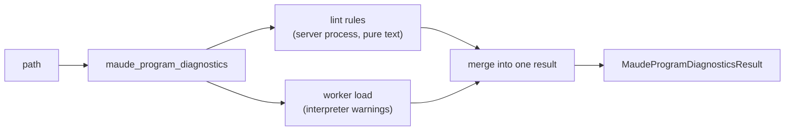

# Research — integration options: what porting the linter means for Harold

> Builds on `linter-py-analysis.md` and `harold-diagnostics-pipeline.md`.
> This file frames **options and open questions**; the choices belong in the requirements
> (`idea-honing.md`) and the detailed design. Date: 2026-09-13.

## 1. What `linter.py` would contribute to Harold

Three separable contributions, each with a different integration cost:

| Contribution | Value | Nature |
| --- | --- | --- |
| **Static heuristics** (6 rules) for common LLM/Maude mistakes, some borrowed from other languages (`when`, `--`, Unicode punctuation) | Catches errors that Maude reports only as terse `parsing error`, and some Maude accepts silently (non-linear patterns) | Pure text, no interpreter |
| **Autofix** (Unicode punctuation → ASCII) | Safe, deterministic repair a client/model could apply | Pure text, but applying it **mutates** the file → conflicts with `readOnlyHint=True` |
| **Model-facing messages** | Explanatory, actionable diagnostics (vs. Maude's laconic output) | Formatting; needs English rewrite |

So the honest answer to "is it a set of heuristics?": **yes, it is a curated failure
taxonomy of static heuristics** — some specific to mixing Maude with other languages'
habits, some general to any generated text (typographic punctuation), some Maude-specific
semantics (`=` vs `==`, non-linear patterns). It is not a parser and not a general linter.

## 2. Is extending `maude_program_diagnostics` the right choice?

The two candidate shapes:

### Option A — Extend `maude_program_diagnostics` (one composite tool)

Run lint rules and the interpreter load in one call, return a merged diagnostic list.

- Pros: one call gives the agent everything; no client orchestration; matches the tool's
  "report every problem" promise; the tool already has a diagnostics tag.
- Cons: couples a cheap pure-text pass to an expensive per-call worker round trip (and to the
  interpreter's state mutation); a lint-only need still pays the worker cost; mixes two
  producers with different precision/semantics in one model.

### Option B — New `maude_program_lint` tool (static only)

- Pros: fast, no interpreter, **no state mutation** (interpreter "last load wins"), works even
  if Maude fails to init, cleaner separation of "static analysis" vs. "load/report"; trivially
  testable; keeps each tool's result model coherent.
- Cons: a client wanting a full picture must call two tools (and reconcile two result shapes);
  two tools to document/tag/maintain; some overlap in the model types.

### Option C — Shared internal lint module + tool-agnostic seam

Put the rules in an internal component (e.g. `harold_mcp/maude/lint.py` or
`harold_mcp/lint/`) that returns a **neutral** issue type, and expose it through **whichever**
tool(s) we choose via a thin adapter. This makes A and B composable and avoids a rewrite if we
later move from one to the other. It is a **structure** decision, orthogonal to A vs. B.

### Relevant repo signals

- The server `instructions` already say Harold's tools cover *"Diagnosing Maude programs
  (**linters** and other static checks)"* — i.e. linting is expected under the diagnostics
  umbrella, but "linters" is plural and not tied to one tool.
- The `DIAGNOSTICS` tag already means "static analysis of Maude programs", so either shape
  fits the tag vocabulary; no new functional-category tag is strictly required.
- v1 deliberately made the tool **idempotent and read-only**, with `success=False` on any
  warning. Adding lint findings fits that philosophy (point out everything to fix).

## 3. Model changes to consider (`MaudeProgramDiagnosticsResult`)

If lint issues are surfaced, the current model needs (at minimum) semantic decisions:

1. **Severity mapping.** linter `fatal` → `"error"`, linter `warning` → `"warning"`. But today
   `"error"` means *only* "unrecoverable load failure", and its message is the fixed
   `_HARD_FAILURE_MESSAGE` with `range=None`. Using `"error"` for lint fatals **broadens the
   meaning of the existing enum value** — needs documenting. Alternatives: keep two values but
   add a `source` field; or add an explicit `"info"`; or drop the "synthesized error" notion.
2. **Provenance.** LSP diagnostics carry a `source` (`"maude"` vs `"linter"`). Without it, an
   agent cannot tell whether a message came from the interpreter or from a heuristic. Strong
   candidate for a new optional field (e.g. `source: Literal["maude","linter"]`).
3. **Rule code.** LSP-style `code` (e.g. `"when-guard"`, `"non-ascii"`) would let clients/
   models filter and track fixes. The current linter has none; adding codes is a small,
   high-value extension.
4. **Ranges.** Linter issues are line-only, like Maude's — maps cleanly onto
   `MaudeRange`/`MaudePosition` with `range=None` for file-wide problems. No change needed.
5. **`success` semantics.** If `success` stays "no warnings and no errors", lint findings must
   count — otherwise a file with only lint issues would report `success=True`. Consistent with
   R4's intent.
6. **Summary counts.** `MaudeDiagnosticsSummary{warning,error}` already covers the mapped
   severities; a `source` split (maude vs linter) is optional.
7. **Autofix surface.** If we report suggested fixes (rather than applying them), the model
   needs an optional `fix`/`replacement` field, and a policy for whether anything is written
   to disk. Writing is a **behavioral change** to a `readOnlyHint=True` tool — likely a new
   tool or an explicit opt-in parameter instead. **Resolved (2026-09-13): report-only** —
   fixes are exposed as an optional response field; the tool never writes to the file. See
   `../idea-honing.md` Q1.
8. **Messages.** English, model-actionable, and ideally cite the offending token/character
   (the current messages already do this, in French).

## 4. Deep-analysis-driven open questions (for requirements clarification)

1. **Qid rule.** The rough idea's quoted requirement mentions a *redeclared `Qid` sort
   shadowing the built-in*, but `linter.py` has no such rule. Port it as a new rule, or treat
   the quote as outdated?
2. **Scope of port.** Exactly the 6 existing rules? Or also rewrite/extend the heuristic set
   (more keywords, Maude versions, string-literal awareness)?
3. **Fatal → error semantics.** Should lint fatals become `severity="error"` in the existing
   model, or should severity remain a Maude-only notion with lint findings always `warning`
   plus a `source`/`code` field?
4. **Tool shape.** One composite `maude_program_diagnostics`, a separate
   `maude_program_lint`, or both over a shared internal module?
5. **Autofix.** Report suggested fixes only, apply them, or split into a separate mutating
   tool with different annotations (`readOnlyHint=False`)? — **Resolved: report-only**
   (optional fix-suggestions field, tool stays read-only); see `../idea-honing.md` Q1.
6. **False positives.** How aggressive should the heuristic rules be (rule 6's keyword list is
   deliberately small; over-flagging erodes trust in a diagnostics tool)?
7. **Language/i18n.** Messages must be English; keep the taxonomy but rewrite messages. Any
   need for a locale mechanism, or English-only?
8. **Severity vocabulary.** Keep the binary `{warning,error}`, or introduce an `info` level
   (v1 explicitly deferred `info`/advisory)?
9. **Interpreter independence.** Confirm linting runs in the server process (no worker) so it
   works without Maude and without mutating interpreter state.
10. **Testing.** Reuse/extend the three fixture families; add lint-specific fixtures (one per
    rule) to `tests/` for both unit and integration levels.

## 5. References

- `research/linter-py-analysis.md`, `research/harold-diagnostics-pipeline.md`
- `harold-mcp/src/harold_mcp/server/server.py` — server `instructions` mentioning "linters and other static checks".
- `harold-mcp/src/harold_mcp/server/tags.py` — `DIAGNOSTICS` = "static analysis of Maude programs".
- `harold-mcp/.agents/planning/maude-diagnostics-tool-v1/design/detailed-design.md` — R3/R4/R6/R7/R14/V1 scope deferrals (columns, codes, `info`).
