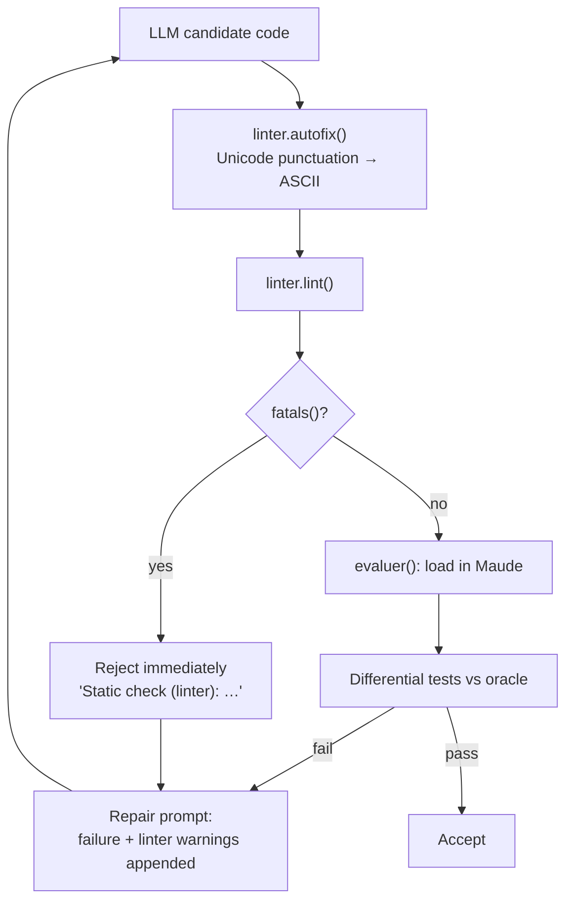

# Research — `improve-rag/improvement/linter.py` deep analysis

> Source analyzed: `improve-rag/improvement/linter.py` (171 lines, complete read).
> Grounding: the real LLM-generated failures in
> `improve-rag/improvement/tests/rag-gemini-2.5-flash/maudec/maude/`.
> Date: 2026-09-13.

## 1. What this file is

A **micro-linter for LLM-generated Maude code**. Its own docstring states each rule comes
from a *real, observed* failure, and that it has two uses:

1. **Clear diagnostics to inject into the repair prompt** — because Maude's own parser
   messages are often laconically just `parsing error`.
2. **Autofix of safe substitutions** — Unicode punctuation copied from PDFs/word processors
   is normalized to ASCII.

It is **not** a Maude parser and **not** a general-purpose linter. It is a small, per-line,
regex/heuristic **failure taxonomy** distilled from the observed failures of one model run.
It has **no dependency on the `maude` bindings** — it is pure Python (`re`, `unicodedata`).
It never runs or loads a program.

## 2. Public surface

| Symbol | Signature | Returns | Purpose |
| --- | --- | --- | --- |
| `FATAL` / `WARN` | `"fatal"` / `"warning"` | — | Severity constants. `FATAL` = won't compile; `WARN` = legal but suspicious in generated code. |
| `UNICODE_FIXES` | `dict[str, str]` | — | 8 punctuation substitutions (`’ ‘ “ ” – — non-breaking space …`). |
| `autofix` | `(code) -> (code, fixes)` | `(str, list[str])` | Applies the deterministic Unicode substitutions; returns the new code and human-readable fix descriptions. |
| `lint` | `(code) -> list[dict]` | issues | The 6 rules. Each issue is `{"severity", "line", "msg"}`. |
| `format_issues` | `(issues) -> str` | text | Repair-prompt formatting: `- ligne {line} [{severity}] : {msg}`. |
| `fatals` | `(issues) -> list` | subset | Issues with `severity == FATAL`. |
| `__main__` | CLI | stdout | Autofix a file path, then print issues. |

Note the issue key is **`msg`**, not `message`, and lines are **1-based**. There are **no
rule identifiers/codes**, and `autofix` descriptions carry no line numbers.

## 3. Rule taxonomy (the core contribution)

All detection is **textual**. `lint` strips comments per line via `_sans_commentaires`
(truncate at the first `***` or `---`) before matching rules 1–4, and builds a global picture
of declared `var/vars`, inline `X:Sort`, `op(s)`, and `sort(s)` for rules 5–6.

| # | Rule | Severity | Detection (heuristic) | Autofix? | Real fixture |
| --- | --- | --- | --- | --- | --- |
| 1 | Non-ASCII character outside a comment | `fatal` | Iterate the comment-stripped line; first char with `ord > 127` (then `break`). Message names the character and guesses "typographic apostrophe/dash". | **Yes** — `autofix` maps the 8 known punctuation chars | `simple-list.maude` line 21 (`L’`, U+2019) |
| 2 | `when` guard | `fatal` | `\bwhen\b` on the comment-stripped line. Suggests `ceq … if …`. | No | `repeated.maude` line 30 |
| 3 | `--` comment | `fatal` | `(^|\s)--(?!-)(\s|$)` on the **raw** line (so a trailing `--` comment is caught but `---` is not). | No | `simple-list.maude` lines 28, 36 |
| 4 | Lone `=` inside an `if … then` term | `fatal` | Find `\bif\b(.*?)\bthen\b`; inside that span, a `=` not preceded by `= < > ~ / \` and not followed by `=` or `/` (so `==`, `=/=`, `<=`, `>=`, `<=`, `/\`, `\/` are excluded). | No | `collatz.maude` line 9 |
| 5 | Non-linear LHS pattern | `warning` | Match `eq`/`ceq` left-hand side; tokenize identifiers; flag any **declared** variable appearing more than once. Legal in Maude (forces sub-term equality) but often accidental. | No | `free-tuples.maude` line 25 (`B-ignore` twice) |
| 6 | Undeclared capitalized identifier in `eq`/`rl` | `warning` | In `eq/ceq/rl/crl` lines, any `[A-Z]\w*` token not in declared vars/ops/sorts, not a known keyword (small `MOTS_CLES` set) and not a built-in sort (`Bool Nat Int Float String Qid`). | No | — heuristic |

### Severity semantics

- `FATAL` — "will not compile". Rules 1–4.
- `WARN` — "legal but suspicious in generated code". Rules 5–6; explicitly documented as
  possibly intentional (non-linear pattern) or as a clearer restatement of what the parser
  will report anyway (undeclared identifier).

## 4. How the linter is consumed today (role in the pipeline)

- **`repair.py` `verifier()`** (`improve-rag/improvement/repair.py` L266–307):
  - any `fatal` → reject at once with `"Static check (linter):\n" + format_issues(fatals)`;
  - if load fails or differential tests fail, all linter issues (including warnings) are
    appended as "possibly related" context.
- **`autofix`** is applied to model output **before** verification in `repair.py`,
  `generate.py`, `best_of.py`, and `opencode/agent_loop.py`.
- **`best_of.py` `verifier_candidat()`** also uses `fatals(lint(code))` as a fast gate.

So the linter contributes three distinct things: (a) a **preprocessing autofix**, (b) a
**cheap static gate** that avoids invoking the interpreter for obviously broken code, and
(c) **model-facing explanatory messages** that are richer than Maude's own.

## 5. Discrepancies / gaps vs. the rough idea

The rough idea quotes a requirement listing four triggers: a `when` guard, a typographic
Unicode apostrophe, `=` inside `if_then_else_fi`, **and "a redeclared `Qid` sort shadowing
the built-in"**. Findings:

- The current `linter.py` has **no `Qid`/redeclaration rule** — grep for `Qid`/`redeclar`/
  `shadow` finds no rule implementing it (only `Qid` appears as a *built-in* in rule 6's
  allow-list). Either the quote describes an earlier/other version, or that rule was intended
  but never implemented. **This needs requirements clarification** (port it? drop it?).
- The quote is also incomplete relative to the code: there are **6 rules**, not 4, plus 8
  Unicode substitutions and `--`-comment detection.
- The linter does **not** detect the failures Maude itself reports (e.g. missing `is`
  keyword, missing separator). It is **complementary** to Maude warnings, not a replacement.

## 6. Porting-relevant characteristics

| Property | Observation | Consequence for harold |
| --- | --- | --- |
| Dependencies | Only `re`, `unicodedata` (stdlib). No `maude`. | The rules can run in the **MCP server process**; no worker needed. |
| Input | A **code string** (read from a path only in `__main__`). | harold's tool receives a **path**; contents must be read (server-side pre-check already touches the path). |
| Output | `list[{severity, line, msg}]`, `severity ∈ {fatal, warning}`. | harold's model uses `severity ∈ {warning, error}`, `message`, and LSP `range` with 1-based line. Needs an adapter; `fatal→error`, `warning→warning` is the natural mapping. |
| Locale | French messages and formatting (`- ligne …`). | Messages must be rewritten in English for Harold's clients. |
| Precision | Line-only; no column/end span; no rule code. | Matches harold's line-only ranges; a `code`/`source` field would be a model addition. |
| Interpreter needs | None. Rules 5–6 need only a file-wide view of declarations. | Linting does **not** require the Maude worker; can run even when the interpreter is unavailable. |
| Autofix | Deterministic, non-destructive substitution on a copy. | Applying fixes would be a **mutation**; the current tool is `readOnlyHint=True`. Decide: report fixes vs. apply them. |
| False positives | Rules 1–4 ignore strings; rules 5–6 are explicitly heuristic (`MOTS_CLES` is small, rule 6 warns it's a heuristic). | Warning severity is deliberate; must decide how much to trust/surface as `error`. |

## 7. References

- `improve-rag/improvement/linter.py` — the artifact.
- `improve-rag/improvement/repair.py` L266–307 — `verifier()` integration.
- `improve-rag/.agents/summary/components.md` §`linter.py` — the knowledge-base summary.
- `improve-rag/.agents/summary/requirements.md` §How Verification Is Used — the "0. Lint (static, free)" stage.
- Fixtures: `tests/rag-gemini-2.5-flash/maudec/maude/{repeated,simple-list,collatz,free-tuples}.maude`.
