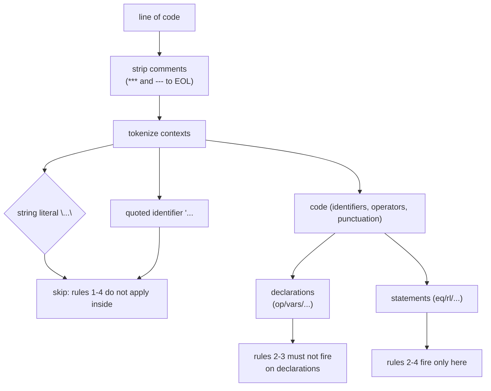

# Research — Maude 3.5.1 lexical behavior for hardening the ported linter rules

> Purpose: pin down the Maude lexical facts needed for the Q9(b) false-positive hardening of
> the six ported rules (`../idea-honing.md` Q9). Method: empirical probes run with the real
> interpreter (`/home/juanrh/systems/maude/Maude-3.5.1-linux-x86_64/maude`, Maude 3.5.1) plus
> the real improve-rag fixture. Date: 2026-09-14.

## 1. Method

Each probe is a small `.maude` file written to `/tmp/` and loaded with `load <file>` on the
3.5.1 binary. A clean load (no `Warning:` lines) means Maude accepts the construct; warnings
show exactly what the parser rejects. Probe contents are reproduced below so the claims are
reproducible.

## 2. Findings (probe table)

| # | Probe (file content) | Result | Implication |
| --- | --- | --- | --- |
| A | `fmod T is protecting STRING . op s : -> String . eq s = "when -- = café" . endfm` | loads clean | String literals can contain `when`, `--`, `=`, and non-ASCII. Rules 1–4 must **skip string contents**. |
| B | `fmod T is protecting QID . op q : -> Qid . eq q = 'when . endfm` | loads clean | `'when` is a valid quoted identifier. Rule 2 must skip quoted identifiers. |
| C | `fmod T is protecting QID . op q : -> Qid . eq q = '-- . endfm` | loads clean | `'--` is a valid quoted identifier. Rule 3 must skip quoted identifiers. |
| D | `op when : Bool -> Bool .` (+ eq use) | loads clean | `when` is **not** reserved; it is a valid identifier. Rule 2 must not fire on declarations (`op when`, `var when`). |
| E | `op _--_ : Nat Nat -> Nat .` | loads clean | `--` is a valid (infix) operator token. Rule 3 must not fire on operator declarations. |
| I | `op -- : Nat -> Nat .` + `eq -- N = N .` | declaration parses; the *use* `-- N` fails ("didn't expect token N") | Prefix `--` declares but is unusable in prefix position; rule 3's whitespace-delimited `--` is still a *contextual* error in code, but declarations must be skipped. |
| F | `op café : -> Nat .` (+ eq, with `protecting NAT`) | loads clean | Accented letters are accepted in identifiers. |
| G/G2 | `op L’ : -> Nat .` (U+2019); `red L’ .` | loads clean; reduces to `1` | Typographic apostrophe U+2019 is accepted in identifiers **and works in terms**. |
| H | `op f–g : -> Nat .` (U+2013) | loads clean | En dash accepted in identifiers. |
| L | `op f“ : -> Nat .` (U+201C) | loads clean | Typographic double quote accepted in identifiers. |
| M | `eq f(N) = if N = 0 then 0 else 1 fi .` | real parse error ("didn't expect token =") | Rule 4's premise holds: `=` inside `if_then_else_fi` is a genuine parse error. |

## 3. The decisive finding: linter rule 1's premise is wrong for Maude 3.5.1

The source linter's rule 1 flags any non-ASCII character outside a comment as `fatal` with
the message "Maude won't parse it". Empirically, **Maude 3.5.1 accepts non-ASCII bytes as
identifier characters**: `é` (U+00E9), `’` (U+2019), `–` (U+2013), `“` (U+201C) all parse in
declarations, and `red L’ .` reduces normally. Maude's lexer is byte-oriented and treats
bytes ≥ 0x80 as identifier characters, so a non-ASCII character never causes a "non-ASCII"
tokenization error — at worst it fuses with a neighboring identifier and causes a
contextual parse error elsewhere.

The real fixture confirms the misattribution. `improve-rag/improvement/tests/rag-gemini-2.5-flash/maudec/maude/simple-list.maude`
declares `vars L L’ : List{X} .` (line 21, U+2019) **and** has `--` comments (lines 28 and
36). Loading it on Maude 3.5.1 warns only about the `--` tokens and the cascade from them
(lines 28, 34, 36, 38, 39); **nothing is reported for line 21**. The U+2019 was never the
failure — the linter's taxonomy attributes it to the wrong cause.

**Consequence for the port (needs a requirements amendment):**

- Rule 1 cannot be mapped to `"error"` under Q6's rule that `error` is for findings that
  cannot be false positives — here the "won't compile" premise itself is false on the
  pinned interpreter.
- The rule still has value as a **normalization advisory**: typographic punctuation is
  almost always an accidental paste from a PDF/word processor, and non-ASCII identifiers
  are a portability/tooling hazard. The `UNICODE_FIXES` autofix (Q2 `fix` field) remains
  the useful payload.
- Recommended severity: `warning` (suspicious paste, likely unintended) or `info` (Maude
  accepts it, pure style). → **Open question for the requirements phase** (see §6).

Note: the failure taxonomy's own docstring says each rule comes from a *real observed*
failure; rule 1's *observation* was real (the file did fail), but the *attribution* to the
apostrophe was wrong — the `--` comments were the actual cause, and rule 3 already covers
those.

## 4. Lexical model the hardened rules should respect



- Comments are already stripped by the source linter (`***` and `---` to end of line);
  `--` is **not** a comment delimiter in Maude — that is exactly why it is a real error.
- A string literal runs from `"` to the next `"` (no escape sequences; any character
  allowed). A quoted identifier runs from `'` to the next token boundary (any
  non-whitespace characters allowed, including `--` and `when`).
- Identifiers may contain letters, digits, and — per the empirical probes — any byte ≥ 0x80.
  ASCII punctuation such as `’`/`“`/`–` is *not* punctuation to Maude, it is identifier
  material.

## 5. Rule-by-rule hardening implications

| Source rule | Hardening required (Q9 option b) | Severity after hardening |
| --- | --- | --- |
| 1 non-ASCII | skip strings; keep detection on code lines; rewrite message ("Maude accepts it, but it is usually a typographic-punctuation paste; consider ASCII") | `info` (resolved 2026-09-14 — Q6 amendment in `../idea-honing.md`); autofix stays |
| 2 `when` | skip strings + quoted identifiers + `op`/`var` declarations; fire on statement lines (the Haskell/SML guard pattern appears in `eq`/`rl` conditions) | `warning` (may be an intentional identifier in terms; e.g. `'when` is already excluded) |
| 3 `--` | skip strings + quoted identifiers + operator declarations; fire on statement lines where `--` is whitespace-delimited | `warning` (in code, `--` is a real parse error — this rule could even be `error`, but the regex is heuristic: near-operator usage and line-based matching can misfire) |
| 4 `=` in if_then_else_fi | skip strings + quoted identifiers; keep the `=`-context exclusions (`==`, `=/=`, `<=`, `>=`, `/\`, `\/`) | `warning` |
| 5 non-linear LHS | keep as-is (legal Maude, often accidental) | `warning` |
| 6 undeclared capitalized identifier | revisit the keyword allow-list (small: add e.g. `unify`, `variant`, `getModel`? — to settle in design against the manual's reserved/known words) | `warning` |

The hardened port therefore produces **no `error`-severity heuristic diagnostics at all**
with the current rule set; every heuristic finding is `warning` or `info`. This is
consistent with Q6's "heuristic-linter findings may be false positives".

## 6. Open questions raised for the requirements phase

1. ~~**Severity of the demoted rule 1**~~ — **resolved (2026-09-14): `info`**, recorded as a
   Q6 amendment in `../idea-honing.md` (with the `L’` example program and the
   compile-counterexample justification).
2. **Rule 2/3/4 `error` potential** — rules 2 and 4 are *real* parse errors when they fire
   on statement lines; the linter originally rated them `fatal`. Under Q6, heuristic
   `error` is allowed only for findings that cannot be false positives. Line-based regexes
   can still misfire (e.g. `when` as a declared variable used in a statement, `--` near an
   operator), so the conservative default (`warning`) is recommended; confirm or refine in
   design.

## 7. References

- Probes: `/tmp/{a_string,b_qid_when,c_qid_dash,d_when_op,e_dash_op,f_nonascii,g_u2019,h_u2013,i_prefix_dash,l_u201c,m_eq_in_if}.maude` (this session; reproduced in §2).
- Fixture: `improve-rag/improvement/tests/rag-gemini-2.5-flash/maudec/maude/simple-list.maude` (lines 21, 28, 36).
- Source linter: `improve-rag/improvement/linter.py` (`_sans_commentaires`, rules 1–4, `UNICODE_FIXES`).
- Interpreter: `/home/juanrh/systems/maude/Maude-3.5.1-linux-x86_64/maude` (Maude 3.5.1, built 2025-07-16).

## 8. Appendix — complete probe programs (fixture candidates)

Every probe from §2, reproduced as a complete standalone program with the prelude imports a
real fixture must carry. "Expected" is the behavior observed on Maude 3.5.1. Programs
marked **fixture** are candidates to be copied into `tests/integration/fixtures/` during
implementation (Q11.4: one test fixture per heuristic rule); suggested names follow the
existing `hello.maude` / `redeclare_prelude.maude` style.

| Program | Demonstrates | Expected on 3.5.1 | Fixture candidate |
| --- | --- | --- | --- |
| string-with-specials | rules 1–4 must **not** fire inside a string literal | loads clean, zero diagnostics | `string_with_specials.maude` (negative, rules 1–4) |
| qid-when | rule 2 must **not** fire inside a quoted identifier | loads clean, zero diagnostics | `qid_when.maude` (negative, rule 2) |
| qid-dash | rule 3 must **not** fire inside a quoted identifier | loads clean, zero diagnostics | `qid_dash.maude` (negative, rule 3) |
| when-operator | rule 2 must **not** fire on operator declarations | loads clean, zero diagnostics | `when_operator.maude` (negative, rule 2) |
| dashdash-operator | rule 3 must **not** fire on operator declarations | loads clean, zero diagnostics | `dashdash_operator.maude` (negative, rule 3) |
| nonascii-apostrophe | rule 1 positive (`info` + Unicode autofix) | loads clean, zero interpreter diagnostics; `red L’ .` = `1` | `nonascii_apostrophe.maude` (positive, rule 1) |
| nonascii-accented | rule 1 positive (accented letter) | loads clean | optional: `nonascii_accented.maude` |
| nonascii-endash | rule 1 positive (en dash) | loads clean | optional: `nonascii_endash.maude` |
| nonascii-ldquo | rule 1 positive (typographic `"`) | loads clean | optional: `nonascii_ldquo.maude` |
| prefix-dashdash | `--` in *statement* position is a real parse error (context for rule 3) | loads with 2 warnings (line 5) | no — research only |
| eq-in-if | rule 4 positive; the interpreter reports it too | 2 warnings (`didn't expect token =`, `no parse for statement`) | `eq_in_if.maude` (positive, rule 4) |

Positive fixtures for rules 2, 3, 5 and 6 already exist in the improve-rag set
(`repeated.maude` — `when` guard; `simple-list.maude` — `--` comments; `collatz.maude` —
`=` in `if_then_else_fi`; `free-tuples.maude` — non-linear pattern) and will be adapted
into `tests/integration/fixtures/` during implementation.

### string-with-specials

```maude
fmod T is
    protecting STRING .
    op s : -> String .
    eq s = "when -- = café" .
endfm
```

### qid-when

```maude
fmod T is
    protecting QID .
    op q : -> Qid .
    eq q = 'when .
endfm
```

### qid-dash

```maude
fmod T is
    protecting QID .
    op q : -> Qid .
    eq q = '-- .
endfm
```

### when-operator

```maude
fmod T is
    protecting BOOL .
    op when : Bool -> Bool .
    var B : Bool .
    eq when(B) = B .
endfm
```

### dashdash-operator

```maude
fmod T is
    protecting NAT .
    op _--_ : Nat Nat -> Nat .
endfm
```

### nonascii-apostrophe

```maude
fmod T is
    protecting NAT .
    op L’ : -> Nat .
    eq L’ = 1 .
endfm
```

### nonascii-accented

```maude
fmod T is
    protecting NAT .
    op café : -> Nat .
    eq café = 1 .
endfm
```

### nonascii-endash

```maude
fmod T is
    protecting NAT .
    op f–g : -> Nat .
    eq f–g = 1 .
endfm
```

### nonascii-ldquo

```maude
fmod T is
    protecting NAT .
    op f“ : -> Nat .
    eq f“ = 1 .
endfm
```

### prefix-dashdash

```maude
fmod T is
    protecting NAT .
    op -- : Nat -> Nat .
    var N : Nat .
    eq -- N = N .
endfm
```

### eq-in-if

```maude
fmod T is
    protecting NAT .
    protecting BOOL .
    op f : Nat -> Nat .
    var N : Nat .
    eq f(N) = if N = 0 then 0 else 1 fi .
endfm
```
