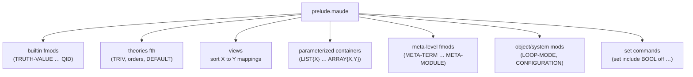

# Research — the prelude sort set for the `prelude-sort-redeclared` rule

> Purpose: define the set of "sorts declared in `prelude.maude`" for the Q7 heuristic rule
> and the Q10 bundled snapshot + update script. Date: 2026-09-14.

## 1. Sources and provenance

- Installed: `/home/juanrh/systems/maude/Maude-3.5.1-linux-x86_64/prelude.maude` — Maude
  3.5.1 (built 2025-07-16), 3234 lines, ends with `select CONVERSION .`.
- Bundled copy (byte-identical, verified with `cmp`):
  `maude-bindings/maude_java_lib/lib/bin/main/maude/stdlib/prelude.maude`.
- The prelude is **always auto-loaded** by Maude (no `-no-prelude`), so every sort it
  declares is a pre-existing name a user file can shadow. (A user module still needs to
  `protecting NAT`/`STRING`/… to *use* those sorts — verified empirically: without the
  import, Maude warns "undeclared sort Nat".) The redeclaration case is silent: `load
  tests/integration/fixtures/redeclare_prelude.maude` prints nothing.

## 2. Prelude structure

## 3. Extraction rules ("only real declarations count", Q10)

A sort name enters the snapshot iff it is declared by a `sort`/`sorts` statement inside an
`fmod`/`fth`/`mod` body, of the form `sort(s) Name… .`. Everything else is excluded:

1. **View bodies** (`view … is … endv`): `sort Elt to Nat .` is a sort **mapping**, not a
   declaration. Discriminator: the statement contains ` to `. (About 30 of the ~96
   `sort(s)` lines in the prelude are view mappings.)
2. **Renaming instantiations**: `protecting LIST{Nat} * (sort NeList{Nat} to NeNatList, …)`
   are mappings too — same ` to ` discriminator. The renamed names (`NatList`, `QidList`,
   …) are *not* `sort` declarations and stay out (see §5.4).
3. **`set` commands** (`set include BOOL off .`) declare nothing.
4. **Comments**: `*** sort, kind and type sets`-style headers must be stripped before
   matching, or they false-positive as declarations.
5. **Gotcha — meta-term trick**: `META-MODULE` contains
   `eq [Q:Qid] = (sth Q:Qid is including Q:Qid . sorts none . none none none none none none none endsth) .`
   (lines 2043–2048): a `sorts none .` that lives inside a strategy-theory *term*, not a
   real declaration. A line-based extractor would collect `none`. The update script must
   exclude it (statement-level tracking, or a documented denylist for this one known
   placeholder).

## 4. The sort inventory (as declared)

### 4.1 Builtin data sorts (non-parameterized fmods)

| Module | Sorts |
| --- | --- |
| `TRUTH-VALUE` | `Bool` |
| `NAT` | `Zero` `NzNat` `Nat` |
| `INT` | `NzInt` `Int` |
| `RAT` | `PosRat` `NzRat` `Rat` |
| `FLOAT` | `FiniteFloat` `Float` |
| `STRING` | `String` `Char` `FindResult` |
| `CONVERSION` | `DecFloat` |
| `BOUND` | `Bound` |
| `QID` | `Qid` |

(`BOOL`, `BOOL-OPS`, `TRUTH`, `EXT-BOOL`, `RANDOM`, … declare no sorts.)

### 4.2 Theory sorts (fth)

| Module | Sorts |
| --- | --- |
| `TRIV` (and the order theories / `DEFAULT` that include it) | `Elt` |

### 4.3 Parameterized container sorts (fmod …{X} / {X,Y})

| Module | Sorts |
| --- | --- |
| `LIST{X}` | `NeList{X}` `List{X}` |
| `WEAKLY-SORTABLE-LIST{X}`, `WEAKLY-SORTABLE-LIST'{X}` | `$Split{X}` |
| `SET{X}` | `NeSet{X}` `Set{X}` |
| `LIST*{X}` | `Item{X}` `PreList{X}` `NeList{X}` `List{X}` |
| `SET*{X}` | `Element{X}` `PreSet{X}` `NeSet{X}` `Set{X}` |
| `MAP{X,Y}` | `Entry{X,Y}` `Map{X,Y}` |
| `ARRAY{X,Y}` | `Entry{X,Y}` `Array{X,Y}` |

(`SORTABLE-LIST{X}`, `SORTABLE-LIST'{X}`, `LIST-AND-SET{X}`, `SORTABLE-LIST-AND-SET{X}`,
`STRING-OPS`, `NAT-LIST`, `QID-LIST`, `QID-SET` declare no new sorts — only renamings.)

### 4.4 Meta-level sorts (META-TERM, META-CONDITION, META-STRATEGY, META-MODULE)

`Sort` `Kind` `Type` `Constant` `Variable` `TermQid` `GroundTerm` `Term`
`NeGroundTermList` `GroundTermList` `NeTermList` `TermList` `Assignment` `Substitution`
`Context` `NeCTermList` `GTermList` `EqCondition` `Condition` `UsingPair` `UsingPairSet`
`RuleApplication` `CallStrategy` `Strategy` `StrategyList` `SubsortDecl` `SubsortDeclSet`
`EmptyQidSet` `NeSortSet` `NeKindSet` `NeTypeSet` `SortSet` `KindSet` `TypeSet`
`NeTypeList` `TypeList` `TypeListSet` `Attr` `AttrSet` `Renaming` `RenamingSet`
`Expression` `ViewExpression` `ModuleExpression` `EmptyCommaList` `NeParameterList`
`ParameterList` `ParameterDecl` `NeParameterDeclList` `ParameterDeclList` `Import`
`ImportList` `Hook` `NeHookList` `HookList` `OpDecl` `OpDeclSet` `MembAx` `MembAxSet`
`Equation` `EquationSet` `Rule` `RuleSet` `StratDecl` `StratDeclSet` `StratDefinition`
`StratDefSet` `FModule` `SModule` `FTheory` `STheory` `Module` `Header` `StratModule`
`StratTheory` `SortMapping` `SortMappingSet` `OpMapping` `OpMappingSet` `StratMapping`
`StratMappingSet` `View` `NeVariableSet` `VariableSet` `Parent` `Type?` `PrintOption`
`PrintOptionSet` `VariantOption` `VariantOptionSet` `SrewriteOption` `UnificandPair`
`UnificationProblem` `PatternSubjectPair` `MatchingProblem`

### 4.5 Object/system modules

| Module | Sorts |
| --- | --- |
| `LOOP-MODE` (`mod`) | `State` `System` |
| `CONFIGURATION` (`mod`) | `Attribute` `AttributeSet` `Oid` `Cid` `Object` `Msg` `Portal` `Configuration` |

## 5. Snapshot scope questions for the design

1. **Theory sorts**: include `Elt`? A user declaring `sort Elt .` is common and usually
   harmless inside parameterized code; including it makes the rule noisier. (The letter of
   Q7 — "any of the sorts in prelude.maude" — includes it.)
2. **Parameterized names**: match as declared (`List{X}`, `Entry{X,Y}`, `$Split{X}`)
   literally, so `sort List{X} .` matches but `sort List .` does not. (This is the only
   literal, predictable rule.)
3. **Meta-level sorts**: ~100 names such as `Term`, `Equation`, `View`. Redeclaring those
   is rarer but equally a shadowing; the letter of Q7 includes them.
4. **Renamed instances** (`NatList`, `QidList`, `NeQidSet`, …): excluded by §3.2 — they
   are not `sort` declarations. Note this is a deliberate scope cut.
5. **Recommendation**: include everything §3 admits (builtins + `Elt` + parameterized +
   meta-level + object sorts), store names verbatim, match declarations literally. One
   uniform rule, no special-casing; the `info` severity (Q7) absorbs the noise.

## 6. Snapshot + update script requirements (Q10)

> **Superseded by the design review (2026-09-15)** — kept as the research record. The
> implemented shape is: the snapshot is a generated Python module
> (`harold_mcp/heuristic/prelude_sorts.py`), the regenerator is a cyclopts CLI in
> `harold_mcp/heuristic/prelude_extract.py` exposed as the `harold-update-prelude-sorts`
> console script (no `scripts/` directory), theory sorts (`Elt`) are excluded, and the
> snapshot is checked against a synthetic prelude plus invariants rather than a bundled
> copy of `prelude.maude`. See `../design/detailed-design.md` §4.5, §4.9, Appendix E.

- **Snapshot**: a bundled Python constant or data file listing the extracted names, with a
  provenance header (Maude version, source path, extraction date). Generated, never
  hand-edited.
- **Update script**: `scripts/update_prelude_sorts.py <abs-path-to-prelude.maude>` (Python
  preferred over bash: the extraction needs comment stripping, module/view tracking, and
  the ` to ` discriminator — all trivial in Python, painful in bash). It must implement §3
  (including the `sorts none .` gotcha) and rewrite the snapshot with fresh provenance.
- **Tests**: the script should be covered by a unit test that regenerates the snapshot from
  the bundled prelude copy and asserts it is byte-identical to the committed snapshot.

## 7. References

- `/home/juanrh/systems/maude/Maude-3.5.1-linux-x86_64/prelude.maude` (3234 lines).
- `maude-bindings/maude_java_lib/lib/bin/main/maude/stdlib/prelude.maude` (byte-identical).
- `tests/integration/fixtures/redeclare_prelude.maude` — the driving fixture (`sort Qid .`,
  loads silently).
- `idea-honing.md` Q7 (rule + `info` severity) and Q10 (bundled snapshot + script).
