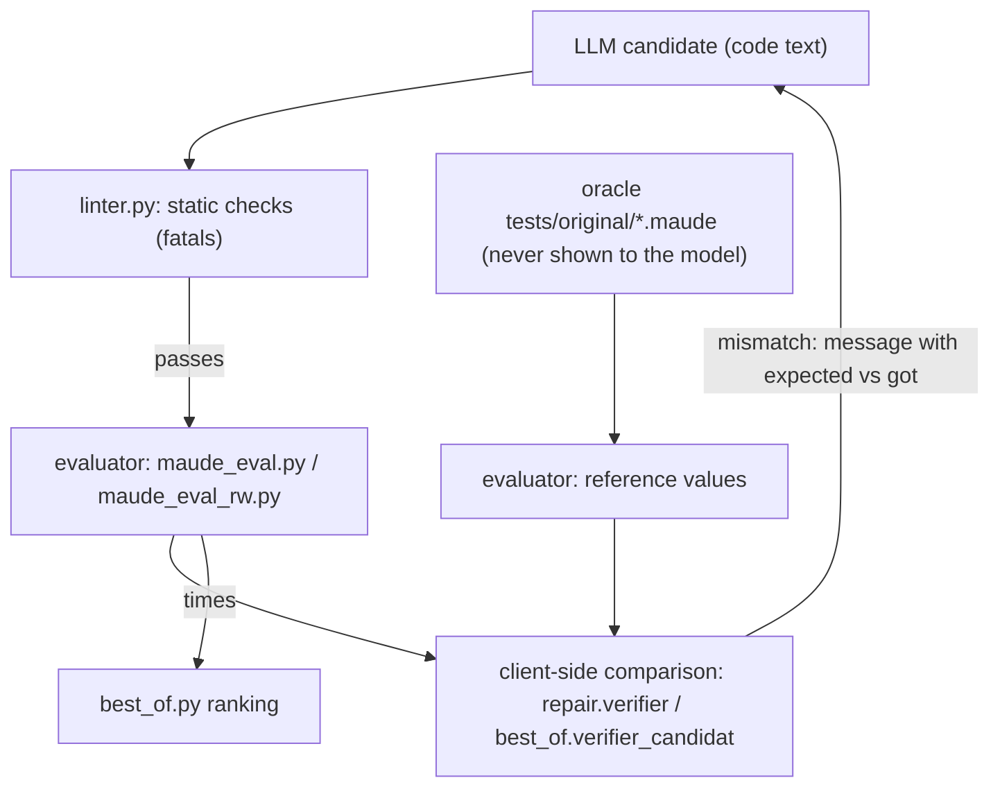

# Research — what `improve-rag` needs from the evaluator, and whether Harold should serve it

> Phase 1 (decision-oriented) research for the rough idea in [`../rough-idea.md`](../rough-idea.md).
> Question answered here: *who consumes `maude_eval.py` today, does a Harold tool have to be
> compatible with them, and should `improve-rag` migrate to Harold?*
> Companion documents: [`contribution.md`](contribution.md), [`placement.md`](placement.md).
> Written 2026-09-16.

## 1. Who calls the evaluators, and for what

The evaluator is the *semantic gate* of the research harness. Its clients orchestrate; it only
produces raw values.

| Consumer | Route | Needs from the evaluator |
| --- | --- | --- |
| `repair.py::evaluer` (L55-88) → `verifier` (L266-307) | `maude_eval.py` | `(loaded, results, stderr_load)`; comparison against the oracle happens in `verifier` |
| `best_of.py::verifier_candidat` (L37-48) | `local_eval.evaluer_rw` | same, **plus per-term `times`** to rank candidates by total reduction time (`best_of.py` L74) |
| `props.py::verifier_proprietes` (L59-74) | `local_eval.evaluer_rw` | evaluates both sides of each metamorphic equality and compares |
| `check.py::MaudeRunner` (L385-438) + `MaudeDriver.diff_test` (L474-520) | persistent pipe session | **two** interpreters loaded side by side (original and candidate), per-term `send`/`recv` with `wait(timeout)`, child death detection |
| `check.py::MaudeDriver.build` (L452-459) | the `maude` CLI | "does it build": `Warning: ` anywhere on stderr ⇒ `BUILD_ERROR` |
| `check.py::benchmark` (L830+) | `BenchExec`/`runexec` on the CLI | wall-clock/memory benchmarking, out of the evaluator's scope |

### 1.1 The de-facto contract the harness has settled on

Repeated across all three routes, this is a battle-tested semantic:

1. **One interpreter session per evaluation**, terms evaluated in the session's current module
   (the last module the file defined).
2. **Per-term outcome**: a pretty-printed value (`prettyPrint(0)`) when the term parses, `None`
   when it does not. `check.py` even maps `None` to `BUILD_ERROR` ("parsing error (most likely)",
   L505).
3. **Load phase separate from term phase**: both clients split captured stderr at the
   `===TERMES===` sentinel and check only the load phase for `Warning`/`Error`
   (`repair.py` L73-85, `local_eval.py` L30-41).
4. **Warnings during load mean "not usable"** — the harness inherits this from
   `MaudeDriver.build`. This is a *policy* of the harness, not a property of evaluation.
5. **Containment**: 60 s timeout per evaluation (`repair.py` L38, `local_eval.py` L11); a hang or
   crash produces a failure verdict, never a hung loop.
6. **The oracle is never inside the evaluator**: comparison is client-side (`repair.py` L280-305,
   `best_of.py`, `props.py`, `diff_test`), and the reference program is never shown to the model
   (`.agents/summary/index.md` → `generate.py`, `repair.py` conventions).

Items 1–3 and 5 are exactly the semantics a Harold evaluation tool would implement; item 4 is a
policy decision Harold has to make for itself (see [`placement.md`](placement.md) §4.3); item 6
means "differential testing" is **not** part of the port at all.

## 2. Should `improve-rag` migrate to a Harold tool?

Assessment (no code was run; this is a design-level judgement):

| Factor | Routing the research loop through Harold/MCP |
| --- | --- |
| Latency/overhead | Each iteration would add an MCP round trip and JSON serialization around work that is currently a single `subprocess.run` in-process; `best_of.py` runs N candidates × iterations. |
| Batch semantics | The harness evaluates whole term lists per candidate and keeps the evaluator's whole result set to compare; an MCP tool call is one such batch, so the calls would be fine-grained *but* the harness would have to be restructured around a server it does not own. |
| Two modules at once | `diff_test` needs original and candidate loaded simultaneously in **two** interpreters. A single-path tool cannot express that; the harness would either call twice (losing simultaneity, which for pure term evaluation is mostly harmless) or need a two-path tool. |
| Determinism/reproducibility | The harness must be reproducible per run; a shared long-lived worker whose loaded modules depend on previous calls (including diagnostics calls) is a reproducibility hazard for research runs. |
| Cost of coupling | A research harness depending on a published MCP server couples the experiment results to the server's release cycle, and vice versa the server would inherit harness requirements (timings, `rlapp`/`arlapp`, spec generation). LP14 of the port-linter project already states `improve-rag` untouched. |

**Verdict: no.** `improve-rag` keeps its evaluators. The two codebases share a *capability* and
lessons, not an interface: the harness is batch/in-process/reproducible-by-run, the MCP tool is
interactive/single-call/human-or-model-facing. If convergence is ever wanted, the realistic
direction is the opposite one — `improve-rag` importing Harold's worker as a library (its
`maude/evaluation.py` value types and worker op would make that possible) — and that is out of
scope here.

## 3. Consequences for a future Harold evaluation tool

**Borrow (design lessons, verified in the research loop):**

- The load-phase/term-phase separation; the harness needed it for a reason and Harold's worker
  will need it as soon as terms are evaluated (its fd-2 capture currently covers the load only).
- Per-term `null` for "does not parse in this module" — it is the single most actionable signal
  the harness gets (it detects changed operator signatures/sorts, `repair.py` L286-289).
- The message style it enables: *expected X, got Y*, and *did not reduce — an equation probably
  does not match* (detectable because the value equals the input, `repair.py` L293-294).
- Timeout discipline: never let one term hang the caller.

**Do not borrow:**

- `times` (ranking is a harness concern), `rlapp_`/`arlapp_` (a harness convention;
  `maude_eval_rw.py` L10-12 admits it is an interpretation of a sketch that `check.py` never
  implemented), TOML spec generation (`check.make_tests` / `inputs/spec/**`), the two-runner
  differential harness, and the "warnings ⇒ not usable" policy.
- Above all, not the subprocess-per-call transport: the worker pool already supersedes it
  (see [`contribution.md`](contribution.md) §2.2).

**Keep the door open for (without building now):** an explicit `module` parameter, since the
harness's "current module = last module in the file" is convenient but history-dependent
(see [`placement.md`](placement.md) §4.2).

## Sources

- `improve-rag/improvement/maude_eval.py`, `maude_eval_rw.py`, `local_eval.py` (L11-43),
  `repair.py` (L38, L55-88, L266-307), `best_of.py` (L28-102), `props.py` (L59-74),
  `check.py` (L385-459, L474-520, L830+).
- `improve-rag/.agents/summary/index.md` (key file map), `components.md` (isolated evaluators),
  `requirements.md` (why verification is layered: linter, load, differential tests, properties).
- `harold-mcp/.agents/planning/port-linter.py/design/detailed-design.md` §2 (LP14).
