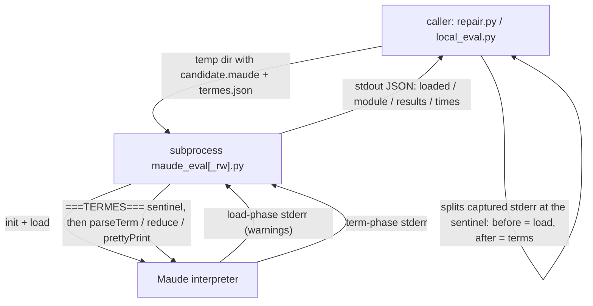

# Research — what `maude_eval.py` would contribute to Harold

> Phase 1 (decision-oriented) research for the rough idea in [`../rough-idea.md`](../rough-idea.md).
> Question answered here: *"What would `maude_eval.py` contribute to our diagnostics tool? Is it
> really worth adding it?"* The companion documents are
> [`placement.md`](placement.md) (where such a capability belongs) and
> [`consumers.md`](consumers.md) (what `improve-rag` needs from it).
> Written 2026-09-16. No code was changed; no Maude probes were run (they are Phase 2, see
> [`../summary.md`](../summary.md) → Next steps).

## 1. The artifact in improve-rag

`maude_eval.py` is the isolated evaluator of the repair loop. It is not a single file: it is a
family of three evaluation routes (each with its client), plus a CLI driver used as the build
gate.

| Route | File | Protocol | Adds |
| --- | --- | --- | --- |
| Plain evaluator | `improve-rag/improvement/maude_eval.py` (43 lines) | One-shot subprocess: `python maude_eval.py <file.maude> <terms.json>`; stdout JSON `{"loaded", "module", "results"}` | — |
| Extended evaluator | `improve-rag/improvement/maude_eval_rw.py` | Same CLI, same JSON plus `"times"` | `rlapp_<Sort>(t)` / `arlapp_<Sort>(t)` conventions, per-term timings |
| Persistent runner | `improve-rag/improvement/check.py` → `MaudeRunner` (L385-438) | `multiprocessing.Pipe` session: `send(term)` / `recv(timeout)` until `send(None)` | Per-term timeout via `wait((pipe, proc.sentinel))`, reusable interpreter |
| CLI driver | `improve-rag/improvement/check.py` → `MaudeDriver.build` (L452-459) | `subprocess.run(('maude', source))` | Treats any `Warning: ` on stderr as `BUILD_ERROR` |

The evaluator itself does four things (`maude_eval.py` L12-39):

```python
maude.init()
maude.load(fichier)
m = maude.getCurrentModule()
print("===TERMES===", file=sys.stderr, flush=True)  # phase sentinel
if m is None:  # no module established
    print(json.dumps({"loaded": False, "module": None, "results": {}}))
    return
for terme in termes:  # one entry per requested term
    t = m.parseTerm(terme)
    if t is None:
        results[terme] = None  # does not parse in this module
    else:
        t.reduce()
        results[terme] = t.prettyPrint(0)
print(json.dumps({"loaded": True, "module": str(m), "results": results}))
```



Three behaviors carry the design intent:

1. **Phase separation of interpreter stderr.** `maude.load` writes its `Warning:` lines to fd 2
   straight from C++ — verified in v1 (`maude-diagnostics-tool-v1/research/maude-bindings.md` §3);
   `parseTerm` is *assumed* to do the same (probe P2 in [`../summary.md`](../summary.md)). The
   `===TERMES===` sentinel printed between the two phases is what lets the caller attribute each
   line to the load or to the terms. Callers act on the load phase only:
   `local_eval.py` L40 and `repair.py` L85 both turn *any* `Warning` in the load phase into
   `loaded = False` ("comme check.py : des warnings au CHARGEMENT = build error").
2. **Per-term tri-state.** A term is either reduced to a printed value, or `null` (= it does not
   parse in this module), which `repair.py::verifier` (L282-294) reads as the signature-change
   signal: *"term `X` does NOT PARSE in your module, while the original computes `Y`. You changed
   the declared operators or sorts."*
3. **Process isolation.** "Un fichier pathologique ne tue pas la boucle de reparation"
   (`maude_eval.py` L6): a SIGSEGV or hang inside the interpreter costs one subprocess, and the
   caller keeps looping (`local_eval.py` L27-28 maps `TimeoutExpired` to
   `"timeout : la reduction ne termine pas"`).

`maude_eval_rw.py` additionally interprets two conventions for **rule-based** modules, where
reduction is not the semantics under test: `rlapp_<Sort>(t)` = one default-strategy rewrite step
(`t.rewrite(1)`), `arlapp_<Sort>(t)` = the sorted set of all one-step successors
(`t.search(maude.ONE_STEP, X:<Sort>)`, capped at 64). It also times every term with
`time.perf_counter()`. Its own docstring is explicit that this is an *interpretation* of a
convention sketched in `collatz.toml` and never implemented in `check.py`.

## 2. Capability inventory against Harold's target state

"Harold target state" = the design being implemented by
`port-linter.py/implementation/plan.md` (provider seam + heuristic linter) and the v1 design
`maude-diagnostics-tool-v1/design/detailed-design.md`.

| # | Capability in the `maude_eval` family | Where it comes from | Harold today (target state) | Gap? |
| --- | --- | --- | --- | --- |
| 1 | Interpreter in an isolated process; a pathological input kills only that process | `maude_eval.py` L6, `local_eval.py` L27-28 | Worker process + pool, with crash **and** timeout recovery (`harold_mcp/maude/executor.py` L179-200) | no |
| 2 | Load a file and capture the interpreter's stderr warnings | `maude_eval.py` L19 | `worker.load_diagnostics` — fd-2 redirection to a temp file, ANSI stripping, warning parser (`harold_mcp/maude/worker.py` L107-133) | no |
| 3 | Hard-failure signal for the load | `maude_eval.py` L26 (`getCurrentModule() is None`) | `bool(maude.load(path))`; per v1 research `load` returns `True` for garbage, so the synthesized `error` effectively never fires | **open question** (§4) |
| 4 | **Term parsing and reduction, values returned** | `maude_eval.py` L30-37 | nothing | **YES — the real content** |
| 5 | Per-term outcome (`null` = does not parse) | same | nothing | yes (§2.3) |
| 6 | Load-phase vs term-phase stderr attribution | `===TERMES===` sentinel | nothing (no term ops exist, so nothing else writes to fd 2 during a call) | only once (4) exists |
| 7 | Per-term timings | `maude_eval_rw.py` L44, L75 | nothing | benchmarking concern, not diagnostics |
| 8 | `rlapp_` / `arlapp_` conventions for rule modules | `maude_eval_rw.py` L45-62 | nothing | test-harness convention |

Capabilities 4–6 are the *only* reason to look at `maude_eval.py`; 1–3 are already solved in
Harold, and 7–8 are harness concerns (see §3).

### 2.1 What the capability buys Harold

Harold exists to let models that are under-trained in Maude program in Maude
(`AGENTS.md` → *Project goals*: diagnose, run, index the documentation). Today's toolchain
answers **syntax** questions only: the load succeeded, Maude printed warnings, and seven text
heuristics fired or did not. Nothing in Harold ever *runs* a term, so every claim about
semantics — "this equation is wrong", "this operator signature changed", "this rule never
matches" — is left to the model's own reasoning, which is precisely the weak spot Harold exists
to compensate for.

Term evaluation closes that loop. It is the difference between:

- *"the file loads with 2 warnings"* (today), and
- *"the file loads cleanly, `f(3)` reduces to `6`, and `g(0)` does not parse in module
  `NAT-EXT`"* (with the capability).

`repair.py::verifier` is a worked example of the value in message form (`repair.py` L286-294):

```
- term `fib(10)` does NOT PARSE in your module, while the original computes `55`.
  You changed the declared operators or sorts. RESTORE the original signatures.
- term `pow(2, 10)` : expected `1024`, got `pow(2, 10)` (did not reduce - an equation
  probably does not match)
```

Both messages are impossible to produce from diagnostics alone: the first needs a term parse
attempt, the second needs a reduction whose result is literally the unreduced input.

### 2.2 What it does **not** contribute

- **No better isolation.** The `maude_eval` isolation story is the subprocess; Harold already has
  a stronger version (long-lived pool + `kill_workers` + pool replacement). v1's research already
  rejected the "spawn the Maude CLI per call" option
  (`maude-diagnostics-tool-v1/research/maude-bindings.md` §3, option C).
- **No better warning capture.** Same fd-2 mechanism, already implemented and hardened (binary
  temp file, lossy decode, ANSI stripping, format variants).
- **No differential testing.** Comparison against an oracle lives in the *clients*
  (`repair.py::verifier`, `best_of.py::verifier_candidat`, `check.py::MaudeDriver.diff_test`),
  never in the evaluator. The evaluator returns raw values.
- **No test-case generation.** Terms come from TOML specs through `check.make_tests` +
  `MaudeDriver.translate_input` (`inputs/spec/**/*.toml`) — harness input, not an evaluator
  feature.
- **No linting.** Already ported independently (that is the `port-linter.py` project).
- **No benchmarking.** Timings and `rlapp_`/`arlapp_` serve `best_of.py`'s ranking and
  `props.py`'s rule-module properties; both are research-harness concerns. `rlapp_`/`arlapp_`
  are a *convention invented for that harness*, not a Maude or Harold concept.

### 2.3 The one diagnostic-shaped slice, and why it is thin

If one insists on feeding something back into `maude_program_diagnostics`, the candidate is a
diagnostic for a term that does not parse or does not reduce ("specification issue" — the rough
idea's own framing). It is thin for three reasons:

1. The terms are **not in the file**: a diagnostic would have `range = null` (whole-file),
   while the tool's whole value proposition is *where* to fix things (LP3: precise columns for
   text providers).
2. The tool's contract is **`{path}` in, problems with that file out** (v1 R2, and see
   [`placement.md`](placement.md) §2). Terms would be a second input.
3. The **values** — the actual product of evaluation — have no place in
   `MaudeProgramDiagnosticsResult`: `diagnostics`/`summary`/`success` express problems, not data.
   Stuffing a reduction result into `message` would make `success` mean "no term produced a
   value", which is not a notion of success.

Conclusion: the contribution is a **new capability** (evaluate terms against a file), not an
extension of the diagnostics tool. That conclusion is developed in [`placement.md`](placement.md)
and was confirmed by the decision in [`../idea-honing.md`](../idea-honing.md) (Q1).

## 3. Verdict

**Worth porting: yes — the capability, not the file.** Term evaluation is the missing semantic
half of Harold's feedback loop and the seed of the project's second stated goal ("run Maude
programs"); `harold_mcp/server/tags.py` L29 already reserves the `interpreter` tag for it.

**Worth porting: not as part of `maude_program_diagnostics`**, and **not now** — a separate tool,
deferred (decision recorded in [`../idea-honing.md`](../idea-honing.md) Q1 and
[`../summary.md`](../summary.md)).

What would actually be ported, when the time comes, is small: a worker op that parses/reduces a
list of terms against a loaded file and returns per-term values, reusing `MaudeExecutor` for
crash/timeout mapping. Everything else in the `maude_eval` family is either already in Harold
(isolation, warning capture, timeouts) or belongs to the research harness (oracle comparison,
spec generation, timings, `rlapp`/`arlapp`).

## 4. Open questions this analysis raises (for Phase 2 / design)

1. **Is `getCurrentModule() is None` a better hard-failure signal than `maude.load`'s bool?**
   v1 explicitly *rejected* module-set heuristics ("a Maude program may legitimately define no
   modules", `maude-bindings.md` §2 and the `no_new_module.maude` fixture). The current-module
   check is a different signal and is unverified, in both directions: it could be a genuine
   improvement for `InterpreterDiagnosticProvider` (today a wholly unparseable file yields 12
   warnings and no `error`), or it could be non-`None` even for garbage input (the module state
   left by a previous load or by the prelude) and/or `None` for legitimate no-module programs,
   which would make it useless or harmful. **Needs a probe** before it is used anywhere.
2. **Does term evaluation write to stderr?** `parseTerm` warnings are assumed to behave like load
   warnings; the `rlapp`/`arlapp` paths call `search`/`rewrite`, which may emit their own output.
   Needed to decide between a sentinel, per-phase fd-2 capture, or nothing at all.
3. **`reduce()` vs the value.** `sigsegv-under-load/issue.md` records the binding gotcha:
   `Term.reduce()` returns the *number of rewrite steps*, not the value; the value is `str(term)`
   / `prettyPrint(0)` afterwards. Any port must not repeat the mistake of treating the return
   value as the result.
4. **Scope of a v1 tool**: plain reduction only, or also `rewrite`/`search` (`rlapp`/`arlapp`)?
   This is the difference between "evaluate terms" and "run Maude programs", and it belongs to
   the requirements step of that future project.

## Sources

- `improve-rag/improvement/maude_eval.py`, `maude_eval_rw.py`, `local_eval.py`,
  `repair.py` (L55-88, L266-307), `best_of.py`, `props.py`, `check.py` (L385-459).
- `improve-rag/.agents/summary/index.md`, `components.md` (isolated Maude evaluators),
  `requirements.md` (verification rationale).
- `harold-mcp/.agents/planning/maude-diagnostics-tool-v1/design/detailed-design.md` §1 (scope,
  requirements R1–R5) and `research/maude-bindings.md` §2–§5 (load semantics, warning capture).
- `harold-mcp/.agents/planning/port-linter.py/design/detailed-design.md` §2 (LP1–LP14).
- `harold-mcp/src/harold_mcp/{maude/worker.py,maude/executor.py,server/tags.py}`.
