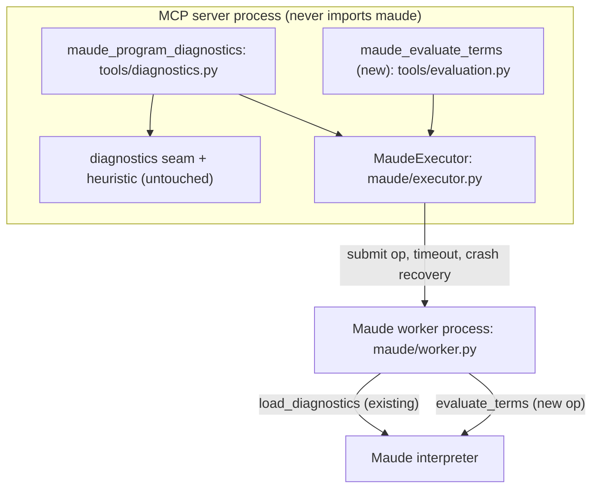

# Research — where term evaluation belongs in Harold

> Phase 1 (decision-oriented) research for the rough idea in [`../rough-idea.md`](../rough-idea.md).
> Question answered here: *"Does it fit in the extensible design for `maude_program_diagnostics`?
> Or should we add a different tool?"* — under the constraint of keeping the code cohesive,
> simple and extensible, with low coupling.
> Companion documents: [`contribution.md`](contribution.md) (what the capability is and what it
> buys), [`consumers.md`](consumers.md) (who needs it).
> Written 2026-09-16.

## 1. The capability as draft requirements

To test the fit, first state what "porting `maude_eval.py`" actually means as a Harold feature
(derived from [`contribution.md`](contribution.md) §2; these are *draft* requirements for a
future project, not approved requirements):

| ID | Draft requirement |
| --- | --- |
| TE1 | **Input**: a path to a Maude source file **and** an ordered list of terms. The file is never modified. |
| TE2 | **Output**: for each term, its outcome — the reduced value when it parses and reduces, or an explicit "does not parse in this module" marker. |
| TE3 | The name of the module the terms were evaluated in is part of the result. |
| TE4 | **Load outcome preserved**: the load's warnings and hard-failure signal remain visible, distinguishable from messages produced by parsing the terms. |
| TE5 | **Containment**: a pathological file or a non-terminating reduction costs at most the worker call (existing executor semantics: crash/timeout, pool replacement, no retry). |
| TE6 | Deterministic, read-only: no mutation of the file, same inputs → same result (annotation profile like the diagnostics tool's). |

The question is whether TE1–TE6 is a *diagnostics* feature or a tool of its own.

## 2. Test 1 — fit against `maude_program_diagnostics` and its provider seam

The target state has an explicit seam: `DiagnosticProvider.diagnose(source: SourceFile) ->
list[ProviderDiagnostic]` (`harold_mcp/diagnostics/provider.py` L130-148), implemented by
`interpreter` (in the target state, also by `heuristic-linter`) and aggregated by
`collect_diagnostics` (`harold_mcp/diagnostics/aggregate.py` L50-91). Mechanically, a term
evaluator *can* be dressed as a provider: the tool builds its providers per call, so a
`TermEvaluationProvider(executor, terms)` could take the terms through its constructor and
receive the file through `diagnose`.

The fit fails on the contract, in five places:

| Constraint | Where | Conflict |
| --- | --- | --- |
| Input schema is exactly `{path: str}` | v1 design R2 | TE1 needs a second input. Either the schema changes (breaking R2) or terms arrive through a side channel the MCP client cannot see. |
| One composite tool, **all** providers attempted, failure of any fails the call | v2 design LP4 | A term-evaluation provider cannot run when the caller passes no terms. "All providers are attempted" forces every diagnostics call to evaluate terms, or breaks the invariant conditionally. |
| `success = true` iff no diagnostic has severity `warning`/`error` | v2 design LP8 | Evaluation's product is *data*. A call that returns three reduced values would carry zero diagnostics → `success=true`; the values themselves would have to travel inside `message` strings, making `success`, `summary` and `severity` reports about something that is not a problem. |
| Diagnostics are properties of the file: positions order them, whole-file problems last | v2 design LP3, LP12 | Term outcomes have no position; every one of them is whole-file, so the documented ordering degenerates and the `range=null` case loses its meaning ("the file itself is the problem"). |
| `DiagnosticSource = Literal["interpreter", "heuristic-linter"]`; `code` names the rule/`compiler` | v2 design LP5, LP6, §5.1 wire models | A third source and a third code family would have to be added for data that is not a finding. The tool description — the MCP-facing contract that a model reads — would grow a second, unrelated meaning. |

**Verdict: rejected.** The seam is *provider-agnostic* but not *product-agnostic*: every one of
its types (`severity`, `code`, `range`, `fix`, `success`, `summary`) is shaped like a problem, and
every requirement written for the tool (LP1–LP12) is about reporting problems with a file. Term
evaluation produces values about a *(file, terms)* pair. Grafting it in would give one tool two
input modes, two result kinds and a `success` flag with two meanings — the opposite of cohesive,
and it would couple the diagnostics layer to the evaluation capability (and, through it, to the
worker's term-evaluation op) for no benefit to either.

This is also consistent with how the two projects already drew their lines: v1 explicitly
deferred "running/reducing terms, module introspection (future tools)"
(`maude-diagnostics-tool-v1/design/detailed-design.md` §1, *Out of scope*), and the v2 design's
door-opening note is about *future diagnostic providers* ("a future tool calls the same
providers", `port-linter.py/design/detailed-design.md` §1) — a provider that reports problems,
not one that returns data.

## 3. Options

| Option | Shape | Assessment |
| --- | --- | --- |
| **A. Extend `maude_program_diagnostics`** with an optional `terms` argument (a term-evaluation provider) | reuse the tool and the seam | **Rejected** (§2): breaks R2 and LP4, makes `success`/`summary`/ordering ambiguous, and adds a second meaning to the wire model. |
| **B. New tool** (`maude_evaluate_terms`), new worker op, reusing `MaudeExecutor` | tool owns its models; shares only the worker/executor | **Recommended.** Each tool does one job; the only shared machinery is the interpreter subsystem, which is exactly the layer both need. Adding a tool does not touch `diagnostics/` at all (no imports in either direction). |
| **C. Do nothing now (defer)** | — | **Chosen now** by the rough-idea owner (Q1): the capability is wanted, but not in this cycle. |
| **D. A broader "interpreter" tool** (terms + `rewrite`/`search`/`rlapp`-style conventions + module introspection) | B with a wider scope | Plausible target: it matches the reserved `interpreter` tag ("running Maude programs in the interpreter (planned)", `harold_mcp/server/tags.py` L29) and the project's goal #2. Shape-wise it is B; its v1 can start with plain term evaluation and grow. |

### 3.1 Recommended shape (for when option B/D is implemented)

- **New**: one worker op in `maude/worker.py` (`evaluate_terms(path, terms)`), one method on
  `MaudeExecutor` (`self._run_task(worker.evaluate_terms, ...)` — crash/timeout mapping comes for
  free, `executor.py` L179-200), one pure value-type module if the tool would otherwise be fat
  (e.g. `maude/evaluation.py`), and the tool module in `server/tools/` with its wire models and
  adapter, tagged `harold_tags(INTERPRETER)`.
- **Unchanged**: everything under `harold_mcp/diagnostics/`, `heuristic/`, `maude/provider.py`,
  `maude/executor.py`'s existing surface, and the diagnostics tool itself. No tool imports
  another tool; both speak to the interpreter subsystem.
- This is the layout the architecture was already prepared for: worker ops are "small module-level
  functions, so future tools can add ops without restructuring"
  (`maude-diagnostics-tool-v1/research/worker-process-architecture.md`).

## 4. Open questions to settle when the tool is designed

These are design questions for the future project (they are **not** answered here):

1. **Timeout granularity.** `MaudeExecutor`'s timeout is per call and its recovery kills the whole
   pool (`executor.py` L190-196). A long list of terms where the 4th hangs therefore costs one pool
   replacement and a failed call, and the caller must retry — for an evaluation tool, per-term
   budget (e.g. splitting the list, or a worker-side watchdog) may be worth the complexity.
2. **Module selection.** `getCurrentModule()` returns the module the interpreter session is in —
   the last one the session loaded, since modules are "last load wins" (v1 research §3; to be
   confirmed by probe P5). Terms evaluated without an explicit module are therefore sensitive to
   interpreter history — including a preceding `maude_program_diagnostics` call, since both tools
   share the pool. TE3 argues for an explicit `module` parameter (Maude's `red in M : t`
   semantics).
3. **Load policy.** `improve-rag` treats load warnings as "not usable" (`repair.py` L85,
   `local_eval.py` L40). For an LLM-facing tool that is a decision, not a given: reporting the
   load warnings *and* the values that could still be computed is probably more useful than
   refusing. TE4 keeps both signals; the policy belongs in the requirements.
4. **Value fidelity.** `prettyPrint(0)` strings only? Sort names? Structurally huge terms
   (the `arlapp` cap of 64 in `maude_eval_rw.py` exists for a reason) and truncated output.
5. **Naming and scope**: `maude_evaluate_terms` (v1 = reduction only) vs a broader
   `run`-style tool (options B vs D) — and whether `rlapp`/`arlapp` conventions are ever Harold's
   business (they are a harness convention; see [`contribution.md`](contribution.md) §2.2).
6. **Tool description/annotations**: same read-only profile as diagnostics; the description must
   state that evaluation mutates the interpreter's loaded modules.

## 5. Decision

- **Yes** to the capability; **no** to extending `maude_program_diagnostics` (option A rejected);
  a **new tool** (option B, growing toward D) is the right home.
- **Deferred**: not implemented in this cycle. Recorded in [`../idea-honing.md`](../idea-honing.md)
  Q1, with the follow-up work listed in [`../summary.md`](../summary.md).

## Sources

- `harold-mcp/src/harold_mcp/diagnostics/provider.py` (L1-148), `diagnostics/aggregate.py`
  (L50-91), `maude/executor.py` (L179-200), `maude/worker.py` (L107-133), `server/tags.py` (L28-30).
- `harold-mcp/.agents/planning/maude-diagnostics-tool-v1/design/detailed-design.md` §1 (scope),
  §2 (R1–R5), `research/worker-process-architecture.md` (worker ops),
  `research/maude-bindings.md` §2–§3 (load semantics, module state).
- `harold-mcp/.agents/planning/port-linter.py/design/detailed-design.md` §1 (scope), §2
  (LP1–LP14), §4 (seam, providers, tool flow), §5.1 (wire models).
- `improve-rag/improvement/repair.py` (L85), `local_eval.py` (L40), `maude_eval_rw.py` (L60).
