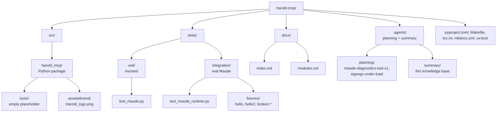

# Architecture

<!-- tags: architecture, structure, mermaid -->

## Overview

`harold-mcp` is a small, single-package Python application following the `src` layout. All application code lives under `src/harold_mcp` and is organized as a flat set of modules with a clear layering:

- **Entry layer** — `main.py`: console entry point, no MCP logic.
- **Server layer** — `server.py`: owns the `FastMCP` instance, initializes the Maude runtime, and registers tools.
- **Runtime layer** — `maude.py`: thread-safe wrapper over the SWIG `maude` bindings. All interpreter access goes through it.
- **Support layer** — `resources.py` (packaged brand assets), `logging.py` (logging utilities), and `tools/` (empty placeholder for future MCP tools).

## Module dependency diagram

```mermaid
graph TB
    main[main.py<br>run()] --> server
    server[server.py<br>FastMCP instance<br>@mcp.tool greet] --> resources[resources.py<br>HAROLD_ICON]
    server --> maude_wrapper[harold_mcp.maude<br>MaudeRuntime / init_maude]
    main --> logging
    server --> logging
    resources --> assets[assets/brand/Harold_logo.png]
    maude_wrapper --> maude_bindings[maude bindings<br>SWIG external package]
    server --> fastmcp[fastmcp]
    server --> tools[harold_mcp.tools<br>empty placeholder]
```

## Key architectural decisions

1. **Lazy Maude initialization, fail-fast startup.** Maude is initialized lazily via `init_maude()` in `harold_mcp.maude`, guarded by a module-level lock and `_maude_initialized` flag (double-checked locking; the flag is set only on success, so failures are retried on the next call). `server.run()` calls `init_maude()` before `mcp.run()` so the server fails fast at startup if Maude cannot initialize. Importing `harold_mcp.server` constructs the `mcp = FastMCP(...)` instance but has no other side effects (see `interfaces.md`).
2. **All Maude access is serialized.** The Maude interpreter is not thread-safe, so `MaudeRuntime` wraps every call in a reentrant lock (`_maude_locked`). A process-wide `MaudeRuntime` singleton (`get_runtime()`) shares that lock across tool calls.
3. **Module wrappers are never cached.** Loading a program may redefine its modules, so `MaudeRuntime` fetches fresh module wrappers on every call ("last load wins", like the Maude CLI). This avoids stale wrappers and the SIGSEGV-under-load failure mode documented in `.agents/planning/sigsegv-under-load/issue.md`.
4. **Single shared server instance.** `main.run()` imports the `mcp` instance from `server.py` and calls `mcp.run()`; there is no server factory. Tools are registered with the `@mcp.tool` decorator directly on that shared instance.
5. **Tools have a dedicated subpackage.** `harold_mcp.tools/` is the intended home of the planned MCP tools (first one: `maude_program_diagnostics` for the Maude diagnostics tool v1, per `.agents/planning/maude-diagnostics-tool-v1/rough-idea.md`); it is currently empty.

## Directory organization



## Related documents

- `components.md` — what each module does
- `interfaces.md` — how the layers talk to each other and to the outside world
- `.agents/planning/sigsegv-under-load/issue.md` — design rationale for the `MaudeRuntime` facade
