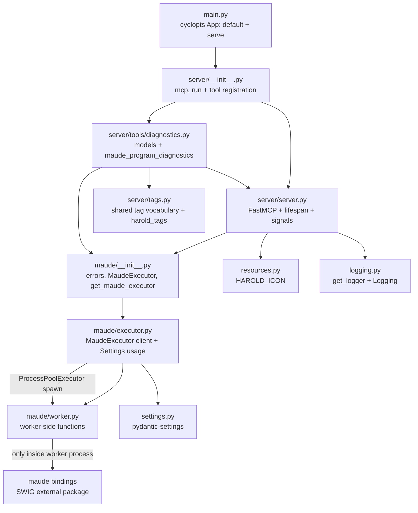
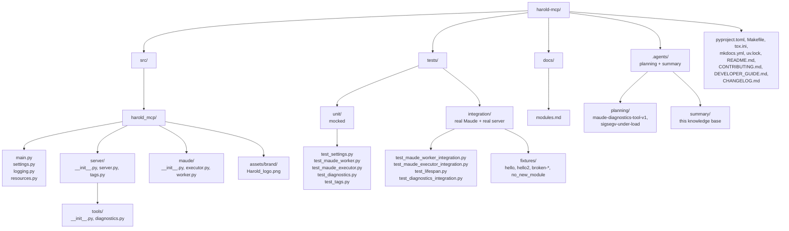

# Architecture

<!-- tags: architecture, structure, mermaid -->

## Overview

`harold-mcp` is a small Python application with a two-process architecture:

- **MCP server process** (FastMCP, multithreaded): the tool, the result models, and the
  `MaudeExecutor` client wrapper. It **never imports the `maude` SWIG bindings**.
- **Maude worker process** (spawned, single-threaded): owns the interpreter, captures its
  stderr, parses warnings. Managed through a `ProcessPoolExecutor` (`spawn` context,
  `initializer=init_maude`).

The split exists for two reasons (design rationale in
`.agents/planning/maude-diagnostics-tool-v1/design/detailed-design.md` §1):
(1) **stderr isolation/capture** — the `maude` package writes `Warning:` lines to fd 2 from
C++, capturable only via OS-level redirection, which the worker scopes to its own process;
(2) **crash containment** — the bindings have a SIGSEGV history, so a worker death kills
only the worker and the pool is replaced.

## Module dependency diagram

## Key architectural decisions

1. **Interpreter only lives in the worker.** The server process never imports `maude`
   (R17): `worker.py` imports it lazily inside functions, so importing the module in the
   server process is side-effect-free. `worker.init_maude` runs `maude.init(advise=False)`
   and then **disables Maude IO** (`setAllowDir/File/Processes(False)`), so programs loaded
   into the worker cannot read/write files or spawn processes. The worker inherits the
   server's stdout (the MCP transport) and must never write to it.
2. **`ProcessPoolExecutor`, spawn context.** `max_workers` from `HAROLD_MAUDE_WORKERS`
   (default 1) serializes calls through one worker; each `submit` returns its own `Future`,
   so concurrent callers never cross-talk. `spawn` (not `fork`/`forkserver`): the server
   process is threaded, and `forkserver` needs an AF_UNIX socket. The executor spawns
   workers on demand — a worker is only started when none is idle.
3. **Crash/timeout recovery.** `MaudeExecutor._run_task` maps result-time
   `BrokenProcessPool`/`TimeoutError` to `MaudeWorkerCrashedError`/`MaudeWorkerTimeoutError`
   and swaps the pool (`_reset_executor`, CQS command, identity-checked under an RLock);
   the old pool is killed with `kill_workers()` (Python 3.14). A timed-out worker is
   killed because a hung `maude.load` cannot be interrupted otherwise. The failed call is
   never auto-retried — diagnostics is idempotent, the MCP client retries.
4. **Warm-up and fail-fast startup.** The FastMCP lifespan (`@lifespan`-decorated
   `app_lifespan`) starts the pool and pings every worker at startup; a broken
   `init_maude` surfaces as `MaudeInitError` and aborts startup. Teardown always runs.
5. **Graceful SIGTERM.** FastMCP's `mcp.run()` installs no signal handling, so `run()`
   registers a SIGTERM handler that raises `KeyboardInterrupt`; the asyncio runner cancels
   the server task (running the lifespan `finally`), and `run()` then calls `os._exit(0)`
   because FastMCP's stdio transport leaves a non-daemon stdin-reader thread that would
   hang interpreter shutdown.
6. **Tool registration as a package side effect.** `server/__init__.py` imports
   `harold_mcp.server.tools`; the tool module imports `mcp` from the concrete
   `harold_mcp.server.server` module, making any import order cycle-proof. `main.py` needs
   no wiring.
7. **Configuration via `pydantic-settings`.** `harold_mcp.settings.Settings`
   (`HAROLD_` prefix): `maude_workers` (default 1), `maude_worker_timeout_secs` (default
   60). `get_maude_executor(settings=Depends(get_settings))` is a lazy, lock-guarded
   singleton — FastMCP nested dependency injection.
8. **CLI via cyclopts.** `harold_mcp.main` builds a cyclopts `App` whose default command and
   `serve` subcommand both call `server.run`; the console script points at `main:app`. The
   `__main__` guard in `main.py` remains required — the `spawn`-context worker re-imports the
   main module.
9. **Shared tool metadata: tags in one place, annotations for the client.** The tag
   vocabulary is centralized in `server/tags.py` (`harold_tags(*tags)` always adds the two
   domain tags `maude` + `programming`; each tool adds one functional-category tag).
   Effect/safety metadata is deliberately **not** duplicated as tags: it lives in
   `ToolAnnotations` (the full read-only profile for the diagnostics tool). Empirical: with
   mcp SDK 1.29 (spec 2025-06-18) tags are **not serialized to clients** — they are
   server-side categorization for visibility control (`mcp.enable`/`mcp.disable` by tag);
   annotations do reach clients.

## Directory organization

## Related documents

- `components.md` — what each module does
- `interfaces.md` — how the layers talk to each other and to the outside world
- `.agents/planning/maude-diagnostics-tool-v1/design/detailed-design.md` — the full design,
  including rationale and alternatives
- `.agents/planning/sigsegv-under-load/issue.md` — the SIGSEGV history that motivates the
  worker process
