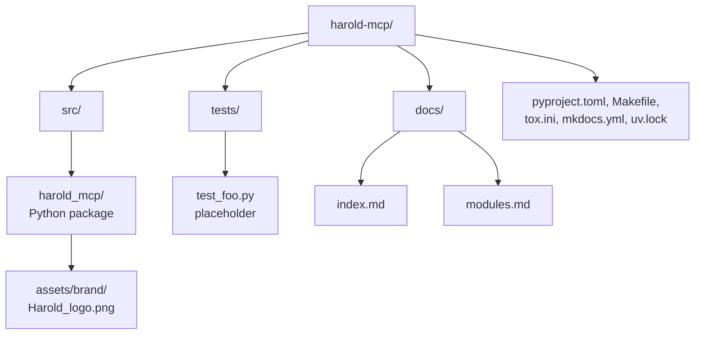

# Architecture

<!-- tags: architecture, structure, mermaid -->

## Overview

`harold-mcp` is a small, single-package Python application following the `src` layout. All application code lives under `src/harold_mcp` and is organized as a flat set of modules with a clear layering:

- **Entry layer** — `main.py`: console entry point, no MCP logic.
- **Server layer** — `server.py`: owns the `FastMCP` instance, initializes the Maude runtime, and registers tools.
- **Support layer** — `resources.py` (packaged brand assets) and `logging.py` (logging utilities).

## Module dependency diagram

```mermaid
graph TB
    main[main.py<br>run()] --> server
    server[server.py<br>FastMCP instance<br>@mcp.tool greet] --> resources
    server --> maude[maude bindings]
    main --> logging
    server --> logging
    resources --> assets[assets/brand/Harold_logo.png]
    server --> fastmcp[fastmcp]
```

## Key architectural decisions

1. **Lazy Maude initialization, fail-fast startup.** Maude is initialized lazily via the cached `maude.init()` in `harold_mcp.maude`; `server.run()` calls it before `mcp.run()` so the server fails fast at startup if Maude cannot initialize. Importing `harold_mcp.server` constructs the `mcp = FastMCP(...)` instance but has no other side effects (see `interfaces.md`).
2. **Single shared server instance.** `main.run()` imports the `mcp` instance from `server.py` and calls `mcp.run()`; there is no server factory. Tools are registered with the `@mcp.tool` decorator directly on that shared instance.
3. **No package submodules.** All logic currently lives at the top level of `harold_mcp`; assets are the only nested content.

## Directory organization



## Related documents

- `components.md` — what each module does
- `interfaces.md` — how the layers talk to each other and to the outside world
