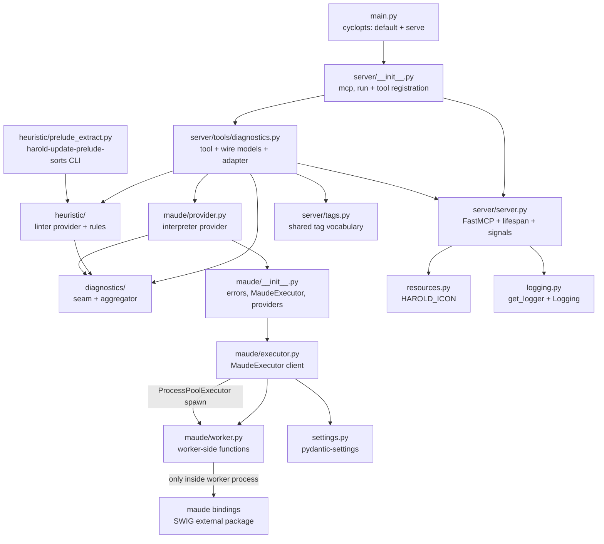
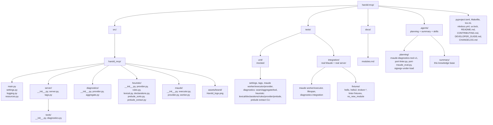

# Architecture

<!-- tags: architecture, structure, mermaid -->

## Overview

`harold-mcp` is a small Python application with a two-process architecture, an in-process
provider seam, and a heuristic linter that runs in the server process:

- **MCP server process** (FastMCP, multithreaded): the tools, the diagnostics provider
  seam and aggregation, the heuristic linter, the wire models, and the `MaudeExecutor`
  client wrapper. It **never imports the `maude` SWIG bindings**.
- **Maude worker process** (spawned, single-threaded): owns the interpreter, captures its
  stderr, parses warnings. Managed through a `ProcessPoolExecutor` (`spawn` context,
  `initializer=init_maude`).

The process split exists for two reasons (design rationale in
`.agents/planning/maude-diagnostics-tool-v1/design/detailed-design.md` §1):
(1) **stderr isolation/capture** — the `maude` package writes `Warning:` lines to fd 2 from
C++, capturable only via OS-level redirection, which the worker scopes to its own process;
(2) **crash containment** — the bindings have a SIGSEGV history, so a worker death kills
only the worker and the pool is replaced.

The heuristic linter (`.agents/planning/port-linter.py/`) deliberately did **not** need the
worker: it is pure text processing, so it runs in the server process next to the tool, and
its findings are merged with the interpreter's by the diagnostics aggregator.

## Module dependency diagram

```mermaid
graph TB
    main[main.py<br>cyclopts: default + serve] --> serverpkg[server/__init__.py<br>mcp, run + tool registration]
    serverpkg --> serversrv[server/server.py<br>FastMCP + lifespan + signals]
    serverpkg --> tools[server/tools/diagnostics.py<br>tool + wire models + adapter]
    tools --> diagpkg[diagnostics/<br>seam + aggregator]
    tools --> heurpkg[heuristic/<br>linter provider + rules]
    tools --> maudeprov[maude/provider.py<br>interpreter provider]
    tools --> serversrv
    tools --> tags[server/tags.py<br>shared tag vocabulary]
    heurpkg --> diagpkg
    maudeprov --> diagpkg
    maudeprov --> maudepkg[maude/__init__.py<br>errors, MaudeExecutor, providers]
    maudepkg --> executor[maude/executor.py<br>MaudeExecutor client]
    executor --> worker[maude/worker.py<br>worker-side functions]
    executor --> settings[settings.py<br>pydantic-settings]
    worker -->|only inside worker process| bindings[maude bindings<br>SWIG external package]
    executor -->|ProcessPoolExecutor spawn| worker
    cli[heuristic/prelude_extract.py<br>harold-update-prelude-sorts CLI] --> heurpkg
    serversrv --> resources[resources.py<br>HAROLD_ICON]
    serversrv --> logging[logging.py<br>get_logger + Logging]
```

## Key architectural decisions

1. **Interpreter only lives in the worker.** The server process never imports `maude`
   (R17): `worker.py` imports it lazily inside functions, so importing the module in the
   server process is side-effect-free. `worker.init_maude` runs
   `maude.init(loadPrelude=True, advise=False)` and then **disables Maude IO**
   (`setAllowDir/File/Processes(False)`), so programs loaded into the worker cannot
   read/write files or spawn processes. The worker inherits the server's stdout (the MCP
   transport) and must never write to it.
2. **`ProcessPoolExecutor`, spawn context.** `max_workers` from `HAROLD_MAUDE_WORKERS`
   (default 1) serializes calls through one worker; each `submit` returns its own `Future`,
   so concurrent callers never cross-talk. `spawn` (not `fork`/`forkserver`): the server
   process is threaded, and `forkserver` needs an AF_UNIX socket. The executor spawns
   workers on demand — a worker is only started when none is idle.
3. **Crash/timeout recovery.** `MaudeExecutor._run_task` maps result-time
   `BrokenProcessPool`/`TimeoutError` to `MaudeWorkerCrashedError`/`MaudeWorkerTimeoutError`
   and swaps the pool (`_reset_executor`, CQS command, identity-checked under an RLock);
   the old pool is killed with `kill_workers()` (Python 3.14). A timed-out worker is
   killed because a hung `maude.load` cannot be interrupted otherwise. The failed call is
   never auto-retried — diagnostics is idempotent, the MCP client retries.
4. **Warm-up and fail-fast startup.** The FastMCP lifespan (`@lifespan`-decorated
   `app_lifespan`) starts the pool and pings every worker at startup; a broken
   `init_maude` surfaces as `MaudeInitError` and aborts startup. Teardown always runs.
5. **Graceful SIGTERM.** FastMCP's `mcp.run()` installs no signal handling, so `run()`
   registers a SIGTERM handler that raises `KeyboardInterrupt`; the asyncio runner cancels
   the server task (running the lifespan `finally`), and `run()` then calls `os._exit(0)`
   because FastMCP's stdio transport leaves a non-daemon stdin-reader thread that would
   hang interpreter shutdown.
6. **Tool registration as a package side effect.** `server/__init__.py` imports
   `harold_mcp.server.tools`; the tool module imports `mcp` from the concrete
   `harold_mcp.server.server` module, making any import order cycle-proof. `main.py` needs
   no wiring.
7. **Configuration via `pydantic-settings`.** `harold_mcp.settings.Settings`
   (`HAROLD_` prefix): `maude_workers` (default 1), `maude_worker_timeout_secs` (default
   60). `get_maude_executor(settings=Depends(get_settings))` is a lazy, lock-guarded
   singleton — FastMCP nested dependency injection.
8. **CLI via cyclopts, two console scripts.** `harold_mcp.main` builds a cyclopts `App`
   whose default command and `serve` subcommand both call `server.run`;
   `harold_mcp.heuristic.prelude_extract` builds the maintenance CLI for the prelude sort
   snapshot. `main.py` keeps the `if __name__ == "__main__"` guard because the
   `spawn`-context worker re-imports the main module.
9. **Shared tool metadata: tags in one place, annotations for the client.** The tag
   vocabulary is centralized in `server/tags.py` (`harold_tags(*tags)` always adds the two
   domain tags `maude` + `programming`; each tool adds one functional-category tag).
   Effect/safety metadata is deliberately **not** duplicated as tags: it lives in
   `ToolAnnotations` (the full read-only profile for the diagnostics tool). Empirical: with
   mcp SDK 1.29 (spec 2025-06-18) tags are **not serialized to clients** — they are
   server-side categorization for visibility control (`mcp.enable`/`mcp.disable` by tag);
   annotations do reach clients.
10. **Diagnostics provider seam and all-or-nothing aggregation.** `harold_mcp.diagnostics`
    defines what a diagnostic is (`DiagnosticSource`, `Severity`, `ProviderDiagnostic`
    with native 1-based positions and a report-only `FixSuggestion`), the
    `DiagnosticProvider` protocol, and `collect_diagnostics`. The seam is
    provider-agnostic, stdlib-only and free of framework types; concrete providers live
    with the capability they belong to (`maude/provider.py`, `heuristic/provider.py`), and
    the tool is the only place that wires providers and adapts seam values to the wire
    models. Providers run **in order** (interpreter first — the order is also the
    tie-break for findings on the same line) and a failure of any provider fails the whole
    call with `DiagnosticCollectionError`, which names every failing provider (no partial
    results: MCP cannot express "error + content"). The merge order is file position,
    provider registry order, column, with whole-file problems last.
11. **Heuristic linter in the server process.** `harold_mcp.heuristic` is pure text in /
    diagnostics out; it never imports the `maude` bindings and never depends on the
    worker. A length-preserving masking layer blanks comments, string literals, quoted
    identifiers and statement labels to spaces, so a character's index always equals its
    1-based column; rules are a registry of `(code, severity, detect)` tuples whose order
    is the evaluation order and the deterministic tie-break. Severities are `info` (does
    not affect the load) and `warning` (suspicious, may be a false positive); `error` is
    reserved for findings that cannot be false positives, so no current rule uses it.
    `iter_sort_declarations` is shared between the `prelude-sort-redeclared` rule and the
    snapshot extractor so they can never disagree on what a declaration is.
12. **Error layering: diagnostics errors are not Maude errors.** The tool's input error
    (`SourceFileNotFoundError`, raised by `SourceFile.from_path`) and provider failures
    (`DiagnosticProviderError`, `DiagnosticCollectionError`) belong to the diagnostics
    layer (`DiagnosticsError` base), independent of `MaudeError`. At the interpreter
    provider boundary a `MaudeWorkerError` is wrapped with `raise ... from`, so the Maude
    cause survives for logs while the MCP surface reports a diagnostics failure. The old
    `MaudeFileNotFoundError` no longer exists.

## Directory organization

```mermaid
graph TB
    root[harold-mcp/] --> src
    root --> tests
    root --> docs
    root --> agents[.agents/<br>planning + summary + skills]
    src[src/] --> pkg[harold_mcp/]
    pkg --> flat[main.py<br>settings.py<br>logging.py<br>resources.py]
    pkg --> serverpkg[server/<br>__init__.py, server.py, tags.py]
    serverpkg --> tools[tools/<br>__init__.py, diagnostics.py]
    pkg --> diagpkg[diagnostics/<br>__init__.py, provider.py, aggregate.py]
    pkg --> heurpkg[heuristic/<br>__init__.py, provider.py, rules.py,<br>lexical.py, declarations.py,<br>prelude_sorts.py, prelude_extract.py]
    pkg --> maudepkg[maude/<br>__init__.py, executor.py,<br>provider.py, worker.py]
    pkg --> assets[assets/brand/<br>Harold_logo.png]
    tests[tests/] --> unit[unit/<br>mocked] --> u[settings, tags, maude worker/executor/provider,<br>diagnostics: seam/aggregate/tool,<br>heuristic: lexical/declarations/rules/provider/prelude,<br>prelude extract CLI]
    tests --> integration[integration/<br>real Maude + real server]
    integration --> i[maude worker/executor, lifespan,<br>diagnostics integration]
    integration --> fixtures[fixtures/<br>hello, hello2, broken-*,<br>linter fixtures, no_new_module]
    docs[docs/] --> dmodules[modules.md]
    agents --> planning[planning/<br>maude-diagnostics-tool-v1,<br>port-linter.py, port-maude_eval.py,<br>sigsegv-under-load]
    agents --> summary[summary/<br>this knowledge base]
    root --> cfg[pyproject.toml, Makefile, tox.ini,<br>mkdocs.yml, uv.lock, README.md,<br>CONTRIBUTING.md, DEVELOPER_GUIDE.md,<br>CHANGELOG.md]
```

## Related documents

- `components.md` — what each module does
- `interfaces.md` — how the layers talk to each other and to the outside world
- `.agents/planning/maude-diagnostics-tool-v1/design/detailed-design.md` — the v1 design,
  including rationale and alternatives
- `.agents/planning/port-linter.py/design/detailed-design.md` — the provider seam, linter
  rules, snapshot and error-layering design
- `.agents/planning/sigsegv-under-load/issue.md` — the SIGSEGV history that motivates the
  worker process
