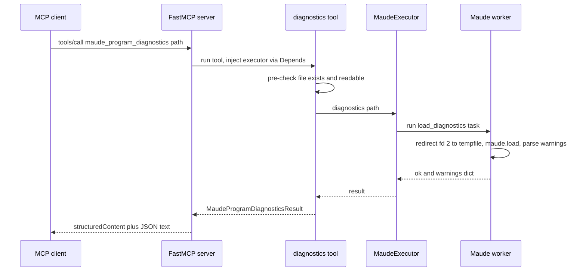

# Interfaces

<!-- tags: interfaces, api, entry-points, mcp -->

## External interfaces

### MCP server (stdio)

- **Transport**: stdio (FastMCP default via `mcp.run()`).
- **Server name**: `Harold`, with the packaged logo as icon,
  `website_url="https://demiourgoi.github.io"`, and `instructions` describing the tool
  areas (diagnose, run, RAG over Maude docs).
- **Tools**:
  - `maude_program_diagnostics(path: str) -> MaudeProgramDiagnosticsResult` — loads the
    Maude source file at `path` into the interpreter (in the worker process) and reports
    every problem, including recoverable warnings. Input schema is exactly `{path: str}`
    (the executor is injected via `Depends`, excluded from the schema). Annotated with the
    full read-only profile — `readOnlyHint=True`, `destructiveHint=False`,
    `idempotentHint=True`, `openWorldHint=False` (the spec defaults `destructiveHint` to
    true, so it must be negated explicitly) — and tagged `tags=harold_tags(DIAGNOSTICS)`
    (`{maude, programming, diagnostics}`; see the tags module below). With mcp SDK 1.29
    the tags are not serialized to clients — only the annotations reach the wire.
    Missing/unreadable files raise `MaudeFileNotFoundError` →
    `isError`; worker crashes/timeouts raise `MaudeWorkerCrashedError` /
    `MaudeWorkerTimeoutError` → `isError` (the MCP client retries; the pool is replaced).
    The docstring is the MCP tool description. Loading mutates interpreter state
    ("last load wins"), documented in the description.

### Console script

- **`harold-mcp`** → `harold_mcp.main:app` (declared in `pyproject.toml` `[project.scripts]`) — a
  **cyclopts** CLI. The default command and the `serve` subcommand both run the MCP server over
  stdio; `--help`/`--version` come from cyclopts (no other commands exist yet).
- On startup the lifespan warms up the worker pool (fail-fast on `MaudeInitError`); on
  SIGTERM the server tears the pool down and exits 0.
- Intended for installation via `uvx harold-mcp` and configuration as an MCP server command
  for clients (Zed, opencode, Cline configuration examples live in `README.md`).

### Configuration (env vars)

| Env var | Default | Meaning |
| --- | --- | --- |
| `HAROLD_MAUDE_WORKERS` | `1` | number of Maude worker processes |
| `HAROLD_MAUDE_WORKER_TIMEOUT_SECS` | `60` | per-call timeout in seconds |

Invalid values fail fast at import (pydantic validation).

## Internal Python interfaces

- `harold_mcp.server.mcp` / `harold_mcp.server.run` — the shared FastMCP instance and the
  server entry point. Tools register via `@mcp.tool` on the instance imported from
  `harold_mcp.server.server` (never the package `__init__` — cycle-proof).
- `harold_mcp.server.tags` — the shared tool-tag vocabulary:
  - Constants: `MAUDE`/`PROGRAMMING` (domain tags), `DIAGNOSTICS`/`INTERPRETER`/`DOCS`
    (functional categories; the latter two await their planned tools).
  - `harold_tags(*tags) -> set[str]` — builds a tool's tag set with the domain tags
    automatically added; pass it to `@mcp.tool(tags=...)`.
  - Effect/safety metadata stays in `ToolAnnotations`, not tags.
- `harold_mcp.settings.Settings` / `get_settings()` — configuration model and singleton.
- `harold_mcp.maude.MaudeExecutor` — the client wrapper:
  - `start()` / `shutdown()` — pool lifecycle.
  - `submit(fn, *args) -> Future` — raw submit (test/crash support); raises
    `MaudeWorkerCrashedError` on a broken pool.
  - `diagnostics(path) -> LoadDiagnosticsResult` — typed worker op; crash/timeout mapped to
    `MaudeWorkerCrashedError` / `MaudeWorkerTimeoutError`, pool replaced.
  - `_run_task(fn, *args) -> T` — generic submit-and-await runner for future worker ops.
- `harold_mcp.maude.get_maude_executor(settings=Depends(get_settings))` — lazy, lock-guarded
  singleton; FastMCP resolves the nested `get_settings` dependency. Direct callers pass
  settings explicitly.
- `harold_mcp.maude.worker` — worker-side module (imported by the worker process only in
  practice; safe to import anywhere): `init_maude`, `ping`, `sleep`, `load_diagnostics`,
  `_crash`, and the `WarningDict` / `LoadDiagnosticsResult` TypedDicts.
- `harold_mcp.maude` error hierarchy — `MaudeError`, `MaudeInitError`,
  `MaudeWorkerError` (`MaudeWorkerCrashedError`, `MaudeWorkerTimeoutError`),
  `MaudeFileNotFoundError` (`.path`).
- `harold_mcp.resources.HAROLD_ICON` — `mcp.types.Icon` used for server branding.
- `harold_mcp.logging.get_logger` / `harold_mcp.logging.Logging` — logging helpers.

## Import-time side effects

Importing `harold_mcp.server`:

1. Builds the global `mcp` server instance (in `harold_mcp.server.server`).
2. Registers the tools (via `server/__init__.py` → `tools/__init__.py` → `diagnostics.py`).
3. Reads the `HAROLD_*` env vars once (pydantic-settings `Settings`).

The Maude interpreter is **not** touched at import time: no `maude` import in the server
process (worker.py imports it lazily), and the worker pool is created in the lifespan
(startup), not at import.

## Related documents

- `components.md` — module responsibilities
- `workflows.md` — end-to-end flows
- `data_models.md` — the types these interfaces use
