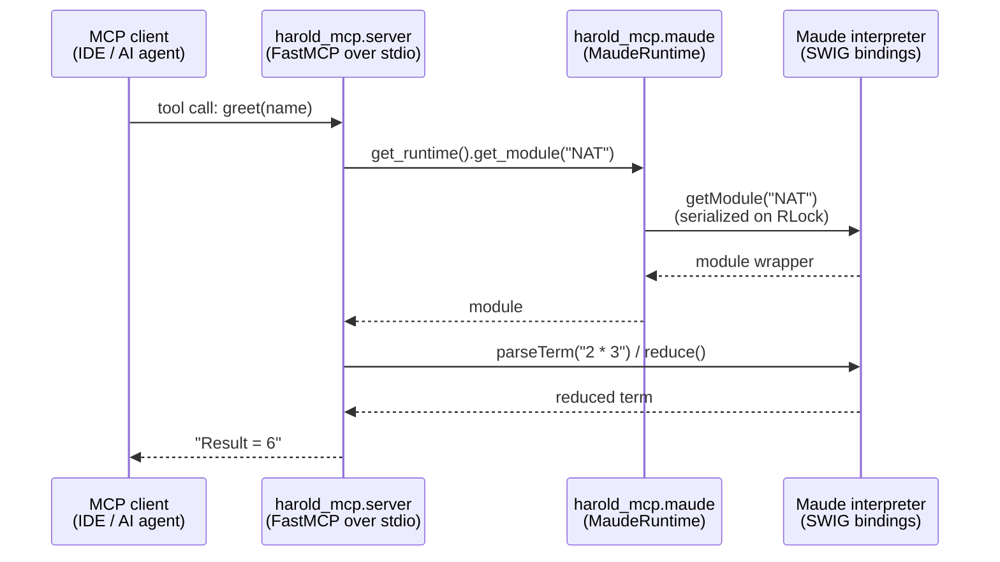

# Interfaces

<!-- tags: interfaces, api, entry-points, mcp -->

## External interfaces

### MCP server (stdio)

- **Transport**: stdio (FastMCP default via `mcp.run()`).
- **Server name**: `Harold`, with the packaged logo as icon, `website_url="https://demiourgoi.github.io"`, and `instructions` describing the tool areas (diagnose, run, RAG over Maude docs).
- **Tools**:
  - `greet(name: str) -> str` — hello-world tool; loads Maude module `NAT`, parses `2 * 3`, reduces it, and returns `Result = <term>`. (`name` is accepted but unused.)

### Console script

- **`harold-mcp`** → `harold_mcp.main:run` (declared in `pyproject.toml` `[project.scripts]`).
- Intended for installation as a command for MCP clients (Zed, opencode, Cline configuration examples live in `README.md`).

## Internal Python interfaces

- `harold_mcp.server.mcp` — the shared `FastMCP` instance. Modules register tools on it via `@mcp.tool`.
- `harold_mcp.server.run` — initializes Maude (fail-fast at startup), then runs the server (`mcp.run()`). Console script entry: `harold-mcp` → `main.run` → `server.run`.
- `harold_mcp.maude.init_maude` — lock-guarded, once-per-process Maude initialization; safe to call repeatedly; retries after failure; raises `MaudeInitError`.
- `harold_mcp.maude.MaudeRuntime` — thread-safe facade over the Maude bindings; serializes all interpreter access on an `RLock` and fetches fresh module wrappers on every call:
  - `get_module(module_name) -> Any` — module wrapper or `MaudeModuleNotFoundError`.
  - `load_program(program_path: str | Path) -> None` — (re)load a program file, absolute-resolved; `MaudeLoadError` on failure.
  - `load_module(program_path, module_name) -> Any` — reload program, then return a fresh wrapper.
- `harold_mcp.maude.get_runtime` — returns the process-wide `MaudeRuntime` singleton.
- `harold_mcp.maude.MaudeError` hierarchy — `MaudeInitError`, `MaudeLoadError` (`.program_path`), `MaudeModuleNotFoundError` (`.module_name`).
- `harold_mcp.resources.HAROLD_ICON` — `mcp.types.Icon` used for server branding.
- `harold_mcp.logging.get_logger` — re-exported logging helper (module-level loggers like `_LOG = get_logger(__name__)`).
- `harold_mcp.logging.Logging` — base class providing a per-class `_log` property.

## Import-time side effects

Importing `harold_mcp.server`:

1. Constructs the global `mcp` server instance.
2. Registers the `greet` tool.

The Maude runtime is **not** initialized at import time. `harold_mcp.maude.init_maude()` initializes it lazily on first interpreter access, and `server.run()` calls it before `mcp.run()` so the server fails fast at startup if Maude cannot initialize.

## Related documents

- `components.md` — module responsibilities
- `workflows.md` — end-to-end flows
- `data_models.md` — the error types these interfaces raise
