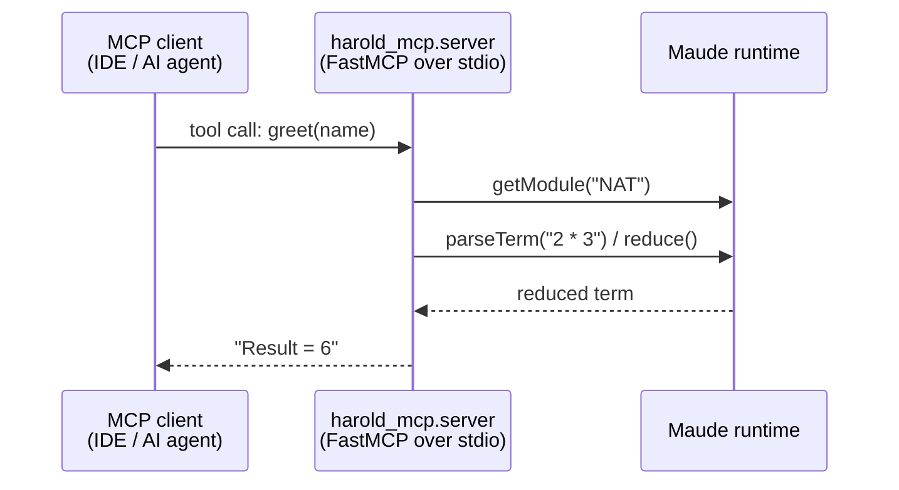

# Interfaces

<!-- tags: interfaces, api, entry-points, mcp -->

## External interfaces

### MCP server (stdio)

- **Transport**: stdio (FastMCP default via `mcp.run()`).
- **Server name**: `Harold`, with the packaged logo as icon.
- **Tools**:
  - `greet(name: str) -> str` — hello-world tool; loads Maude module `NAT`, parses `2 * 3`, reduces it, and returns `Result = <term>`.

### Console script

- **`harold-mcp`** → `harold_mcp.main:run` (declared in `pyproject.toml` `[project.scripts]`).
- Intended for installation as a command for MCP clients (Zed, opencode, Cline configuration examples live in `README.md`).

## Internal Python interfaces

- `harold_mcp.server.mcp` — the shared `FastMCP` instance. Modules register tools on it via `@mcp.tool`.
- `harold_mcp.server.run` — initializes Maude (fail-fast at startup), then runs the server (`mcp.run()`). Console script entry: `harold-mcp` → `main.run` → `server.run`.
- `harold_mcp.maude.init` — cached Maude runtime initialization; safe to call repeatedly.
- `harold_mcp.maude.MaudeRuntime` — (WIP) wrapper over the Maude bindings; `get_module(name)` ensures init, then returns the module.
- `harold_mcp.resources.HAROLD_ICON` — `mcp.types.Icon` used for server branding.
- `harold_mcp.logging.get_logger` — re-exported logging helper (module-level loggers like `_LOG = get_logger(__name__)`).
- `harold_mcp.logging.Logging` — base class providing a per-class `_log` property.

## Import-time side effects

Importing `harold_mcp.server`:

1. Constructs the global `mcp` server instance.
2. Registers the `greet` tool.

The Maude runtime is **not** initialized at import time. `harold_mcp.maude.init()` (cached) initializes it lazily on first use, and `server.run()` calls it before `mcp.run()` so the server fails fast at startup if Maude cannot initialize.

## Related documents

- `components.md` — module responsibilities
- `workflows.md` — end-to-end flows
