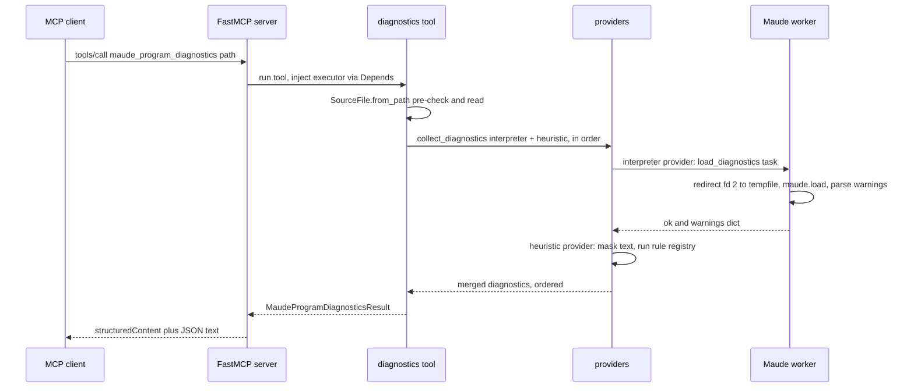

# Interfaces

<!-- tags: interfaces, api, entry-points, mcp -->

## External interfaces

### MCP server (stdio)

- **Transport**: stdio (FastMCP default via `mcp.run()`).
- **Server name**: `Harold`, with the packaged logo as icon,
  `website_url="https://demiourgoi.github.io"`, and `instructions` describing the tool
  areas (diagnose, run, RAG over Maude docs).
- **Tools**:
  - `maude_program_diagnostics(path: str) -> MaudeProgramDiagnosticsResult` — diagnoses
    one Maude source file with two providers in a single call: the **Maude interpreter**
    load (worker process) and Harold's **heuristic linter** (server process, pure text).
    Input schema is exactly `{path: str}` (the executor is injected via `Depends`,
    excluded from the schema).
    - Every diagnostic carries `source` (`"interpreter"` | `"heuristic-linter"`), `code`
      (`"compiler"` for the interpreter; the rule name for linter findings), `severity`
      (`"info"` | `"warning"` | `"error"`), `message`, an LSP-style 1-based `range`
      (`null` for whole-file problems; interpreter findings have `column=null`; heuristic
      findings carry exact exclusive-end columns), and an optional report-only `fix`
      (`description` + applyable `edits`; the tool never writes to the file).
    - `success` is `true` only when no diagnostic has severity `warning` or `error`;
      `"info"`-only results (a shadowed prelude sort, non-ASCII punctuation Maude
      accepts) still succeed. `summary` counts all three severities. Diagnostics are
      ordered by file position, with interpreter findings first on a line and whole-file
      problems last.
    - Errors: missing/unreadable input raises `SourceFileNotFoundError`; any provider
      failure raises `DiagnosticCollectionError` (names every failing provider; a worker
      crash/timeout is chained from the interpreter provider) — no partial results are
      returned. Both surface to the client as tool errors (`isError`); the MCP client
      retries, the pool is replaced.
    - Annotated with the full read-only profile — `readOnlyHint=True`,
      `destructiveHint=False`, `idempotentHint=True`, `openWorldHint=False` (the spec
      defaults `destructiveHint` to true, so it must be negated explicitly) — and tagged
      `tags=harold_tags(DIAGNOSTICS)` (`{maude, programming, diagnostics}`; see the tags
      module below). With mcp SDK 1.29 the tags are not serialized to clients — only the
      annotations reach the wire.
    - Only the free-form text above `Args:` becomes the MCP tool description (FastMCP
      excludes `Returns`/`Raises`/`Example` sections — noted in a comment in the code),
      and the result models' attribute docstrings become output-schema field descriptions
      (see `data_models.md`). Loading mutates interpreter state ("last load wins"),
      documented in that prose.

```mermaid
sequenceDiagram
    participant C as MCP client
    participant F as FastMCP server
    participant T as diagnostics tool
    participant P as providers
    participant W as Maude worker
    C->>F: tools/call maude_program_diagnostics path
    F->>T: run tool, inject executor via Depends
    T->>T: SourceFile.from_path pre-check and read
    T->>P: collect_diagnostics interpreter + heuristic, in order
    P->>W: interpreter provider: load_diagnostics task
    W->>W: redirect fd 2 to tempfile, maude.load, parse warnings
    W-->>P: ok and warnings dict
    P->>P: heuristic provider: mask text, run rule registry
    P-->>T: merged diagnostics, ordered
    T-->>F: MaudeProgramDiagnosticsResult
    F-->>C: structuredContent plus JSON text
```

### Console scripts

- **`harold-mcp`** → `harold_mcp.main:app` (declared in `pyproject.toml`
  `[project.scripts]`) — a **cyclopts** CLI. The default command and the `serve`
  subcommand both run the MCP server over stdio; `--help`/`--version` come from cyclopts.
- **`harold-update-prelude-sorts`** → `harold_mcp.heuristic.prelude_extract:app` — the
  maintenance CLI for the bundled prelude sort snapshot:
  `harold-update-prelude-sorts <prelude.maude> [--output PATH] [--check]
  [--maude-version V]`. It prints extraction/exclusion counts, writes the generated
  module (byte-stable), refuses extractions with fewer than 50 sort names, and with
  `--check` compares the **data** against a fresh extraction (exit 1 when stale; the
  provenance header may differ). See `DEVELOPER_GUIDE.md`.
- On startup the lifespan warms up the worker pool (fail-fast on `MaudeInitError`); on
  SIGTERM the server tears the pool down and exits 0.
- Intended for installation via `uvx harold-mcp` and configuration as an MCP server
  command for clients (the Zed and opencode configurations we test live in `README.md`;
  any other MCP-compatible client works too).

### Configuration (env vars)

| Env var | Default | Meaning |
| --- | --- | --- |
| `HAROLD_MAUDE_WORKERS` | `1` | number of Maude worker processes |
| `HAROLD_MAUDE_WORKER_TIMEOUT_SECS` | `60` | per-call timeout in seconds |

Invalid values fail fast at import (pydantic validation).

## Internal Python interfaces

- `harold_mcp.server.mcp` / `harold_mcp.server.run` — the shared FastMCP instance and the
  server entry point. Tools register via `@mcp.tool` on the instance imported from
  `harold_mcp.server.server` (never the package `__init__` — cycle-proof).
- `harold_mcp.server.tags` — the shared tool-tag vocabulary:
  - Constants: `MAUDE`/`PROGRAMMING` (domain tags), `DIAGNOSTICS`/`INTERPRETER`/`DOCS`
    (functional categories; the latter two await their planned tools).
  - `harold_tags(*tags) -> set[str]` — builds a tool's tag set with the domain tags
    automatically added; pass it to `@mcp.tool(tags=...)`.
  - Effect/safety metadata stays in `ToolAnnotations`, not tags.
- `harold_mcp.diagnostics` — the provider seam (stdlib-only):
  - `DiagnosticProvider` — the protocol (`name`, `diagnose(source)`); implement it to
    add a new diagnostics source. Providers live with their capability package and raise
    `DiagnosticProviderError` (chaining the cause).
  - Value types: `SourceFile` (`from_path` — the tool's pre-check and read; raises
    `SourceFileNotFoundError`), `ProviderDiagnostic` (source, severity, code, message,
    1-based `line`/`column`/`end_column`, optional fix), `FixEdit`, `FixSuggestion`,
    `Severity`, `DiagnosticSource`.
  - `collect_diagnostics(providers, source) -> list[ProviderDiagnostic]` — runs every
    provider in order, merges and orders the result, and raises
    `DiagnosticCollectionError` (with `.failures`) when any provider failed.
- `harold_mcp.heuristic` — the linter:
  - `HeuristicLinterProvider(rules=RULES)` — a `DiagnosticProvider` over the rule
    registry.
  - `RULES` — the ordered `Rule` registry (`code`, `severity`, `detect`); add a rule here
    to extend the linter. `RuleFinding` / `Rule` are the rule-authoring types.
  - `SourceView.from_text(text)` — the masked code view rules run over; `CodeLine`,
    `Declarations`, `declaration_index`, `is_identifier_char` (lexical layer).
  - `iter_sort_declarations(lines)` + `SortDeclaration` — the shared sort-declaration
    reader (rule 7 and the snapshot extractor).
  - `PRELUDE_SORTS` / `PRELUDE_SORT_BASES` — the generated snapshot data.
  - `extract_prelude_sorts` / `render_snapshot_module` — the snapshot maintenance API
    behind the CLI.
- `harold_mcp.settings.Settings` / `get_settings()` — configuration model and singleton.
- `harold_mcp.maude.MaudeExecutor` — the client wrapper:
  - `start()` / `shutdown()` — pool lifecycle.
  - `submit(fn, *args) -> Future` — raw submit (test/crash support); raises
    `MaudeWorkerCrashedError` on a broken pool.
  - `diagnostics(path) -> LoadDiagnosticsResult` — typed worker op; crash/timeout mapped
    to `MaudeWorkerCrashedError` / `MaudeWorkerTimeoutError`, pool replaced.
  - `_run_task(fn, *args) -> T` — generic submit-and-await runner for future worker ops.
- `harold_mcp.maude.InterpreterDiagnosticProvider(executor)` — the interpreter provider
  (warning mapping + synthesized whole-file error; worker errors become
  `DiagnosticProviderError` with the cause chained).
- `harold_mcp.maude.get_maude_executor(settings=Depends(get_settings))` — lazy,
  lock-guarded singleton; FastMCP resolves the nested `get_settings` dependency. Direct
  callers pass settings explicitly.
- `harold_mcp.maude.worker` — worker-side module (imported by the worker process only in
  practice; safe to import anywhere): `init_maude`, `ping`, `sleep`, `load_diagnostics`,
  `_crash`, and the `WarningDict` / `LoadDiagnosticsResult` TypedDicts.
- `harold_mcp.maude` error hierarchy — `MaudeError`, `MaudeInitError`,
  `MaudeWorkerError` (`MaudeWorkerCrashedError`, `MaudeWorkerTimeoutError`).
- `harold_mcp.resources.HAROLD_ICON` — `mcp.types.Icon` used for server branding.
- `harold_mcp.logging.get_logger` / `harold_mcp.logging.Logging` — logging helpers.

## Import-time side effects

Importing `harold_mcp.server`:

1. Builds the global `mcp` server instance (in `harold_mcp.server.server`).
2. Registers the tools (via `server/__init__.py` → `tools/__init__.py` →
   `diagnostics.py`, which also imports the heuristic registry and the prelude snapshot
   data).
3. Reads the `HAROLD_*` env vars once (pydantic-settings `Settings`).

The Maude interpreter is **not** touched at import time: no `maude` import in the server
process (worker.py imports it lazily), and the worker pool is created in the lifespan
(startup), not at import. The heuristic linter and the prelude snapshot are pure data and
text processing — importing them never touches the interpreter.

## Related documents

- `components.md` — module responsibilities
- `workflows.md` — end-to-end flows
- `data_models.md` — the types these interfaces use
