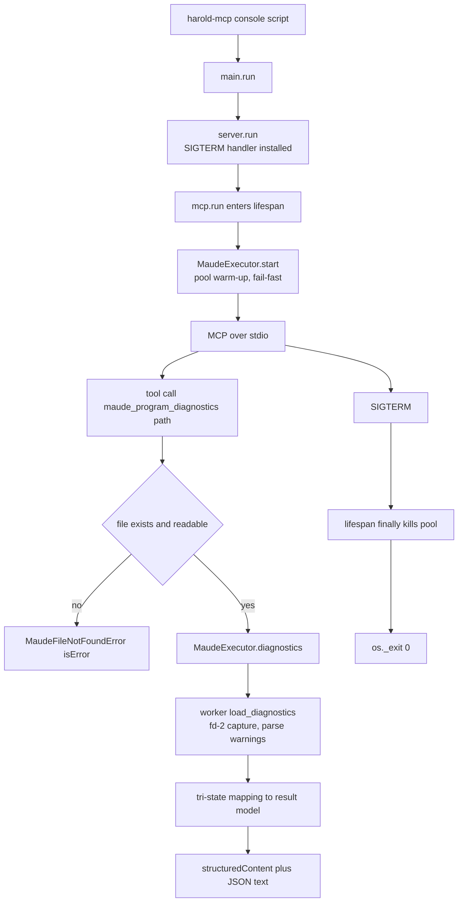
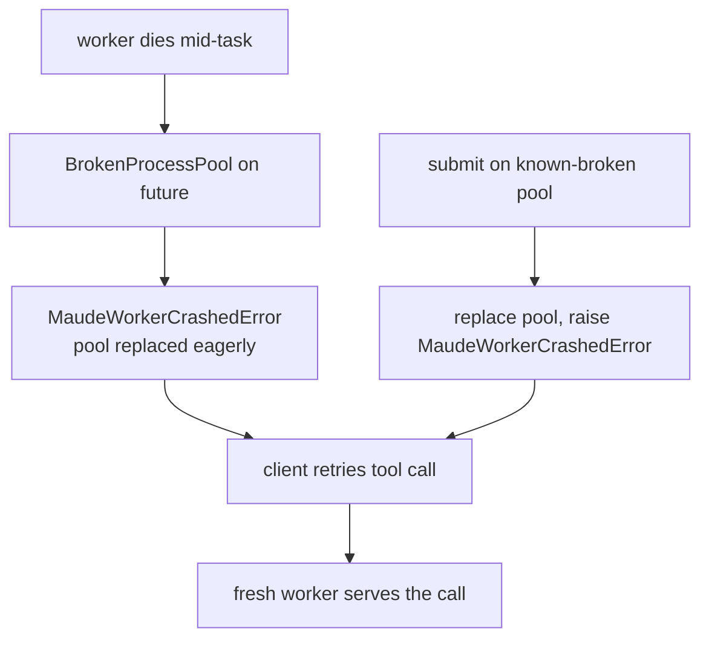

# Workflows

<!-- tags: workflows, dev-loop, ci -->

## Development loop

1. `make install` — `uv sync`, creates the environment and refreshes `uv.lock`.
   (Dev-environment details, IDE recommendations, and the release process live in
   `DEVELOPER_GUIDE.md`.)
2. Edit code under `src/harold_mcp` (tests under `tests/`).
3. `make check` — lockfile consistency (`uv lock --locked`), ruff (lint fails if any
   auto-fix is applied) + ruff format, mypy, **basedpyright** (unused call results), deptry.
4. `make test` — pytest with coverage (`--cov --cov-config=pyproject.toml`).
5. `make release` — full CI pass (`install check test docs-test`), then prints a success
   message.

## Running the server

- Development: `make run` (or `uv run harold-mcp`) — serves MCP over stdio.
- Entry points: `uv run harold-mcp --help` lists the cyclopts CLI (default command and
  `serve`).
- Startup: lifespan warm-up pings the Maude worker (fail-fast on init failure).
- Shutdown: SIGTERM/SIGINT → graceful pool teardown → exit 0 (a hard `kill -9` skips the
  lifespan; workers then exit on their own via the queue pipe).
- Connect an MCP client (Zed, opencode, Cline) to the `harold-mcp` command; configuration
  examples and the `HAROLD_*` env-var table live in `README.md`.

## Tool execution flow

## Worker crash recovery

## Documentation workflow

- `make docs-test` — strict MkDocs build (`-s`, fails on warnings).
- `make docs` — serve docs locally with MkDocs.
- Docs are generated from docstrings via mkdocstrings; add new modules to `docs/modules.md`.

## Planning workflow

- Feature ideas start in `.agents/planning/<feature>/` (e.g. `maude-diagnostics-tool-v1/`
  with `rough-idea.md`, `idea-honing.md`, `research/`, `design/`, `implementation/`).
  Design rationale for existing code is recorded there too (e.g.
  `sigsegv-under-load/issue.md`). Consult these before implementing a planned feature.

## Packaging and release

- `make build` — build the wheel with `pyproject-build`.
- `make publish` — upload to PyPI with twine (requires `PYPI_TOKEN`).
- Release process (per `DEVELOPER_GUIDE.md`): create a GitHub release with a `*.*.*` tag
  matching the `pyproject.toml` version without the `.dev0` suffix; the `release-main`
  workflow patches the version, publishes to PyPI, and deploys the docs. Afterwards, bump
  the version on `main` (back to a `*.dev0` WIP) and add a `CHANGELOG.md` entry. PyPI
  versions are immutable — a failed publish means bumping to the next version.

## Cross-environment testing

- `tox` — runs the test suite on Python 3.14 (single env `py314` in `tox.ini`). The CI
  workflows themselves live at the Git repository root (`../.github/workflows/` relative
  to this package directory).

## Related documents

- `architecture.md` — where each step happens in the code
- `review_notes.md` — known gaps in the current workflows
