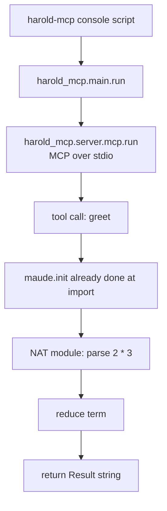

# Workflows

<!-- tags: workflows, dev-loop, ci -->

## Development loop

1. `make install` — `uv sync`, creates the environment and refreshes `uv.lock`.
2. Edit code under `src/harold_mcp` (tests under `tests/`).
3. `make check` — lockfile consistency (`uv lock --locked`), ruff (lint fails if any auto-fix is applied), ruff format, mypy, deptry.
4. `make test` — pytest with coverage (`--cov --cov-config=pyproject.toml`).
5. `make release` — full CI pass (`install check test docs-test`), then prints a success message.

## Running the server

- Development: `make run` (or `uv run harold-mcp`) — serves MCP over stdio.
- Connect an MCP client (Zed, opencode, Cline) to the `harold-mcp` command; configuration examples live in `README.md`.
- Production distribution will be via `uvx` (Python package on PyPI).

## Tool execution flow

## Documentation workflow

- `make docs-test` — strict MkDocs build (`-s`, fails on warnings).
- `make docs` — serve docs locally with MkDocs.
- Docs are generated from docstrings via mkdocstrings; add new modules to `docs/modules.md`.

## Packaging and release

- `make build` — build the wheel with `pyproject-build`.
- `make publish` — upload to PyPI with twine (requires `PYPI_TOKEN`; see `README.md`).

## Cross-environment testing

- `tox` — runs the test suite on Python 3.14 (single env `py314` in `tox.ini`). The CI workflows themselves live at the Git repository root (`../.github/workflows/` relative to this package directory).

## Related documents

- `architecture.md` — where each step happens in the code
- `review_notes.md` — known gaps in the current workflows
