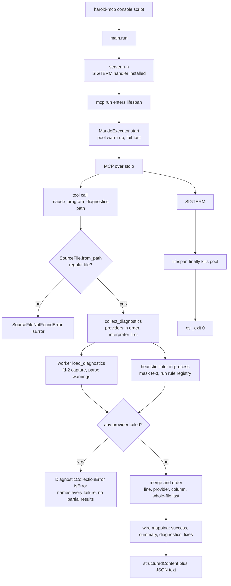
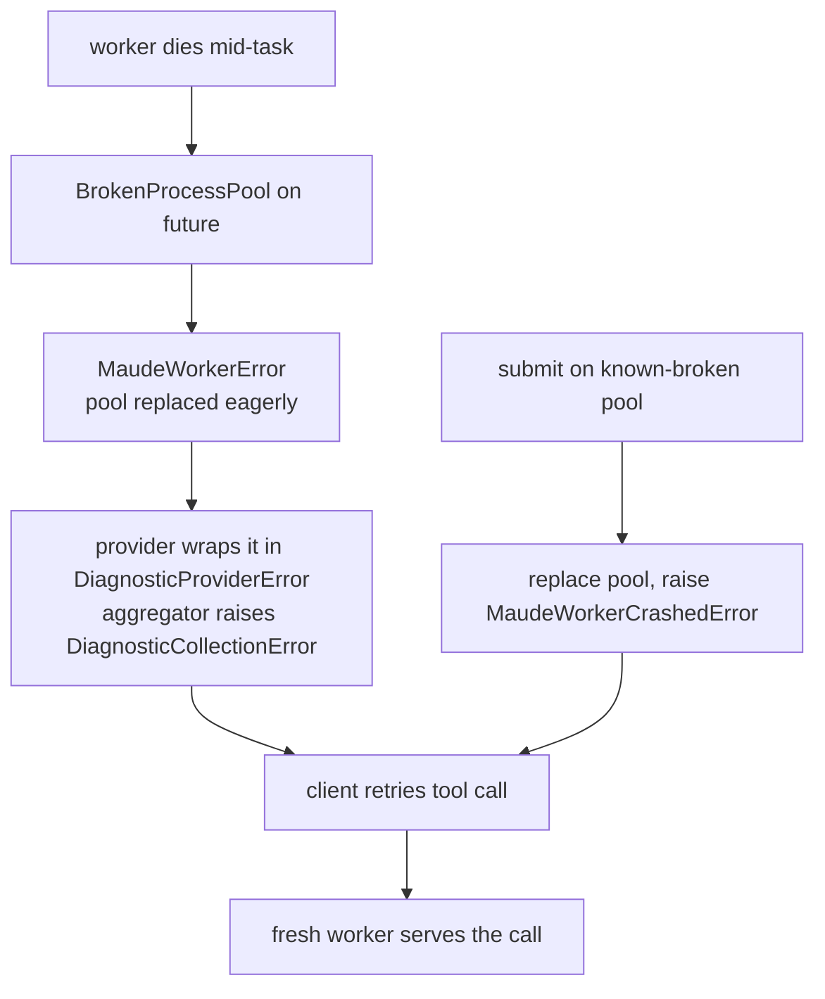

# Workflows

<!-- tags: workflows, dev-loop, ci -->

## Development loop

1. `make install` — `uv sync`, creates the environment and refreshes `uv.lock`.
   (Dev-environment details, IDE recommendations, and the release process live in
   `DEVELOPER_GUIDE.md`.)
2. Edit code under `src/harold_mcp` (tests under `tests/`).
3. `make check` — lockfile consistency (`uv lock --locked`), ruff (lint fails if any
   auto-fix is applied) + ruff format, mypy, **basedpyright** (unused call results), deptry.
4. `make test` — pytest with coverage (`--cov --cov-config=pyproject.toml`).
5. `make release` — full CI pass (`install check test docs-test`), then prints a success
   message.

## Running the server

- Development: `make run` (or `uv run harold-mcp`) — serves MCP over stdio.
- Entry points: `uv run harold-mcp --help` lists the cyclopts CLI (default command and
  `serve`).
- Startup: lifespan warm-up pings the Maude worker (fail-fast on init failure).
- Shutdown: SIGTERM/SIGINT → graceful pool teardown → exit 0 (a hard `kill -9` skips the
  lifespan; workers then exit on their own via the queue pipe).
- Connect an MCP-compatible client (Zed and opencode are the configurations we test; other
  MCP clients work too) to the `harold-mcp` command; configuration examples and the
  `HAROLD_*` env-var table live in `README.md`.

## Tool execution flow


```mermaid
flowchart TD
    A[harold-mcp console script] --> B[main.run]
    B --> C[server.run<br>SIGTERM handler installed]
    C --> D[mcp.run enters lifespan]
    D --> E[MaudeExecutor.start<br>pool warm-up, fail-fast]
    E --> F[MCP over stdio]
    F --> G[tool call maude_program_diagnostics path]
    G --> H{SourceFile.from_path<br>regular file?}
    H -->|no| I[SourceFileNotFoundError isError]
    H -->|yes| J[collect_diagnostics<br>providers in order, interpreter first]
    J --> K[worker load_diagnostics<br>fd-2 capture, parse warnings]
    J --> L[heuristic linter in-process<br>mask text, run rule registry]
    K --> M{any provider failed?}
    L --> M
    M -->|yes| N[DiagnosticCollectionError isError<br>names every failure, no partial results]
    M -->|no| O[merge and order<br>line, provider, column, whole-file last]
    O --> P[wire mapping: success, summary, diagnostics, fixes]
    P --> Q[structuredContent plus JSON text]
    F --> R[SIGTERM]
    R --> S[lifespan finally kills pool]
    S --> T[os._exit 0]
```

### Failure semantics

- A missing or unreadable input fails **before** any provider runs
  (`SourceFileNotFoundError`, raised by the tool's pre-check/read).
- Any provider failure fails the whole call with `DiagnosticCollectionError`: the message
  names every failing provider and its reason, the first failure is chained
  (`__cause__`), and the successful providers' findings are discarded (MCP cannot express
  "error + content", so there are no partial results). A worker crash or timeout appears
  as the interpreter provider's chained cause.
- A provider bug that is not a `DiagnosticProviderError` is reported with its exception
  type, so the message says what actually broke.

### Heuristic linter flow

1. `SourceFile.from_path` reads the text once (lossy UTF-8, newline-normalizing).
2. `SourceView.from_text` builds the masked code view (comments, string literals, quoted
   identifiers and statement labels blanked to spaces, length-preserving) plus the
   file-wide declaration index and sort-declaration list.
3. The rule registry runs **in order** (that order is also the tie-break for findings that
   share a position); each rule returns findings with exact 1-based spans.
4. `HeuristicLinterProvider` stamps each finding with the rule's `code`/`severity` and
   hands them to the aggregator; fixes are report-only, the file is never modified.

## Worker crash recovery


```mermaid
flowchart TD
    A[worker dies mid-task] --> B[BrokenProcessPool on future]
    B --> C[MaudeWorkerError<br>pool replaced eagerly]
    C --> D[provider wraps it in DiagnosticProviderError<br>aggregator raises DiagnosticCollectionError]
    D --> E[client retries tool call]
    E --> F[fresh worker serves the call]
    F2[submit on known-broken pool] --> G[replace pool, raise MaudeWorkerCrashedError]
    G --> E
```

## Prelude snapshot maintenance

- `harold_mcp.heuristic.prelude_sorts` is a **generated** module (first line of the
  docstring and the header say `do not edit`); `harold-update-prelude-sorts` regenerates it.
- Regenerate after upgrading the Maude interpreter the project is built against (see the
  `maude` pin in `pyproject.toml`) or whenever `prelude.maude` changes:

  ```bash
  uv run harold-update-prelude-sorts /path/to/Maude-3.5.1-linux-x86_64/prelude.maude
  uv run harold-update-prelude-sorts /path/to/Maude-3.5.1-linux-x86_64/prelude.maude --check
  ```

- The CLI refuses extractions with fewer than 50 sort names (the realistic failure is the
  reader breaking), writes byte-stable output, and records provenance (source path,
  SHA-256, Maude version, date) in the module header. `--check` compares the **data**
  only, so a different machine's header does not fail it.
- CI does not ship a Maude installation: the tests assert snapshot invariants (not byte
  equality with an installation). `DEVELOPER_GUIDE.md` documents the procedure.

## Documentation workflow

- `make docs-test` — strict MkDocs build (`-s`, fails on warnings).
- `make docs` — serve docs locally with MkDocs.
- Docs are generated from docstrings via mkdocstrings; add new modules to `docs/modules.md`.

## Planning workflow

- Feature ideas start in `.agents/planning/<feature>/` (e.g. `maude-diagnostics-tool-v1/`
  and `port-linter.py/` with `rough-idea.md`, `idea-honing.md`, `research/`, `design/`,
  `implementation/`, `summary.md`). Design rationale for existing code is recorded there
  too (e.g. `sigsegv-under-load/issue.md`). Consult these before implementing a planned
  feature; `port-maude_eval.py/` is a research-only record paused at its decision point.

## Packaging and release

- `make build` — build the wheel with `pyproject-build`.
- `make publish` — upload to PyPI with twine (requires `PYPI_TOKEN`).
- Release process (per `DEVELOPER_GUIDE.md`): first update `CHANGELOG.md` for the release
  (the `update-changelog-for-release` skill helps; add a one-sentence release summary at
  the top of the section) and bump `pyproject.toml` to the next WIP version with a new
  `CHANGELOG.md` section. Then create a GitHub release with a `*.*.*` tag matching the
  released version (without `.dev0`); the `release-main` workflow patches the version,
  publishes to PyPI, and deploys the docs. PyPI versions are immutable — a failed publish
  means bumping to the next version.

## Cross-environment testing

- `tox` — runs the test suite on Python 3.14 (single env `py314` in `tox.ini`). The CI
  workflows themselves live at the Git repository root (`../.github/workflows/` relative
  to this package directory).

## Related documents

- `architecture.md` — where each step happens in the code
- `review_notes.md` — known gaps in the current workflows
