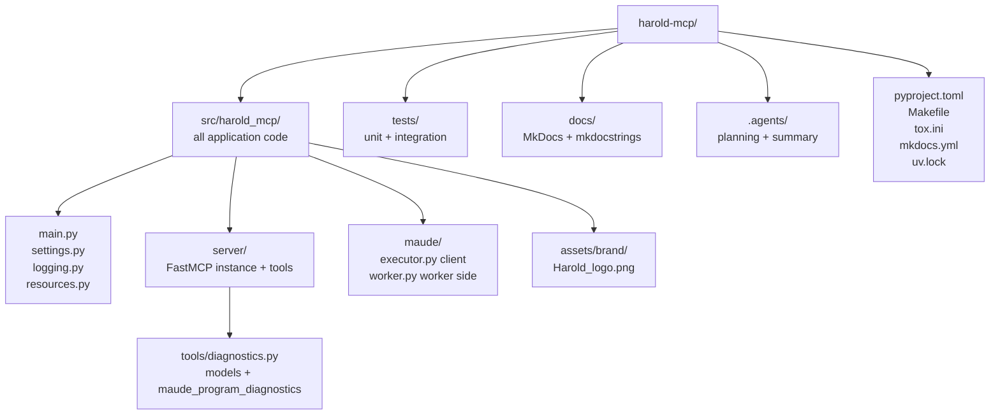

# harold-mcp — AGENTS.md

<!-- auto-generated by codebase-summary; full knowledge base in .agents/summary/index.md -->

This file is the agent-oriented entry point to the repository. It covers navigation, entry points, and repo-specific conventions. If the answer to a question is not on this page — module internals, data models, full workflow details — open [`.agents/summary/index.md`](.agents/summary/index.md) first; it routes to the detailed knowledge base files. The **Custom Instructions** section at the end is human-maintained and authoritative for project context and conventions.

## Table of Contents

- [Knowledge base](#knowledge-base) — where to go when this page doesn't have the answer
- [Codebase at a glance](#codebase-at-a-glance) — what this repo is and the stack it uses
- [Directory organization](#directory-organization) — where code, tests, docs, and config live
- [Key entry points](#key-entry-points) — how the app starts and where tools are registered
- [Repo-specific conventions and gotchas](#repo-specific-conventions-and-gotchas) — behavior-changing details agents must know
- [Repo-specific commands](#repo-specific-commands) — the Makefile-driven workflow
- [Config files agents might miss](#config-files-agents-might-miss) — where tooling configuration lives
- [Custom Instructions](#custom-instructions) — human-maintained project context (preserved across refreshes)

## Knowledge base

<!-- tags: knowledge-base, routing -->

If AGENTS.md doesn't answer your question, open [`.agents/summary/index.md`](.agents/summary/index.md) — it's the routing table for everything else.

## Codebase at a glance

<!-- tags: overview, stack -->

- **What**: `harold-mcp` is a Python package implementing an MCP (Model Context Protocol) server for AI-assisted Maude programming. Its first real tool is `maude_program_diagnostics`: it loads a Maude source file into the interpreter and reports every problem, including recoverable warnings, as a structured LSP-style result.
- **Architecture**: two processes. The **MCP server** (FastMCP, threaded) never imports the `maude` SWIG bindings; the **Maude worker** (spawned via `ProcessPoolExecutor`, single-threaded, `initializer=init_maude`) owns the interpreter, captures its stderr (where `Warning:` lines go), and parses them. The split gives stderr isolation for the capture and SIGSEGV containment.
- **Stack**: Python ≥ 3.14, built with **FastMCP**, the official **MCP SDK** (`mcp`), the **Maude bindings** (`maude`), **pydantic** + **pydantic-settings**. Dependencies are managed with **uv** (`uv.lock` is committed). Build backend: hatchling.
- **Configuration**: `HAROLD_MAUDE_WORKERS` (default `1`) and `HAROLD_MAUDE_WORKER_TIMEOUT_SECS` (default `60`), read once at import via `pydantic-settings` (`harold_mcp.settings`).

See: [`.agents/summary/codebase_info.md`](.agents/summary/codebase_info.md), [`.agents/summary/dependencies.md`](.agents/summary/dependencies.md).

## Directory organization

<!-- tags: navigation, layout -->



- New application code goes in `src/harold_mcp`; MCP tools go in `harold_mcp/server/tools/`, registered with `@mcp.tool` on the instance from `harold_mcp.server.server` (registration happens as a side effect of importing the `harold_mcp.server` package).
- New tests go in `tests/unit/` (mocked, hermetic) or `tests/integration/` (real Maude interpreter; give test files distinct basenames — pytest treats same-named files in both trees as one module).
- Feature plans and design rationale live in `.agents/planning/` (see below).

## Key entry points

<!-- tags: entry-points -->

- Console script **`harold-mcp`** → `harold_mcp.main:run` (`src/harold_mcp/main.py`); starts the MCP server over stdio. `main.py`'s `__main__` guard is required (the `spawn`-context worker re-imports the main module).
- **`src/harold_mcp/server/server.py`** — the `mcp = FastMCP(..., lifespan=app_lifespan)` instance; the `@lifespan`-decorated `app_lifespan` warms up the worker pool (fail-fast on `MaudeInitError`) and tears it down in `finally`; `run()` installs a SIGTERM→`KeyboardInterrupt` handler and calls `os._exit(0)` after cleanup (FastMCP's stdio transport leaves a non-daemon stdin-reader thread that would hang interpreter shutdown).
- **`src/harold_mcp/server/tools/diagnostics.py`** — the tool and its pydantic result models (`MaudeProgramDiagnosticsResult` etc.): file pre-check → executor call → tri-state mapping (`success` = no warnings and no errors; `range=None` for whole-file problems).
- **`src/harold_mcp/maude/executor.py`** — the client: error hierarchy, `MaudeExecutor` (pool lifecycle, warm-up pings, generic `_run_task` with crash/timeout recovery via `kill_workers`), `get_maude_executor(settings=Depends(get_settings))` lazy singleton.
- **`src/harold_mcp/maude/worker.py`** — worker-side ops (`init_maude`, `ping`, `sleep`, `load_diagnostics` with fd-2 capture + ANSI-stripping warning parser, `_crash`). Imports `maude` **lazily inside functions** so the server process never touches the bindings.
- **`src/harold_mcp/settings.py`** — `Settings` (pydantic-settings, `HAROLD_` prefix) + `get_settings()`.

See: [`.agents/summary/interfaces.md`](.agents/summary/interfaces.md), [`.agents/summary/components.md`](.agents/summary/components.md).

## Repo-specific conventions and gotchas

<!-- tags: conventions, gotchas -->

1. **The server process never imports `maude`.** Only the worker touches the interpreter. `worker.py` keeps the import lazy; keep it that way (the absolute `import maude` is the third-party package, not `harold_mcp.maude`).
2. **Worker lifecycle is the lifespan's job.** The pool starts in `app_lifespan` (warm-up pings, fail-fast) and is killed in its `finally` (`ProcessPoolExecutor.kill_workers()`, Python 3.14). `start()` is not called at import time.
3. **Crash/timeout recovery semantics.** `MaudeExecutor._run_task` maps `BrokenProcessPool`/`TimeoutError` to `MaudeWorkerCrashedError`/`MaudeWorkerTimeoutError`, replaces the pool exactly once (identity check under `_executor_lock`, an RLock), and never auto-retries the failed call — diagnostics is idempotent, the MCP client retries. A timed-out worker must be killed (`kill_workers`); `shutdown()` cannot stop a hung `maude.load`.
4. **FastMCP DI and lint**: `Depends(...)` defaults need `# noqa: B008`; the `@lifespan` decorator replaces the deprecated `@asynccontextmanager` + `AsyncIterator` annotation (yield `None`, annotate `AsyncGenerator[dict[str, Any] | None]`).
5. **Strict typing is enforced**: mypy runs with `disallow_untyped_defs = true` — annotate everything. The `maude` package has no type stubs (mypy override `ignore_missing_imports`), so Maude values are `Any`; narrow boundaries explicitly (`bool(...)`, `cast`). basedpyright additionally enforces **unused call results** (`reportUnusedCallResult`) — mark intentional discards with `_ = ...`.
6. **Ruff auto-fix fails CI**: `make check` runs `ruff check --exit-non-zero-on-fix`; any lint issue ruff could auto-fix fails the check. Run `uv run ruff check` and `uv run ruff format` before committing.
7. **Style floor**: Python 3.14 (`target-version = "py314"`), line length 120 (`E501` ignored), `ruff format` with preview enabled (PEP 758 `except A, B:` is valid).
8. **Use `uv`, not raw pip**: all commands go through `uv run` / `uv sync`. After changing dependencies, run `uv lock` and commit `uv.lock`; `make check` verifies sync via `uv lock --locked`.
9. **Tests run with coverage flags**: `make test` invokes pytest with `--cov --cov-config=pyproject.toml --cov-report=xml`; tox adds `--doctest-modules tests`. Unit tests live in `tests/unit/` (mocked); integration tests live in `tests/integration/` (real interpreter and, in the smoke test, the real stdio server; fixtures in `tests/integration/fixtures/`).
10. **Docs are generated from docstrings**: MkDocs + mkdocstrings render `src/harold_mcp`. When adding a module, add a `::: harold_mcp.<module>` entry to `docs/modules.md` and keep `make docs-test` green (strict build, fails on warnings).
11. **The knowledge base is committed**: `.agents/summary/` is version-controlled and trusted by agents. Keep it in sync when architecture or conventions change (re-run codebase-summary); see [`.agents/summary/review_notes.md`](.agents/summary/review_notes.md).
12. **Empirical Maude facts** (see `.agents/planning/maude-diagnostics-tool-v1/research/maude-bindings.md`): `maude.load` returns `True` for every parseable input (even 12-warning garbage and binary files) — the synthesized `error` path only fires for missing files, which the tool pre-checks away; warnings are colorized with ANSI escapes when stderr is a TTY at init time; capture in binary mode and decode lossily.

## Repo-specific commands

<!-- tags: commands -->

All commands are `Makefile` targets that wrap `uv` (repo-specific wrappers, not raw tool invocations):

| Command | Purpose |
| --- | --- |
| `make install` | `uv sync` — create/refresh the environment |
| `make check` | lockfile sync, ruff (lint + format), mypy, basedpyright (unused call results), deptry |
| `make test` | pytest with coverage |
| `make release` | full CI pass: `install check test docs-test` |
| `make run` | start the MCP server over stdio |
| `make docs` / `make docs-test` | serve docs / strict docs build |
| `make build` / `make publish` | build wheel / upload to PyPI |

Setup and IDE-configuration details (Zed, opencode, Cline) and the `HAROLD_*` env-var table live in `README.md`; the contribution and PR workflow lives in `CONTRIBUTING.md`.

## Config files agents might miss

<!-- tags: config -->

- **`pyproject.toml`** — single source of tool config: ruff, mypy, **basedpyright** (`reportUnusedCallResult` only, everything else off), pytest, coverage, deptry inputs, console script, dependencies.
- **`tox.ini`** — single-version test env (`py314`). The GitHub Actions workflows themselves live at the repository root (`../.github/workflows/` relative to this package directory).
- **`mkdocs.yml`** — docs site config; nav lists `docs/index.md` and `docs/modules.md`.
- **`uv.lock`** — committed lockfile; regenerate after dependency changes.
- **`Makefile`** — the canonical dev command surface (see commands above).
- **`.agents/summary/`** — committed knowledge base (routing index plus detailed docs). Trust it as an index into the codebase; refresh it after significant changes.
- **`.agents/planning/`** — committed design/planning docs: `maude-diagnostics-tool-v1/` (the complete PDD cycle for `maude_program_diagnostics`: requirements, research, design, implementation plan) and `sigsegv-under-load/issue.md` (SIGSEGV history that motivated the worker architecture). Consult before implementing planned features.

## Custom Instructions

<!-- This section is maintained by developers and agents during day-to-day work.
     It is NOT auto-generated by codebase-summary and MUST be preserved during refreshes.
     Add project-specific conventions, gotchas, and workflow requirements here. -->

You must ignore files with extension `.md.html` that appear next to a `.md` file with the same basename. Those are just renders of the original markdown file, with the same content.

### Project goals

Harold is an MCP (Model Context Protocol) server with tools for programming with the Maude specification and verification language.

Specifically, we want to develop the following tools:

- Diagnose Maude programs (linters, etc.)
- Run Maude programs
- Expose a vector index of the Maude documentation to enable RAG (Retrieval-Augmented Generation)

The use case for Harold is to use it with AI-assisted programming tools such as opencode or Cline, together with LLM models that are not sufficiently trained in the Maude language.

> **Note:** The project is in its early stages. Only a basic skeleton exists right now; none of the MCP tools described above are implemented yet.

### Recommendations

1. Add more tests as tools are implemented.
2. After significant architecture or functionality changes:
    1. Suggest the user to re-run the codebase-summary agent skill, so the knowledge base at `.agents/summary/` does not drift from the code. Document new modules in `docs/modules.md`
    2. Record a summary of the new functionality on `CHANGELOG.md`
    3. Review the user documentation on `README.md` is up to date. In particular check the list of tools and their description is accurate.
    4. Suggest the user a minor increase on the project `version` on `pyproject.toml`. Also add a new section for the new version to `CHANGELOG.md`

### Running `make` commands from agent sandboxes

Agents running in sandboxed environments may lack write access to the user's
`uv` cache (`~/.cache/uv`), making `uv` fail with errors like
`Could not acquire lock ... Read-only file system`. In that case, prepend
`UV_CACHE_DIR=/tmp/uv-cache` to any `make` command:

```sh
UV_CACHE_DIR=/tmp/uv-cache make check
UV_CACHE_DIR=/tmp/uv-cache make test
UV_CACHE_DIR=/tmp/uv-cache make release
```

(This is harmless in normal environments too, but there it is not needed.)

### References

- [FastMCP](https://gofastmcp.com/llms.txt)
- Maude programming language:
  - Overview: [wikipedia page on Maude](https://en.wikipedia.org/wiki/Maude_system)
  - Reference. [Maude manual](https://maude.lcc.uma.es/maude-manual/)
  - [Maude bindings for Python](https://fadoss.github.io/maude-bindings/)
  - In case a folder `maude-bindings` is available: that is the source code of the `maude` Python package. Those are SWIG bindings for the Maude language, that is exposed as a C++ library.
