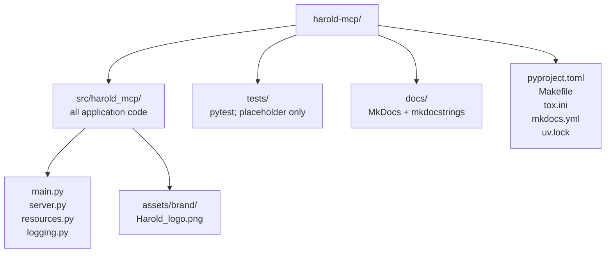

# harold-mcp — AGENTS.md

<!-- auto-generated by codebase-summary; full knowledge base in .agents/summary/index.md -->

This file is the agent-oriented entry point to the repository. For details, consult the structured knowledge base in [`.agents/summary/`](.agents/summary/index.md). The **Custom Instructions** section at the end is human-maintained and authoritative for project context and conventions.

## Table of Contents

- [Codebase at a glance](#codebase-at-a-glance) — what this repo is and the stack it uses
- [Directory organization](#directory-organization) — where code, tests, docs, and config live
- [Key entry points](#key-entry-points) — how the app starts and where tools are registered
- [Repo-specific conventions and gotchas](#repo-specific-conventions-and-gotchas) — behavior-changing details agents must know
- [Repo-specific commands](#repo-specific-commands) — the Makefile-driven workflow
- [Config files agents might miss](#config-files-agents-might-miss) — where tooling configuration lives
- [Custom Instructions](#custom-instructions) — human-maintained project context (preserved across refreshes)

## Codebase at a glance

<!-- tags: overview, stack -->

- **What**: `harold-mcp` is a Python package implementing an MCP (Model Context Protocol) server for AI-assisted Maude programming. Today it is a hello-world skeleton: a single `greet` tool.
- **Stack**: Python ≥ 3.10 (language floor: 3.10 — no 3.11+ syntax), built with **FastMCP** (the MCP framework), the official **MCP SDK** (`mcp`), and the **Maude bindings** (`maude`). Dependencies are managed with **uv** (`uv.lock` is committed). Build backend: hatchling.
- **Runtime side effect**: importing `harold_mcp.server` initializes the Maude runtime (`maude.init()`) and constructs the global `mcp = FastMCP(...)` server instance.

See: [`.agents/summary/codebase_info.md`](.agents/summary/codebase_info.md), [`.agents/summary/dependencies.md`](.agents/summary/dependencies.md).

## Directory organization

<!-- tags: navigation, layout -->



- New application code goes in `src/harold_mcp` (src layout, flat modules).
- New tests go in `tests/` (currently only the placeholder `test_foo.py`).

## Key entry points

<!-- tags: entry-points -->

- Console script **`harold-mcp`** → `harold_mcp.main:run` (`src/harold_mcp/main.py`); starts the MCP server over stdio.
- **`src/harold_mcp/server.py`** — the heart of the app: `mcp = FastMCP(name="Harold", ...)`, `maude.init()`, and tool registration via `@mcp.tool`. **Add new MCP tools here.** Current tool: `greet(name: str) -> str`, which reduces `2 * 3` in Maude's `NAT` module (`name` is accepted but unused — placeholder behavior).
- **`src/harold_mcp/resources.py`** — packaged brand icon (`HAROLD_ICON`) used by the server.
- **`src/harold_mcp/logging.py`** — `get_logger` re-export and the `Logging` base class (`_log` property).

See: [`.agents/summary/interfaces.md`](.agents/summary/interfaces.md), [`.agents/summary/components.md`](.agents/summary/components.md).

## Repo-specific conventions and gotchas

<!-- tags: conventions, gotchas -->

1. **Import side effects**: any import of `harold_mcp.server` runs `maude.init()` and builds the server instance. Expect this when testing; keep heavy logic out of import time.
2. **Strict typing is enforced**: mypy runs with `disallow_untyped_defs = true` — annotate all functions and methods. The `maude` package has no type stubs (mypy override `ignore_missing_imports`), so Maude values are effectively `Any` to mypy.
3. **Ruff auto-fix fails CI**: `make check` runs `ruff check --exit-non-zero-on-fix`, so any lint issue ruff could auto-fix fails the check. Run `uv run ruff check` and `uv run ruff format` before committing.
4. **Style floor**: Python 3.10 (`target-version = "py310"`), line length 120 (`E501` ignored), `ruff format` with preview enabled.
5. **Use `uv`, not raw pip**: all commands go through `uv run` / `uv sync`. After changing dependencies, run `uv lock` and commit `uv.lock`; `make check` verifies sync via `uv lock --locked`.
6. **Tests run with coverage flags**: `make test` invokes pytest with `--cov --cov-config=pyproject.toml --cov-report=xml`; tox adds `--doctest-modules tests`. New tests live in `tests/`.
7. **Docs are generated from docstrings**: MkDocs + mkdocstrings render `src/harold_mcp`. When adding a module, add a `::: harold_mcp.<module>` entry to `docs/modules.md` and keep `make docs-test` green (strict build, fails on warnings).
8. **Known issue — `make release`**: the target is defined twice in the `Makefile`. It currently works only because GNU make merges the prerequisites, but the recipe is just an echo. Prefer running `make install check test docs-test` explicitly. See [`.agents/summary/review_notes.md`](.agents/summary/review_notes.md).

## Repo-specific commands

<!-- tags: commands -->

All commands are `Makefile` targets that wrap `uv` (repo-specific wrappers, not raw tool invocations):

| Command | Purpose |
| --- | --- |
| `make install` | `uv sync` — create/refresh the environment |
| `make check` | lockfile sync, ruff (lint + format), mypy, deptry |
| `make test` | pytest with coverage |
| `make release` | intended full CI pass — see gotcha #8 |
| `make run` | start the MCP server over stdio |
| `make docs` / `make docs-test` | serve docs / strict docs build |
| `make build` / `make publish` | build wheel / upload to PyPI |

Setup and IDE-configuration details (Zed, opencode, Cline) live in `README.md`; the contribution and PR workflow lives in `CONTRIBUTING.md`.

## Config files agents might miss

<!-- tags: config -->

- **`pyproject.toml`** — single source of tool config: ruff, mypy, pytest, coverage, deptry inputs, console script, dependencies.
- **`tox.ini`** — multi-Python test matrix (3.10–3.14) plus a `[gh-actions]` mapping. No GitHub Actions workflow is present in this checkout (see review notes).
- **`mkdocs.yml`** — docs site config; nav lists `docs/index.md` and `docs/modules.md`.
- **`uv.lock`** — committed lockfile; regenerate after dependency changes.
- **`Makefile`** — the canonical dev command surface (see commands above).
- No `.pre-commit-config.yaml` exists yet despite `pre-commit` being a dev dependency (see review notes).

## Custom Instructions

<!-- This section is maintained by developers and agents during day-to-day work.
     It is NOT auto-generated by codebase-summary and MUST be preserved during refreshes.
     Add project-specific conventions, gotchas, and workflow requirements here. -->

## Project goals

Harold is an MCP (Model Context Protocol) server with tools for programming with the Maude specification and verification language.

Specifically, we want to develop the following tools:

- Diagnose Maude programs (linters, etc.)
- Run Maude programs
- Expose a vector index of the Maude documentation to enable RAG (Retrieval-Augmented Generation)

The use case for Harold is to use it with AI-assisted programming tools such as opencode or Cline, together with LLM models that are not sufficiently trained in the Maude language.

> **Note:** The project is in its early stages. Only a basic skeleton exists right now; none of the MCP tools described above are implemented yet.

## How to build the code

Use makefile

```bash
# Run linters, formatters, and type checking
make check
# Run tests
make test
```

## References

- [FastMCP](https://gofastmcp.com/llms.txt)
- Maude programming languaje:
  - Overview: [wikipedia page on Maude](https://en.wikipedia.org/wiki/Maude_system)
  - Reference. [Maude manual](https://maude.lcc.uma.es/maude-manual/)
