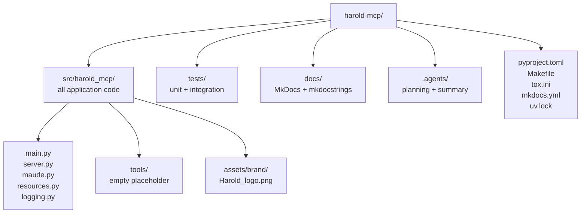

# harold-mcp — AGENTS.md

<!-- auto-generated by codebase-summary; full knowledge base in .agents/summary/index.md -->

This file is the agent-oriented entry point to the repository. It covers navigation, entry points, and repo-specific conventions. If the answer to a question is not on this page — module internals, data models, full workflow details — open [`.agents/summary/index.md`](.agents/summary/index.md) first; it routes to the detailed knowledge base files. The **Custom Instructions** section at the end is human-maintained and authoritative for project context and conventions.

## Table of Contents

- [Knowledge base](#knowledge-base) — where to go when this page doesn't have the answer
- [Codebase at a glance](#codebase-at-a-glance) — what this repo is and the stack it uses
- [Directory organization](#directory-organization) — where code, tests, docs, and config live
- [Key entry points](#key-entry-points) — how the app starts and where tools are registered
- [Repo-specific conventions and gotchas](#repo-specific-conventions-and-gotchas) — behavior-changing details agents must know
- [Repo-specific commands](#repo-specific-commands) — the Makefile-driven workflow
- [Config files agents might miss](#config-files-agents-might-miss) — where tooling configuration lives
- [Custom Instructions](#custom-instructions) — human-maintained project context (preserved across refreshes)

## Knowledge base

<!-- tags: knowledge-base, routing -->

If AGENTS.md doesn't answer your question, open [`.agents/summary/index.md`](.agents/summary/index.md) — it's the routing table for everything else.

## Codebase at a glance

<!-- tags: overview, stack -->

- **What**: `harold-mcp` is a Python package implementing an MCP (Model Context Protocol) server for AI-assisted Maude programming. Today it is a hello-world skeleton: a single `greet` tool, plus a thread-safe `MaudeRuntime` wrapper over the Maude interpreter. An empty `harold_mcp.tools` subpackage is the planned home of the real tools.
- **Stack**: Python ≥ 3.14, built with **FastMCP** (the MCP framework), the official **MCP SDK** (`mcp`), and the **Maude bindings** (`maude`). Dependencies are managed with **uv** (`uv.lock` is committed). Build backend: hatchling.
- **Lazy Maude init**: importing `harold_mcp.server` does **not** initialize Maude. Init happens lazily via `init_maude()` in `harold_mcp.maude` (lock-guarded, once per process, retried on failure), and eagerly in `server.run()` before `mcp.run()` so the server fails fast at startup. Importing still constructs the global `mcp = FastMCP(...)` instance.

See: [`.agents/summary/codebase_info.md`](.agents/summary/codebase_info.md), [`.agents/summary/dependencies.md`](.agents/summary/dependencies.md).

## Directory organization

<!-- tags: navigation, layout -->



- New application code goes in `src/harold_mcp` (src layout, flat modules); MCP tool implementations go in `harold_mcp/tools/` and are registered with `@mcp.tool` on the server instance.
- New tests go in `tests/unit/` (mocked, hermetic) or `tests/integration/` (real Maude interpreter).
- Feature plans and design rationale live in `.agents/planning/` (see below).

## Key entry points

<!-- tags: entry-points -->

- Console script **`harold-mcp`** → `harold_mcp.main:run` (`src/harold_mcp/main.py`); starts the MCP server over stdio.
- **`src/harold_mcp/server.py`** — the heart of the app: `mcp = FastMCP(name="Harold", ...)` (with `instructions`, `website_url`, icon), `run()` (initializes Maude via `init_maude()`, then calls `mcp.run()`), and tool registration via `@mcp.tool`. Current tool: `greet(name: str) -> str`, which reduces `2 * 3` in Maude's `NAT` module (`name` is accepted but unused — placeholder behavior).
- **`src/harold_mcp/maude.py`** — safe access layer over the SWIG `maude` bindings: `init_maude()` (once per process, retried on failure), `MaudeRuntime` (RLock-serialized `get_module` / `load_program` / `load_module`, no wrapper caching), `get_runtime()` singleton, and the `MaudeError` hierarchy. Design rationale: [`.agents/planning/sigsegv-under-load/issue.md`](.agents/planning/sigsegv-under-load/issue.md).
- **`src/harold_mcp/resources.py`** — packaged brand icon (`HAROLD_ICON`) used by the server.
- **`src/harold_mcp/logging.py`** — `get_logger` re-export and the `Logging` base class (`_log` property).

See: [`.agents/summary/interfaces.md`](.agents/summary/interfaces.md), [`.agents/summary/components.md`](.agents/summary/components.md).

## Repo-specific conventions and gotchas

<!-- tags: conventions, gotchas -->

1. **No import-time Maude init**: importing `harold_mcp.server` builds the server instance but does **not** initialize Maude. Init happens lazily (`init_maude()` in `harold_mcp.maude`, guarded by a lock and `_maude_initialized` flag; failures are retried on the next call) and eagerly in `server.run()` before `mcp.run()`, so the server fails fast at startup if Maude cannot initialize. Keep heavy logic out of import time.
2. **All Maude access goes through `MaudeRuntime`**: the interpreter is not thread-safe, so `get_module` / `load_program` / `load_module` serialize access on a reentrant lock. Never call `maude.*` functions directly from tool code; use `get_runtime()`.
3. **Module wrappers are never cached**: loading a program may redefine its modules, so `MaudeRuntime` always fetches fresh wrappers ("last load wins"). Caching wrappers caused a SIGSEGV failure mode documented in `.agents/planning/sigsegv-under-load/issue.md`.
4. **Strict typing is enforced**: mypy runs with `disallow_untyped_defs = true` — annotate all functions and methods. The `maude` package has no type stubs (mypy override `ignore_missing_imports`), so Maude values are effectively `Any` to mypy.
5. **Ruff auto-fix fails CI**: `make check` runs `ruff check --exit-non-zero-on-fix`, so any lint issue ruff could auto-fix fails the check. Run `uv run ruff check` and `uv run ruff format` before committing.
6. **Style floor**: Python 3.14 (`target-version = "py314"`), line length 120 (`E501` ignored), `ruff format` with preview enabled.
7. **Use `uv`, not raw pip**: all commands go through `uv run` / `uv sync`. After changing dependencies, run `uv lock` and commit `uv.lock`; `make check` verifies sync via `uv lock --locked`.
8. **Tests run with coverage flags**: `make test` invokes pytest with `--cov --cov-config=pyproject.toml --cov-report=xml`; tox adds `--doctest-modules tests`. Unit tests live in `tests/unit/` (mocked); integration tests live in `tests/integration/` (real Maude interpreter, fixtures in `tests/integration/fixtures/`).
9. **Docs are generated from docstrings**: MkDocs + mkdocstrings render `src/harold_mcp`. When adding a module, add a `::: harold_mcp.<module>` entry to `docs/modules.md` and keep `make docs-test` green (strict build, fails on warnings).
10. **The knowledge base is committed**: `.agents/summary/` is version-controlled and trusted by agents. Keep it in sync when architecture or conventions change (re-run codebase-summary); see [`.agents/summary/review_notes.md`](.agents/summary/review_notes.md).

## Repo-specific commands

<!-- tags: commands -->

All commands are `Makefile` targets that wrap `uv` (repo-specific wrappers, not raw tool invocations):

| Command | Purpose |
| --- | --- |
| `make install` | `uv sync` — create/refresh the environment |
| `make check` | lockfile sync, ruff (lint + format), mypy, deptry |
| `make test` | pytest with coverage |
| `make release` | full CI pass: `install check test docs-test` |
| `make run` | start the MCP server over stdio |
| `make docs` / `make docs-test` | serve docs / strict docs build |
| `make build` / `make publish` | build wheel / upload to PyPI |

Setup and IDE-configuration details (Zed, opencode, Cline) live in `README.md`; the contribution and PR workflow lives in `CONTRIBUTING.md`.

## Config files agents might miss

<!-- tags: config -->

- **`pyproject.toml`** — single source of tool config: ruff, mypy, pytest, coverage, deptry inputs, console script, dependencies.
- **`tox.ini`** — single-version test env (`py314`). The GitHub Actions workflows themselves live at the repository root (`../.github/workflows/` relative to this package directory).
- **`mkdocs.yml`** — docs site config; nav lists `docs/index.md` and `docs/modules.md`.
- **`uv.lock`** — committed lockfile; regenerate after dependency changes.
- **`Makefile`** — the canonical dev command surface (see commands above).
- **`.agents/summary/`** — committed knowledge base (routing index plus detailed docs). Trust it as an index into the codebase; refresh it after significant changes.
- **`.agents/planning/`** — committed design/planning docs: `maude-diagnostics-tool-v1/` (first planned MCP tool, `maude_program_diagnostics`) and `sigsegv-under-load/issue.md` (design rationale for `harold_mcp.maude`). Consult before implementing planned features.

## Custom Instructions

<!-- This section is maintained by developers and agents during day-to-day work.
     It is NOT auto-generated by codebase-summary and MUST be preserved during refreshes.
     Add project-specific conventions, gotchas, and workflow requirements here. -->

You must ignore files with extension `.md.html` that appear next to a `.md` file with the same basename. Those are just renders of the original markdown file, with the same content.

### Project goals

Harold is an MCP (Model Context Protocol) server with tools for programming with the Maude specification and verification language.

Specifically, we want to develop the following tools:

- Diagnose Maude programs (linters, etc.)
- Run Maude programs
- Expose a vector index of the Maude documentation to enable RAG (Retrieval-Augmented Generation)

The use case for Harold is to use it with AI-assisted programming tools such as opencode or Cline, together with LLM models that are not sufficiently trained in the Maude language.

> **Note:** The project is in its early stages. Only a basic skeleton exists right now; none of the MCP tools described above are implemented yet.

### Recommendations

1. Add more tests as tools are implemented.
2. Suggest the user to re-run the codebase-summary agent skill after significant architecture changes, so the knowledge base at `.agents/summary/` does not drift from the code. Document new modules in `docs/modules.md`

### Running `make` commands from agent sandboxes

Agents running in sandboxed environments may lack write access to the user's
`uv` cache (`~/.cache/uv`), making `uv` fail with errors like
`Could not acquire lock ... Read-only file system`. In that case, prepend
`UV_CACHE_DIR=/tmp/uv-cache` to any `make` command:

```sh
UV_CACHE_DIR=/tmp/uv-cache make check
UV_CACHE_DIR=/tmp/uv-cache make test
UV_CACHE_DIR=/tmp/uv-cache make release
```

(This is harmless in normal environments too, but there it is not needed.)

### References

- [FastMCP](https://gofastmcp.com/llms.txt)
- Maude programming language:
  - Overview: [wikipedia page on Maude](https://en.wikipedia.org/wiki/Maude_system)
  - Reference. [Maude manual](https://maude.lcc.uma.es/maude-manual/)
  - [Maude bindings for Python](https://fadoss.github.io/maude-bindings/)
  - In case a folder `maude-bindings` is available: that is the source code of the `maude` Python package. Those are SWIG bindings for the Maude language, that is exposed as a C++ library.
